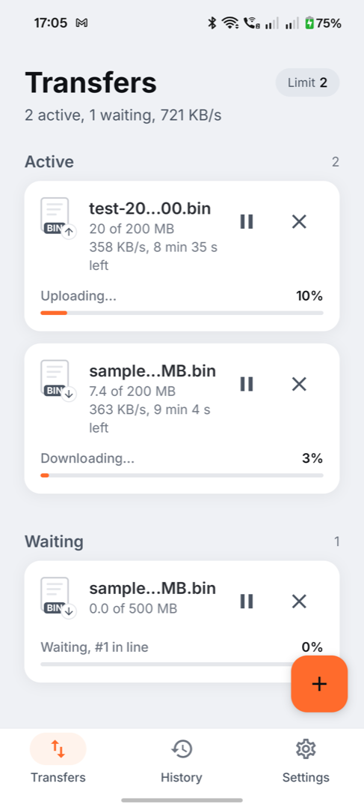
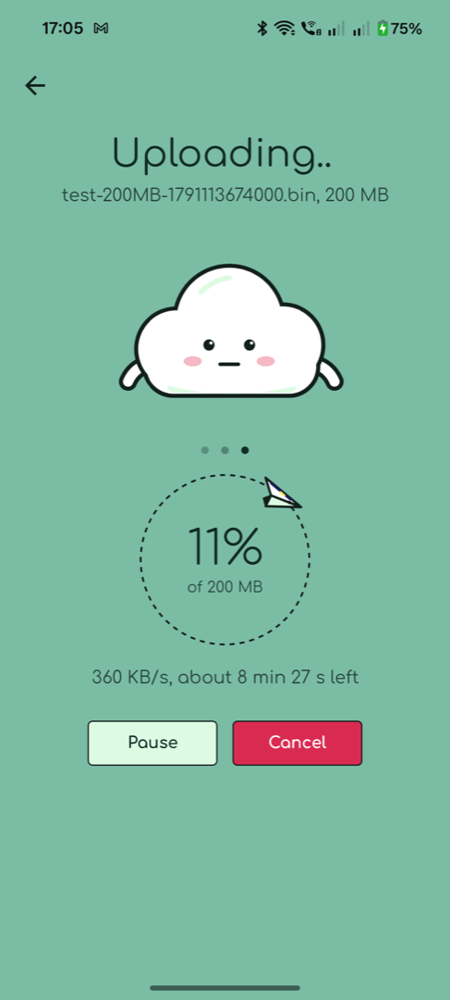
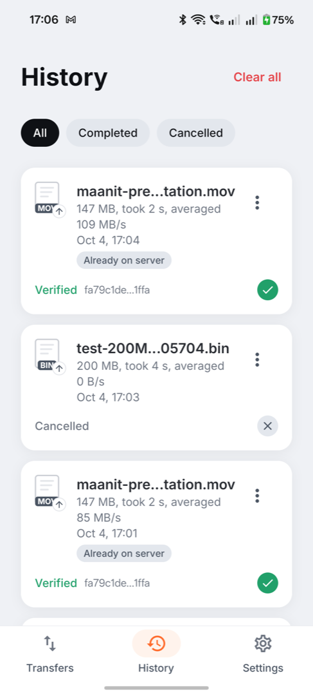
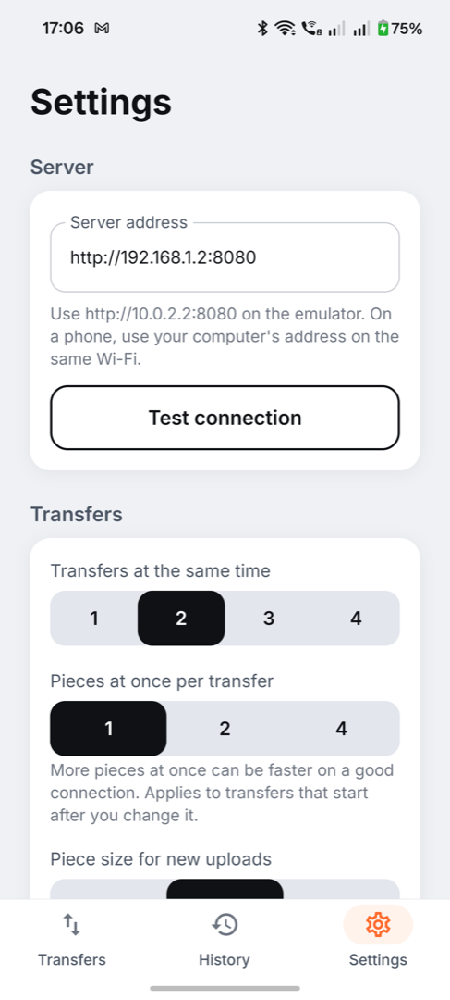
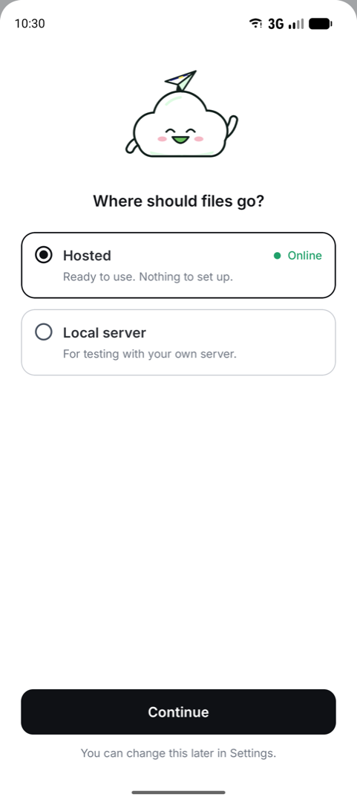
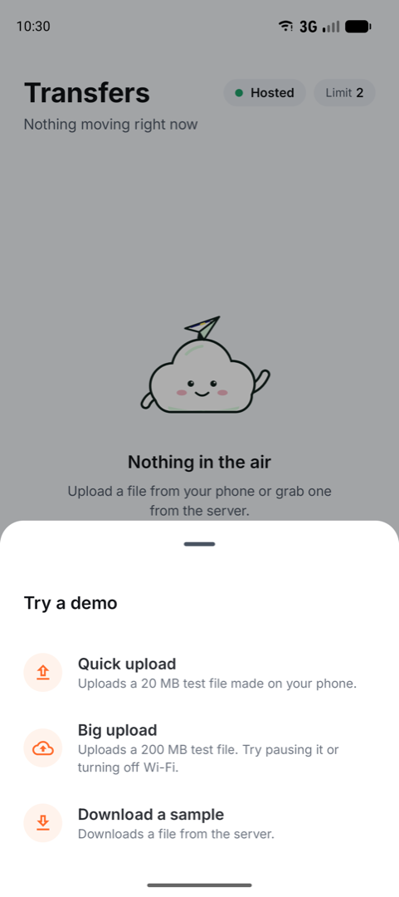
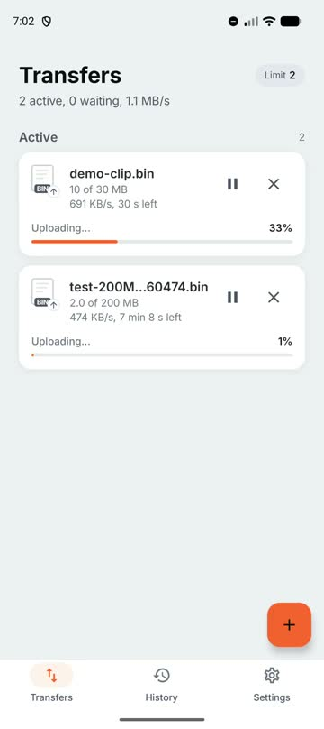
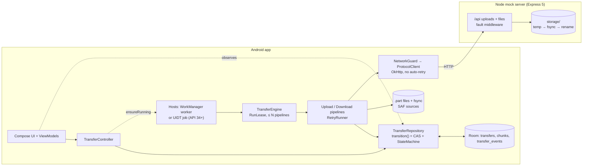
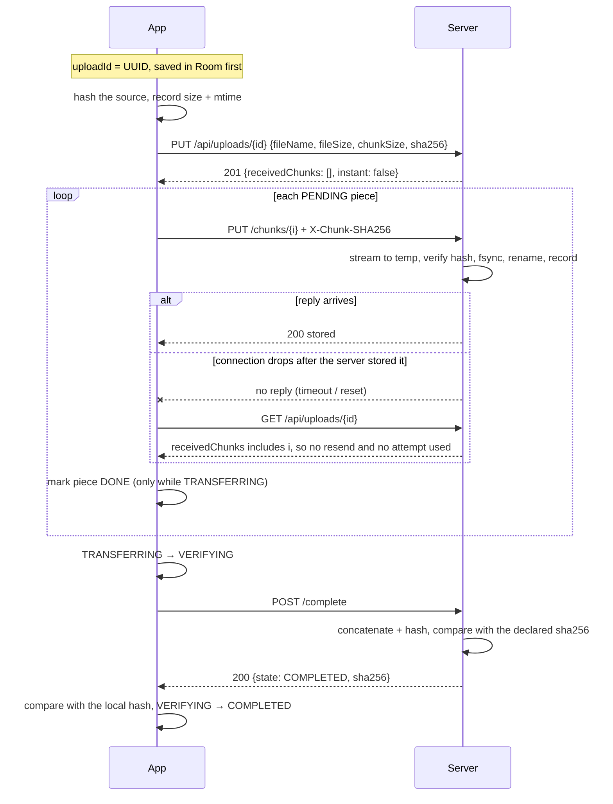
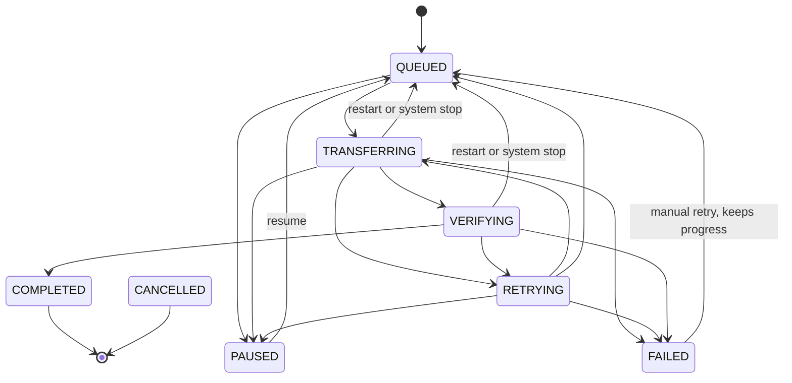

<p align="center">
  <a href="https://github.com/maanit-gupta/StableShare/releases/download/v1.3.0/StableShare-1.3.0.apk">
    
  </a>
</p>

<h1 align="center">StableShare</h1>

<p align="center">
  <a href="https://github.com/maanit-gupta/StableShare/releases/download/v1.3.0/StableShare-1.3.0.apk">
    
  </a>
  <br>
  <sub>Android 8.0+ · 4.0 MB · signed release · <a href="https://github.com/maanit-gupta/StableShare/releases/tag/v1.3.0">release notes</a></sub>
  <br><br>
  <a href="https://github.com/maanit-gupta/StableShare/actions/workflows/ci.yml"></a>
</p>

StableShare is an Android app (Kotlin, Jetpack Compose, minSdk 26) that uploads and downloads files of up to 1 GB (512 MiB on the hosted server) to a Node.js mock server, hosted at https://stableshare.onrender.com by default or run locally, and survives pause and resume, lost or flapping networks, timeouts, lost responses, server errors, app kills and restarts. Files move in SHA-256-checked pieces. Every state change is a validated compare-and-set in Room, and every retry is bounded. A transfer shows **Completed** only after the whole file has been verified end to end. The server injects faults on demand from the app's own network simulator, so you can watch all of this happen.

| Transfers | Detail | History | Settings |
|---|---|---|---|
|  |  |  |  |

| First launch | Try a demo |
|---|---|
|  |  |

**Demo video:** [docs/demo/stableshare-demo.mp4](docs/demo/stableshare-demo.mp4) (3:54; first launch and server choice, Try a demo, an upload and a download on the hosted server, expand a row, pause and resume, History filters and row menu, switch to the local server). See [Demo](#demo) for the 2× GIF.

<a href="docs/demo/stableshare-demo.mp4"></a>

**Download:** tap the icon or the button above, or this link: [StableShare-1.3.0.apk](https://github.com/maanit-gupta/StableShare/releases/download/v1.3.0/StableShare-1.3.0.apk) from the [v1.3.0 release](https://github.com/maanit-gupta/StableShare/releases/tag/v1.3.0) (3 963 781 bytes, v2-signed), SHA-256 `4f5d31be439fb8d05724eb4e8831a63e68b84ae590764c2e96f597785afd1687` ([CHECKSUMS.txt](release/CHECKSUMS.txt)). The same APK is in the repository at [release/StableShare-1.3.0.apk](release/StableShare-1.3.0.apk). The previous [1.2.0](release/StableShare-1.2.0.apk) and [1.1.0](release/StableShare-1.1.0.apk) APKs are kept; 1.1.0 defaults to the local server.

**Install on a phone:** open the link on the Android device, then open the downloaded file. Android asks you to allow installs from your browser or file manager the first time. The app connects to the hosted server by default; nothing needs to be set (see [Quick start](#quick-start)).

The full design is in [docs/DESIGN.md](docs/DESIGN.md) and the UI spec is in [docs/UI-SPEC.md](docs/UI-SPEC.md).

## Demo


The GIF plays at 2× speed. The full 3:54 recording at normal speed is [docs/demo/stableshare-demo.mp4](docs/demo/stableshare-demo.mp4). It was recorded on an API 37 emulator with the 1.3.0 release build against the hosted server and driven by adb ([scripts/record-demo-1.3.sh](scripts/record-demo-1.3.sh), which also takes the screenshots above). The fault-injection walkthrough from 1.2.0 (`kill -9` and restore, lost responses, airplane mode, instant re-upload, cancel) is described in [docs/DEMO-SCRIPT.md](docs/DEMO-SCRIPT.md) and can be re-recorded with [scripts/record-demo.sh](scripts/record-demo.sh).

## Features

- **Resumable uploads and downloads** of files up to 1 GB, in SHA-256-checked pieces (1, 2 or 5 MB).
- **Pause and resume** from any row or the detail screen. Finished pieces are never sent again.
- **Automatic retry** with bounded, jittered backoff for timeouts, dropped connections, 5xx and 429. Lost responses are confirmed with the server instead of resent.
- **Network awareness:** transfers wait without using retry attempts while offline (or on mobile data with Wi-Fi only on) and resume by themselves.
- **Persistence across app kills, crashes and reboots:** every state change is in Room, and resumed transfers show "Restored after restart".
- **Verified completion:** a transfer is Completed only after the whole file's SHA-256 matches (checked by the server for uploads, re-hashed locally for downloads).
- **Several transfers at once** (1–4), cancel with cleanup, History, notifications, and a built-in network simulator that drives the server's fault injection.

## Requirements covered

| # | Requirement | Where implemented | How tested |
|---|---|---|---|
| 1 | Chunked upload of large files (≤ 1 GB) | [UploadPipeline], [FileStore], [server uploads] | `UploadPipelineTest.happyPathCompletesWithServerVerifiedHash`, server `happy path: chunks stored…`, instrumented [PickedFileUploadTest] (real system picker), 112 MB and 155 MB on a phone |
| 2 | Ranged, resumable download | [DownloadPipeline], [server files] | `DownloadPipelineTest.happyPathVerifiesAndRenamesAtomically`, `ProtocolClientTest.downloadRangeSendsRangeAndIfRangeAndHashesBody`, server `Range → 206…` |
| 3 | Pause and resume | [TransferController], [TransferEngine] | `TransferEngineTest.pauseAndResumeUploadNeverResendsEarlierChunks` / `…DownloadNeverRefetchesEarlierChunks` |
| 4 | Survive network loss, resume automatically | [ConnectivityMonitor], [NetworkGuard], [ErrorClassifier] | `UploadPipelineTest.networkLossWaitsWithoutConsumingAttemptsAndResumesWhenOnline`, [WifiOnlyTest], [NetworkGuardTest] |
| 5 | Timeouts and server errors, bounded retries | [RetryRunner], [RetryPolicy] | `UploadPipelineTest.twoServerErrorsThenSuccess`, `…serverErrorsForeverExhaustRetriesKeepingProgressAndManualRetrySendsOnlyTheRest`, [RetryPolicyTest] |
| 6 | Lost responses | [UploadPipeline] (status check before any resend) | `UploadPipelineTest.lostChunkResponseIsConfirmedByStatusWithoutResending`, `…lostCompleteResponseIsConfirmedByStatus`, server `dropAfterProcess: …` |
| 7 | App kill, process death, restart | [TransferRepository] `reconcileAfterProcessStart`, [RestoredTransfers], [PreviousProcessExit] | `TransferEngineTest.processDeathMidChunkUploadResumesFromLastDoneChunk` (and Download), `TransferRepositoryTest.reconciliationRequeuesOnlyInFlightRows`, [chaos-test.sh] (`kill -9`), phone `am crash` |
| 8 | COMPLETED only after whole-file verification | [StateMachine], both pipelines, server `complete` | `StateMachineTest.completedOnlyFromVerifying`, `DownloadPipelineTest.fullFileMismatchRefetchesOnlyTheBadChunks`, server `hash mismatch → 422…` |
| 9 | Cancel with cleanup | [TransferController] | `TransferEngineTest.cancelWhileTransferringUploadDeletesSessionAndIsNeverRevived`, `…DownloadDeletesThePartFile`, `…cancelWhilePausedCleansUpWithoutACoordinator` |
| 10 | Several transfers with a limit (1–4) | [TransferEngine], [RunLease] | `TransferEngineTest.neverMoreThanMaxConcurrentAndRaisingTheLimitApplies`, `…loweringTheLimitLetsRunningTransfersFinish`, [RunLeaseTest] |
| 11 | Progress, speed, ETA | [TransferProgressTracker], [TransferRow] | [TransferProgressTrackerTest], [TransferRowTest] |
| 12 | Source, README, signed release APK | this repository, [release/](release) | `apksigner verify`: v2 scheme verified; SHA-256 matches [CHECKSUMS.txt](release/CHECKSUMS.txt) |

**Extras that exist in the code:**
- **Wi-Fi only** (Settings): no engine request goes over a metered network ([NetworkGuard], [WifiOnlyTest]).
- **Instant upload:** if the server already has a file with the same SHA-256 and size, it completes without sending any piece ([server uploads], [InstantUploadTest], [server instant tests](server/test/instant.test.js)).
- **Pieces at once per transfer** (1, 2 or 4; default 1) ([ChunkWorkers], [ParallelChunksTest]).
- **User-initiated data transfer job** on Android 14+ for user-started transfers, with WorkManager as the other host ([HostSelectingScheduler], [TransferJobService], [HostSelectingSchedulerTest], [TransferJobHostTest]).
- **Network simulator** in Settings: presets, per-fault sliders and live `/admin/stats` counters ([SettingsScreen], [faults.js]).
- **Activity log and chunk map** on the detail screen, and notifications with a **Pause transfers** action ([TransferNotifications], [PauseTransfersReceiver]).
- **Model-based and fuzz tests** for the repository and the engine ([fuzz/](android/app/src/test/java/com/maanit/stableshare/fuzz)), and GitHub Actions CI.

## Quick start

Settings → Server has two choices. **Hosted** is ready to use with nothing to set up: the app talks to https://stableshare.onrender.com, the default ([SettingsRepository.kt](android/app/src/main/java/com/maanit/stableshare/data/settings/SettingsRepository.kt)). The free instance sleeps when idle, so the first request after a quiet spell can take up to a minute while the status pill on Transfers shows **Waking**.

**Local server** runs the same server on your computer. Pick **Emulator** or **Phone on Wi-Fi**, enter your computer's address and port if needed, then tap **Test connection**. Switching servers pauses active transfers; they resume when you switch back.

**Try a demo:** tap **Try a demo** on the empty Transfers screen or in Settings → Demo to start a quick upload, a big upload or a sample download without picking a file.

### 1. Hosted server (default)

Install the APK; it connects to the hosted server by default. See [Hosted server](#hosted-server) for how it is configured.

### 2. Local server (fallback)

**Server** (Node.js 20 or newer):
```sh
cd server
npm install
npm run seed   # sample-0B, sample-odd (3 MiB + 123 B), sample-50MB, sample-200MB, sample-500MB, sample-1GB
npm run dev    # http://0.0.0.0:8080; settings are env vars, see server/.env.example
```

**App:** the signed APK is [release/StableShare-1.3.0.apk](release/StableShare-1.3.0.apk); install it with `adb install -r release/StableShare-1.3.0.apk`. To build from source (JDK 25 toolchain, Android SDK), run `./gradlew assembleDebug` in `android/`. `./gradlew assembleRelease` signs only when `android/keystore.properties` exists; that file and the keystore are not in the repository.

**Server address** (Settings → Server → **Local server**, then **Test connection**):
- **Emulator:** `http://10.0.2.2:8080` reaches the host machine.
- **Phone:** your computer's LAN IP, for example `http://192.168.1.2:8080`, with both devices on the same Wi-Fi. Cleartext HTTP is allowed by [network_security_config.xml](android/app/src/main/res/xml/network_security_config.xml).
- **Android 17+** needs the local-network permission, which onboarding asks for. Without it, traffic to private addresses times out silently.

**Network simulator:** Settings → Network simulator. Pick a preset (Slow network, Flaky Wi-Fi, Lost responses, Corruption, Chaos) or set each fault, then tap **Apply**. **Reset** turns everything off. Faults apply to every client of that server.

## Hosted server

The same server code runs on a Render free web service in Singapore at https://stableshare.onrender.com, built from [server/Dockerfile](server/Dockerfile) and configured by [render.yaml](render.yaml). The hosted behaviour comes only from env vars, all off by default ([config.js](server/src/config.js), [.env.example](server/.env.example)), so the local server and the test suite are unchanged.

- **No persistent disk.** Storage (`STORAGE_DIR=/data`) is wiped on every deploy, restart and idle spin-down. Uploaded files and upload sessions do not survive it.
- **Seed on start.** With `SEED_ON_START=1`, boot rewrites any seed file whose size or SHA-256 does not match ([seedData.js](server/src/seedData.js), [server.js](server/src/server.js)). `SEED_MAX_BYTES` (200 MiB) skips larger seeds, so the hosted list is sample-0B, sample-odd, sample-50MB and sample-200MB.
- **Size cap.** `MAX_UPLOAD_BYTES` is 512 MiB (local default 1 GiB). A larger upload is refused at session init with 413 `FILE_TOO_LARGE` ([uploads.js](server/src/routes/uploads.js), tested in [uploads.test.js](server/test/uploads.test.js)), which the app treats as permanent ([ErrorClassifier.kt](android/app/src/main/java/com/maanit/stableshare/data/net/ErrorClassifier.kt)).
- **Cleanup.** The hourly sweep removes incomplete sessions idle for more than 48 h (`SESSION_TTL_MS`; local 24 h) and, with `COMPLETED_UPLOAD_TTL_MS`, completed uploads older than 24 h together with their instant-upload index entries. Seed files are never touched.
- **Network simulator.** Open to everyone, as locally, and off at every boot. With `FAULT_AUTO_RESET_MS`, faults left on are switched off after 30 minutes without an admin call ([server.js](server/src/server.js)). `DISABLE_FILE_MUTATE=1` removes `POST /admin/files/:id/mutate`, so nobody can rewrite the seed files ([admin.js](server/src/routes/admin.js)).
- **Cold starts.** The free instance spins down when idle and wakes on the next request, so that request is slow. The app's read timeout is 60 s ([ProtocolClient]).
- **Fallback.** If the hosted server is unavailable, run the [local server](#2-local-server-fallback) and set its address in Settings, or watch the [demo](#demo).

## Architecture



Layers (package `com.maanit.stableshare`):
- `domain`: pure rules with no I/O: [StateMachine], [RetryPolicy], [ChunkPlanner].
- `data`: Room ([Entities], [Daos]), [TransferRepository] (the only writer of `state`), [ProtocolClient] + [ErrorClassifier], [FileStore], [SettingsRepository] (DataStore).
- `engine`: the coordinator loop [TransferEngine], [UploadPipeline], [DownloadPipeline], [RetryRunner], [NetworkGuard], [TransferController], progress and connectivity.
- `worker`: the WorkManager coordinator, the UIDT job service, notifications.
- `ui`: Compose screens, with a pure presentation model in [ui/model](android/app/src/main/java/com/maanit/stableshare/ui/model).
- `di`: [AppContainer] does manual dependency injection.

Why each technology:
- **Compose:** most of the UI is custom drawing and state-driven animation. Compose makes both declarative and testable under Robolectric.
- **Room:** transactional SQLite. The state CAS and the guarded chunk writes are plain SQL, and multi-row changes are atomic.
- **WorkManager:** survives process death and reboot, runs as a `dataSync` foreground service and provides unique work.
- **UIDT job:** Android 14+'s intended host for user-started transfers.
- **OkHttp** without Retrofit: streaming bodies with progress, cancellable calls and `retryOnConnectionFailure(false)`, so we decide every retry.
- **Coroutines and Flow:** pause and cancel reach the socket through structured cancellation.
- **Express 5:** one runtime dependency, and async handlers forward errors natively.

How a transfer runs:
- **One coordinator.** User actions call `ensureRunning`, which starts a host: unique WorkManager work `transfer-coordinator`, or the UIDT job for user-started transfers on Android 14+. [RunLease] makes sure only one [TransferEngine] loop runs per process.
- **Slots.** The loop claims the oldest QUEUED rows in one transaction (`claimNextQueued`) and runs at most N pipelines at once (1–4, default 2). The limit is re-read on every pass, so raising it fills slots at once, and lowering it lets running transfers finish.
- **Pieces.** Within a transfer, pieces go one at a time by default, or 1, 2 or 4 at once with the "Pieces at once" setting ([ChunkWorkers]).
- **Pause, resume, cancel.** [TransferController] only changes the row's state. Pause is a CAS to PAUSED. On its next pass the engine cancels any pipeline whose row is no longer TRANSFERRING, RETRYING or VERIFYING, and coroutine cancellation aborts the in-flight OkHttp call. Resume is PAUSED → QUEUED. Uploads then re-sync from the server's received list, and downloads continue from the DONE pieces on disk. Cancel moves the row to CANCELLED first, then stops the job and deletes the server session or `.part` file under `NonCancellable`.

## Transfer protocol

Checked against [uploads.js](server/src/routes/uploads.js), [files.js](server/src/routes/files.js), [admin.js](server/src/routes/admin.js) and [app.js](server/src/app.js). The full spec is in [DESIGN.md §3](docs/DESIGN.md#3-transfer-protocol). Errors are JSON `{error, message}`.

| Method | Path | Purpose | Status codes |
|---|---|---|---|
| PUT | `/api/uploads/:id` | Create a session (client UUID), idempotent. A known `sha256` + size makes it instant. | 201 new, 200 existing or instant, 400, 409 `SESSION_CONFLICT`, 413 |
| PUT | `/api/uploads/:id/chunks/:index` | One piece with `X-Chunk-SHA256` | 200 `stored` / `already_received`, 400, 404, 409, 411, 413, 422 `CHUNK_HASH_MISMATCH` |
| GET | `/api/uploads/:id` | Received piece list, used on resume and after any ambiguous failure | 200, 404 `SESSION_NOT_FOUND` |
| POST | `/api/uploads/:id/complete` | Assemble and verify the full SHA-256, idempotent | 200 `COMPLETED`, 409 `MISSING_CHUNKS`, 422 `FILE_HASH_MISMATCH` |
| DELETE | `/api/uploads/:id` | Cancel cleanup, idempotent | 204 |
| GET | `/api/files` | Downloadable files | 200 |
| GET | `/api/files/:id/manifest?chunkSize=` | Size, SHA-256, ETag, per-piece hashes | 200, 400, 404 |
| GET | `/api/files/:id/content` | `Range` + `If-Range` | 206, 200 if the file changed, 404, 416 |
| GET | `/health` | Liveness | 200 |
| GET / PUT | `/admin/faults` | Fault config (never faulted itself) | 200 |
| POST | `/admin/faults/reset` | Defaults, zeroed stats | 200 |
| GET | `/admin/stats` | Request and injected-fault counters | 200 |
| POST | `/admin/files/:id/mutate` | Change a file in place (tests the remote-changed path) | 200, 404 |

An upload, including a lost response:



If a piece was not stored, the client resends it, and a racing duplicate gets `200 already_received`. A lost `complete` reply is handled the same way: the client checks status, and because `complete` is idempotent, calling it again is safe.

A download:
1. `GET /api/files/:id/manifest?chunkSize=` returns the size, SHA-256, ETag and every piece's offset, length and hash. The transfer and all its piece rows are created from it in one transaction (`TransferRepositoryTest.createDownloadCopiesManifestHashesAndEtag`).
2. The pipeline creates a `<name>.<transferId>.part` file in the app's Downloads folder, after checking free space. On resume, it re-hashes the newest DONE pieces first.
3. For each PENDING piece, `GET /content` with `Range: bytes=a-b` and `If-Range: <etag>`. The body must be a 206 with the exact length and hash. It is then written at its offset and fsynced, and only then marked DONE.
4. In VERIFYING, the whole `.part` file is re-hashed and compared with the manifest's SHA-256. It is then moved to its final name, and the row becomes COMPLETED.

## Persistence strategy

**State machine** ([StateMachine], [DESIGN.md §4](docs/DESIGN.md#4-state-machine)). Every row moves only along these edges. COMPLETED and CANCELLED are terminal: nothing, including restart reconciliation, can revive a cancelled transfer (`StateMachineTest.cancelledIsNeverRevived`).



Every non-terminal state can also go to CANCELLED (left out of the diagram for clarity). The UI's buttons come from `StateMachine.allowedActions(state)`: Pause and Cancel while QUEUED, TRANSFERRING or RETRYING; only Cancel while VERIFYING; Resume on PAUSED; Retry on FAILED.

- **Three Room tables** ([Entities], [schema](android/app/schemas)):
  - `transfers`: one row per transfer, with type, file, sizes, `state`, `bytesDone`, error code, `nextRetryAt`, ETag and expected SHA-256.
  - `chunks`: one row per piece, with offset, length, hash, `PENDING`/`DONE`/`FAILED` and persisted `attempts`.
  - `transfer_events`: an append-only log shown as the detail screen's Activity.
- **`TransferRepository.transition()` is the only writer of `state`.** It is a compare-and-set (`expectedFrom`) validated by the [StateMachine] table and logged in the same transaction. A pipeline that loses a race with the user's pause or cancel updates zero rows and exits ([TransferRepositoryTest] `expectedFromActsAsCompareAndSet`, `everyIllegalTransitionFromEveryReachableStateIsRejected`).
- **Piece progress is written only while the row is TRANSFERRING.** The guard is a subquery in the SQL itself ([Daos]), so a stale, paused or cancelled job writes nothing (`markChunkDoneIgnoredUnlessTransferring`).
- **Write order: bytes, then fsync, then the database.** Downloads `fd.sync()` the `.part` file ([FileStore]) before marking the piece DONE. Uploads mark DONE only after the server's 2xx, and the server fsyncs before it replies. A crash can lose work but can never make the database claim bytes that don't exist. The reverse order could mark a piece DONE whose bytes never reached the disk, and resume would skip it.
- **Restart reconciliation** (`reconcileAfterProcessStart`) runs on the first coordinator run of a process. TRANSFERRING and VERIFYING rows go back to QUEUED and show **Restored after restart**. RETRYING rows keep their persisted backoff. Terminal, PAUSED and FAILED rows are never touched. If the previous process was stopped by the user (Task Manager **Stop** or Force stop, read from `ApplicationExitInfo` by [PreviousProcessExit], API 30+), TRANSFERRING rows become PAUSED instead (`reconciliationAfterAUserStopPausesTransferringAndRequeuesVerifying`).
- **Settings** live in DataStore. **Server state:** each metadata file is written temp → fsync → rename → fsync directory ([storage.js](server/src/storage.js)). Sessions survive server restarts and expire after 24 h idle.
- `allowBackup="false"`, because a restored database without its part files and URI grants would be inconsistent.

## Retry and recovery logic

| Class | Examples | What happens |
|---|---|---|
| RETRYABLE | timeout, connection reset, dropped body, HTTP 5xx, 429, a piece hash mismatch in transit | RETRYING, then backoff and retry. Uses one of the piece's 5 attempts. |
| WAITING | no network, or a metered network with Wi-Fi only on | RETRYING `NETWORK_UNAVAILABLE` / `METERED_NETWORK`. No attempt used. Resumes when the network is usable. |
| FATAL | 404 session or file gone, 409, 413, 416, remote file changed, source changed or missing, repeated whole-file mismatch, disk full | FAILED with a code and message. Manual Retry keeps finished pieces. |

The mapping is in [ErrorClassifier] ([ErrorClassifierTest]). The full table is in [DESIGN.md §7](docs/DESIGN.md#7-retry-and-error-classification).

- **Backoff** ([RetryPolicy]): `delay = uniform(0, min(30 s, 1 s × 2^(attempt−1)))`, so full jitter with a 1 s base, ×2, capped at 30 s. A `Retry-After` header is a lower bound, still capped (`retryAfterIsALowerBoundButCapped`).
- **Attempt limits:** 5 per piece, persisted in `chunks.attempts`, so a restart does not refill them. Non-piece steps (create, status, complete, local hash) get 5 per run. A lost response confirmed by status uses no attempt. With "Retry automatically" off, the first retryable error fails the transfer (`autoRetryOffFailsOnTheFirstRetryableError`).
- **Network and Wi-Fi waiting:** [ConnectivityMonitor] computes `usableNetwork`. [NetworkGuard] wraps every engine request. A request waits up to 1.5 s for a usable network, and an in-flight call is cancelled once the network has been unusable for 1.5 s, so a 1 s blip interrupts nothing (`aOneSecondBlipDoesNotInterruptATransfer`). Waiting rows hold no slot and resume on a usable-network edge or a WorkManager wake-up constrained to `CONNECTED` or `UNMETERED` ([WakeupPlanTest]).
- **Why nothing loops forever:** every failure path ends one of four ways: success, a consumed attempt (max 5), a wait for an external network signal, or FAILED. Restarts inside a pipeline are capped too: at most 2 `MISSING_CHUNKS` re-syncs and 1 session re-creation ([UploadPipeline]), and at most 2 whole-file mismatches ([DownloadPipeline]). OkHttp never retries silently, and idle sockets are evicted at 4 s, before Node's 5 s keep-alive closes them (`idleConnectionsAreEvictedBeforeTheServerClosesThem`).
- **Corrupted-partial recovery (downloads):** on resume, the newest DONE pieces are re-hashed from the `.part` file (`tornTailChunkIsRefetchedOnResume`). If the whole-file check fails, every piece is re-hashed and only the bad ones are fetched again (`fullFileMismatchRefetchesOnlyTheBadChunks`). A missing `.part` file resets all pieces (`partFileDeletedWhilePausedRestartsFromChunkZero`).

## Data integrity and lifecycle

**SHA-256 everywhere.** Uploads send `X-Chunk-SHA256`, and the server rejects a mismatch with 422 before storing anything. Downloads hash each Range body against the manifest before writing it. At the end, the server re-hashes the assembled upload and the client compares that hash with its own. For downloads, the client re-hashes the whole `.part` file. Upload sources are hashed before the session exists, and their size and mtime are re-checked before every piece (`SOURCE_CHANGED`, `SOURCE_MISSING`).

**Atomic finalisation.** A verified `.part` file is moved to its final name in the same directory with `Files.move` and no `REPLACE_EXISTING`, so a name clash becomes "name (1).ext" (`finalizeNeverOverwritesExistingFile`). On the server, pieces are renamed into place only after their hash checks out.

**ETag and If-Range.** Every Range request carries `If-Range: <etag>`. A changed remote file answers 200 instead of 206, which the client reads as `REMOTE_FILE_CHANGED` without consuming the body (`downloadRange200InsteadOf206MeansRemoteChanged`).

**Lifecycle.** Transfers run in a foreground service (WorkManager `dataSync`, or the UIDT job), not in the Activity. After **process death**, the next coordinator run reconciles and resumes from the last fsynced piece. This was tested with `kill -9` on emulators and `am crash` on a phone. After a **reboot**, WorkManager re-enqueues its persisted work. A **system stop** (quota, constraints) sends rows back to QUEUED without an error or a used attempt (`systemStopRequeuesWithoutErrorOrAttemptAndResumes`). **Force stop has a platform limitation:** Android cancels the app's jobs and alarms and won't restart it until the user opens it. On the next launch, the app pauses the interrupted transfers rather than resuming them, and the user resumes them (`userStoppedProcessLeavesItsTransferPausedUntilResumed`).

## Important edge cases handled

Test classes are under [android/app/src/test](android/app/src/test/java/com/maanit/stableshare) and [server/test](server/test). The full catalogue is in [DESIGN.md §11](docs/DESIGN.md#11-edge-case-catalogue).

| Scenario | Behaviour | Where handled | Test |
|---|---|---|---|
| Zero-byte file | 0 pieces, verified empty file | both pipelines, server | `UploadPipelineTest.zeroByteUploadCompletesWithoutChunkRequests`, `DownloadPipelineTest.zeroByteDownloadCompletesAfterVerification` |
| Size not a multiple of the piece size | Shorter last piece | [ChunkPlanner], server | server `odd-size last chunk`, `FileStoreTest.readChunkAtOffsetIncludingShortLastChunk` |
| Duplicate piece | `already_received`, not rewritten | [server uploads] | server `duplicate chunk: already_received and not rewritten` |
| Piece corrupted in transit (upload) | 422, nothing stored, retried | [server uploads] | server `wrong hash rejected and not stored` |
| Piece corrupted in transit (download) | Only that piece refetched | [DownloadPipeline] | `DownloadPipelineTest.chunkCorruptedInTransitIsRefetchedAlone` |
| Lost reply after a piece was stored | Confirmed by status, no resend, no attempt | [UploadPipeline] | `UploadPipelineTest.lostChunkResponseIsConfirmedByStatusWithoutResending` |
| Lost `complete` reply | Status says COMPLETED, transfer completes | [UploadPipeline] | `UploadPipelineTest.lostCompleteResponseIsConfirmedByStatus` |
| Server restart mid-transfer | Sessions and pieces are on disk | [server uploads] | server `server restart keeps sessions and chunks` |
| Session lost | Recreated once, a second loss is FAILED | [UploadPipeline] | `UploadPipelineTest.sessionLostMidUploadIsRecreatedOnce`, `…sessionLostTwiceFails` |
| Server reports missing pieces on `complete` | Missing pieces resent | [UploadPipeline] | `UploadPipelineTest.missingChunksOnCompleteAreResent` |
| Same upload id, other parameters | 409 `SESSION_CONFLICT`, fatal | [server uploads] | server `idempotent create: same params 200, different params 409` |
| Source edited or deleted mid-upload | FAILED `SOURCE_CHANGED` / `SOURCE_MISSING` | [UploadPipeline], [FileStore] | `UploadPipelineTest.sourceChangedMidUploadFails`, `…sourceDeletedMidUploadFails` |
| Remote file changed mid-download | FAILED `REMOTE_FILE_CHANGED`, `.part` kept | [DownloadPipeline] | `DownloadPipelineTest.remoteFileChangedFailsAndKeepsThePartFile` |
| `.part` damaged or deleted while paused | Tail re-hash, whole-file repair, or restart from piece 0 | [DownloadPipeline] | `DownloadPipelineTest.tornTailChunkIsRefetchedOnResume`, `…partFileDeletedWhilePausedRestartsFromChunkZero` |
| Disk full | FAILED `DISK_FULL` | [FileStore] | `DownloadPipelineTest.diskFullFails` |
| Server keeps failing a piece | 5 attempts, FAILED, Retry sends only the rest | [RetryRunner] | `UploadPipelineTest.serverErrorsForeverExhaustRetriesKeepingProgressAndManualRetrySendsOnlyTheRest` |
| Cancel during a backoff | The cancel wins the CAS and the retry exits | [TransferController] | `TransferEngineTest.cancelWhileRetryingWinsOverThePendingRetry` |
| Stale job writes after pause or cancel | Guarded SQL writes 0 rows | [TransferRepository] | `TransferRepositoryTest.markChunkDoneIgnoredUnlessTransferring` |
| Process killed mid-piece | Resumes from the last DONE piece | [TransferEngine] | `TransferEngineTest.processDeathMidChunkUploadResumesFromLastDoneChunk` (and Download) |
| Killed after instant-upload detection | Resumes to verification | [UploadPipeline] | `InstantUploadTest.processDeathAfterInstantDetectionResumesToVerification` |
| Wi-Fi lost with Wi-Fi only on | Call cancelled, waits without using attempts | [NetworkGuard] | `WifiOnlyTest.meteredMidChunkCancelsTheCallAndWaitsWithoutConsumingAttempts` |
| Two downloads of the same file | Separate `.part` files | [FileStore] | `FileStoreTest.twoTransfersOfTheSameFileGetDistinctPartFiles` |
| Server-supplied file name with `../` | Cannot leave the download directory | [FileStore] | `FileStoreTest.serverSuppliedNamesCannotEscapeTheDirectory` |
| Coordinator started in the background | Foreground promotion retried every 10 s | [ForegroundPromoter] | `ForegroundPromoterTest.aRefusedPromotionIsRetriedAfterTheBackoffAndThenFollowsEveryUpdate` |
| Two hosts start at once | One loop, limit never exceeded | [RunLease] | `RunLeaseTest.twoHostsStartingAtOnceRunOneLoopAndNeverExceedTheLimit` |

## Testing

```sh
cd server && npm test                       # 47 tests: protocol, ranges, restart, faults, instant upload, concurrency
cd server && npm run chaos                  # CLI client, 200 MB up + down under faults, kill -9 and resume
cd android && ./gradlew :app:testDebugUnitTest   # 362 JVM tests (Room, engine, Compose UI under Robolectric)
cd android && ./gradlew :app:testDebugUnitTest --tests '*fuzz*' -Pfuzz.seeds=2000   # deep fuzz run
cd android && ./gradlew :app:testDebugUnitTest --tests '*fuzz*' -Pfuzz.seed=1346    # replay one seed
cd android && ./gradlew connectedDebugAndroidTest   # instrumented: launch + real system-picker upload (needs the server)
```

- The engine tests run the real pipelines against an in-memory [FakeTransferServer](android/app/src/test/java/com/maanit/stableshare/engine/FakeTransferServer.kt) with virtual time, and process death is simulated ([EngineHarness](android/app/src/test/java/com/maanit/stableshare/engine/EngineHarness.kt)).
- The fuzz tests are [RepositoryModelTest](android/app/src/test/java/com/maanit/stableshare/fuzz/RepositoryModelTest.kt) (model-based) and [EngineFuzzTest](android/app/src/test/java/com/maanit/stableshare/fuzz/EngineFuzzTest.kt) (random scenarios with invariants). Seeds that once failed are listed in [fuzz-regressions.txt](android/app/src/test/resources/fuzz-regressions.txt).
- CI ([ci.yml](.github/workflows/ci.yml)) runs `npm test` and `./gradlew testDebugUnitTest assembleDebug` on every push and pull request to `main`.
- **Benchmarks** ([docs/benchmarks.md](docs/benchmarks.md)) for pieces at once per transfer, 200 MiB on an API 37 emulator: warm uploads took 40.7 / 41.0 / 34.6 s at N = 1 / 2 / 4, and downloads 26.4 / 23.8 / 21.0 s. On the Slow network preset (20 MiB), uploads took 498 / 236 / 136 s, but that speed-up is inflated because the mock server throttles each request separately. The default stays at 1.

## Known limitations and future work

- **No authentication, and cleartext only for the local server.** The hosted server uses HTTPS; cleartext HTTP is allowed in [network_security_config.xml](android/app/src/main/res/xml/network_security_config.xml) only so the app can reach a local server by IP. Anyone can use the hosted server and its network simulator. A real service needs auth.
- **Instant upload trusts the hash alone.** Anyone who knows a file's SHA-256 and size can claim it. A real service would need proof of possession.
- **Single-process mock server.** Per-session locks ([locks.js](server/src/locks.js)) are in memory, so it can't be scaled out as is.
- **Force stop** can't be survived (see above). Transfers pause and wait for the user.
- **The UIDT job needs a validated network.** JobScheduler turns `NETWORK_TYPE_ANY` into INTERNET + VALIDATED (seen in `dumpsys` on API 37). On older Android versions, and for background starts, WorkManager is the host.
- **Real-device test (OnePlus CPH2717, Android 16):** uploads, kill and resume, instant upload and pause/resume passed. Only a 0-byte download was run on the phone. The 200 MB download was verified on emulators only.
- **Offline race:** in one demo rehearsal, a row showed "Waiting, #1 in line" instead of "Waiting for network", probably because WorkManager stopped on its network constraint before the 1.5 s guard fired. It still resumed on its own.
- **Slow uploads can hit the read timeout:** at 512 kbps, a 2 MiB piece needs about 33 s. Version 1.2.0 raised OkHttp's read timeout from 30 s to 60 s ([ProtocolClient]); a slower link still retries pieces, which still verify.
- **Retrying `REMOTE_FILE_CHANGED`** reuses the old ETag and fails again, so the user must cancel and download again.
- **Rare crash windows:** a crash between the final rename and recording the path re-downloads the file. A cancel cut short by process death leaves a server session (expires in 24 h) or a local file.
- **Untested and minor:** the server's disk-full path (507) has no automated test. Generated test files are never deleted. After `kill -9`, resuming took about 18 s on API 37 and up to 80 s on API 33.

## Project structure

```
StableShare/
├── README.md, CHANGELOG.md, render.yaml (hosted deploy), .gitignore
├── .github/workflows/      ci.yml (tests on push/PR), chaos.yml (manual)
├── docs/                   DESIGN.md, UI-SPEC.md, benchmarks.md, DEMO-SCRIPT.md, demo/, screenshots/, design/mascot/
├── release/                StableShare-1.1.0.apk, StableShare-1.2.0.apk, StableShare-1.3.0.apk, CHECKSUMS.txt
├── scripts/                demo recording helpers
├── server/
│   ├── src/                app.js, server.js, routes/ (uploads, files, admin), faults.js, storage.js, locks.js
│   ├── scripts/            seed.js, cli-client.js, chaos-test.sh
│   ├── .env.example        optional settings (port, storage dir, chunk size, session TTL, hosting)
│   ├── Dockerfile          image for the hosted server (entrypoint.sh)
│   └── test/               uploads, files, faults, instant, concurrency
└── android/
    ├── scripts/            benchmark-parallel.sh (docs/benchmarks.md)
    └── app/src/
        ├── main/java/com/maanit/stableshare/
        │   ├── domain/     StateMachine, RetryPolicy, ChunkPlanner
        │   ├── data/       db/ (Room), repo/, net/, files/, settings/
        │   ├── engine/     TransferEngine, pipelines, RetryRunner, NetworkGuard, RunLease, TransferController
        │   ├── worker/     WorkManager coordinator, UIDT job service, notifications
        │   ├── di/         AppContainer
        │   └── ui/         Compose screens, theme, mascot, presentation model
        ├── test/           JVM + Robolectric tests, fuzz/
        └── androidTest/    instrumented tests
```

[StateMachine]: android/app/src/main/java/com/maanit/stableshare/domain/StateMachine.kt
[RetryPolicy]: android/app/src/main/java/com/maanit/stableshare/domain/RetryPolicy.kt
[ChunkPlanner]: android/app/src/main/java/com/maanit/stableshare/domain/ChunkPlanner.kt
[Entities]: android/app/src/main/java/com/maanit/stableshare/data/db/Entities.kt
[Daos]: android/app/src/main/java/com/maanit/stableshare/data/db/Daos.kt
[TransferRepository]: android/app/src/main/java/com/maanit/stableshare/data/repo/TransferRepository.kt
[ProtocolClient]: android/app/src/main/java/com/maanit/stableshare/data/net/ProtocolClient.kt
[ErrorClassifier]: android/app/src/main/java/com/maanit/stableshare/data/net/ErrorClassifier.kt
[FileStore]: android/app/src/main/java/com/maanit/stableshare/data/files/FileStore.kt
[SettingsRepository]: android/app/src/main/java/com/maanit/stableshare/data/settings/SettingsRepository.kt
[TransferEngine]: android/app/src/main/java/com/maanit/stableshare/engine/TransferEngine.kt
[UploadPipeline]: android/app/src/main/java/com/maanit/stableshare/engine/UploadPipeline.kt
[DownloadPipeline]: android/app/src/main/java/com/maanit/stableshare/engine/DownloadPipeline.kt
[RetryRunner]: android/app/src/main/java/com/maanit/stableshare/engine/RetryRunner.kt
[ChunkWorkers]: android/app/src/main/java/com/maanit/stableshare/engine/ChunkWorkers.kt
[NetworkGuard]: android/app/src/main/java/com/maanit/stableshare/engine/NetworkGuard.kt
[ConnectivityMonitor]: android/app/src/main/java/com/maanit/stableshare/engine/ConnectivityMonitor.kt
[TransferController]: android/app/src/main/java/com/maanit/stableshare/engine/TransferController.kt
[TransferProgressTracker]: android/app/src/main/java/com/maanit/stableshare/engine/TransferProgressTracker.kt
[RestoredTransfers]: android/app/src/main/java/com/maanit/stableshare/engine/RestoredTransfers.kt
[PreviousProcessExit]: android/app/src/main/java/com/maanit/stableshare/engine/PreviousProcessExit.kt
[RunLease]: android/app/src/main/java/com/maanit/stableshare/engine/RunLease.kt
[HostSelectingScheduler]: android/app/src/main/java/com/maanit/stableshare/engine/HostSelectingScheduler.kt
[TransferJobService]: android/app/src/main/java/com/maanit/stableshare/worker/TransferJobService.kt
[ForegroundPromoter]: android/app/src/main/java/com/maanit/stableshare/worker/ForegroundPromoter.kt
[TransferNotifications]: android/app/src/main/java/com/maanit/stableshare/worker/TransferNotifications.kt
[PauseTransfersReceiver]: android/app/src/main/java/com/maanit/stableshare/worker/PauseTransfersReceiver.kt
[AppContainer]: android/app/src/main/java/com/maanit/stableshare/di/AppContainer.kt
[TransferRow]: android/app/src/main/java/com/maanit/stableshare/ui/components/TransferRow.kt
[SettingsScreen]: android/app/src/main/java/com/maanit/stableshare/ui/settings/SettingsScreen.kt
[server uploads]: server/src/routes/uploads.js
[server files]: server/src/routes/files.js
[faults.js]: server/src/faults.js
[chaos-test.sh]: server/scripts/chaos-test.sh
[PickedFileUploadTest]: android/app/src/androidTest/java/com/maanit/stableshare/PickedFileUploadTest.kt
[WifiOnlyTest]: android/app/src/test/java/com/maanit/stableshare/engine/WifiOnlyTest.kt
[NetworkGuardTest]: android/app/src/test/java/com/maanit/stableshare/engine/NetworkGuardTest.kt
[RetryPolicyTest]: android/app/src/test/java/com/maanit/stableshare/domain/RetryPolicyTest.kt
[RunLeaseTest]: android/app/src/test/java/com/maanit/stableshare/engine/RunLeaseTest.kt
[InstantUploadTest]: android/app/src/test/java/com/maanit/stableshare/engine/InstantUploadTest.kt
[ParallelChunksTest]: android/app/src/test/java/com/maanit/stableshare/engine/ParallelChunksTest.kt
[HostSelectingSchedulerTest]: android/app/src/test/java/com/maanit/stableshare/engine/HostSelectingSchedulerTest.kt
[TransferJobHostTest]: android/app/src/test/java/com/maanit/stableshare/worker/TransferJobHostTest.kt
[TransferProgressTrackerTest]: android/app/src/test/java/com/maanit/stableshare/engine/TransferProgressTrackerTest.kt
[TransferRowTest]: android/app/src/test/java/com/maanit/stableshare/ui/components/TransferRowTest.kt
[TransferRepositoryTest]: android/app/src/test/java/com/maanit/stableshare/data/repo/TransferRepositoryTest.kt
[ErrorClassifierTest]: android/app/src/test/java/com/maanit/stableshare/data/net/ErrorClassifierTest.kt
[WakeupPlanTest]: android/app/src/test/java/com/maanit/stableshare/engine/WakeupPlanTest.kt
