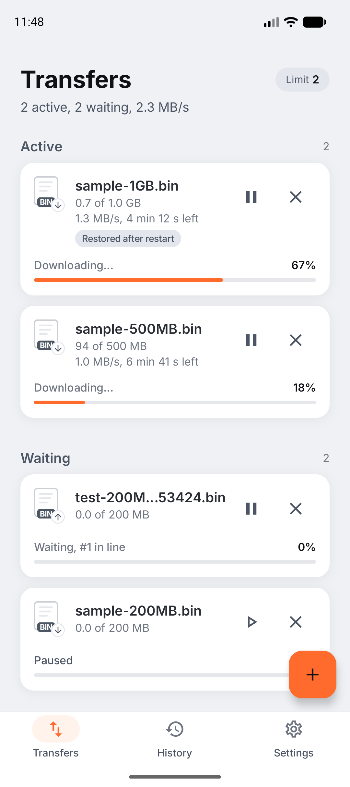
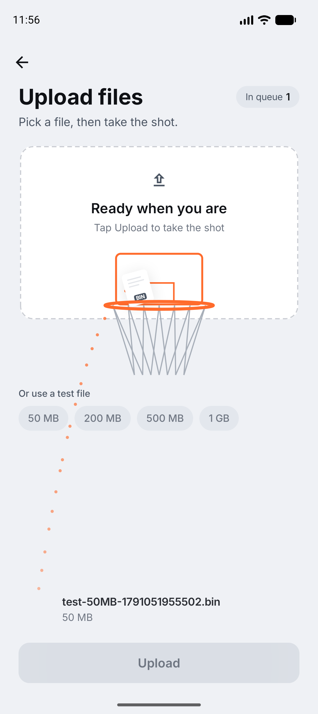
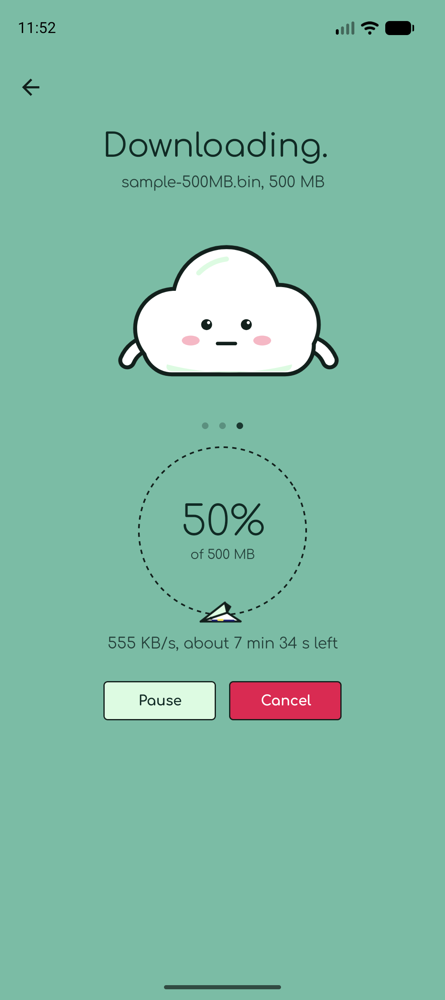
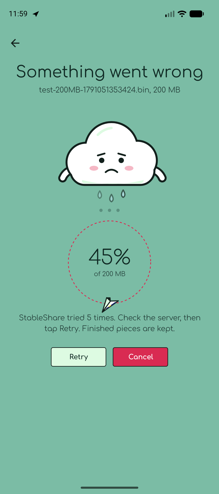
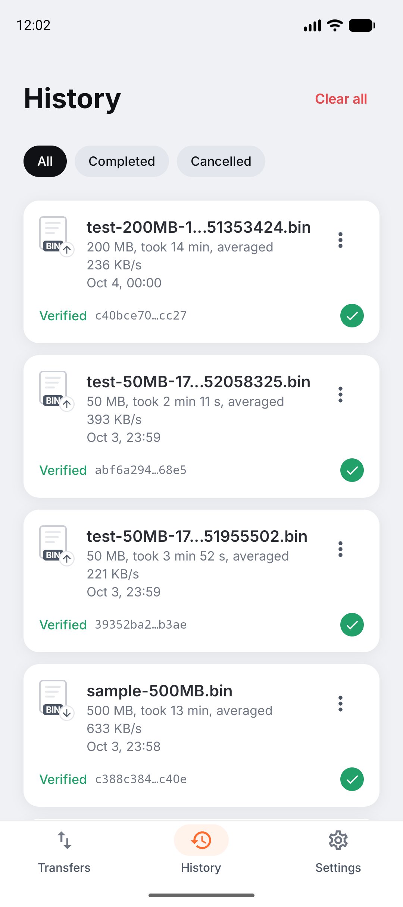
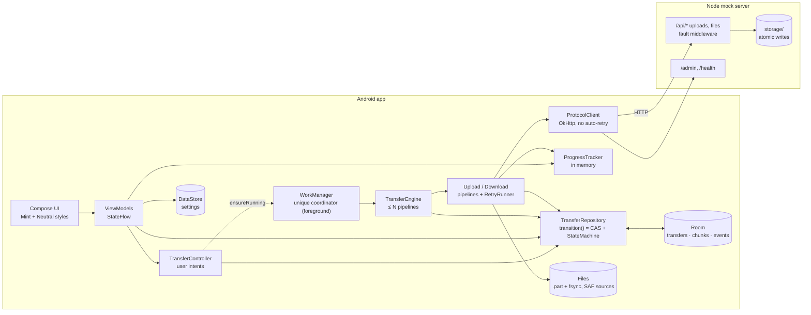
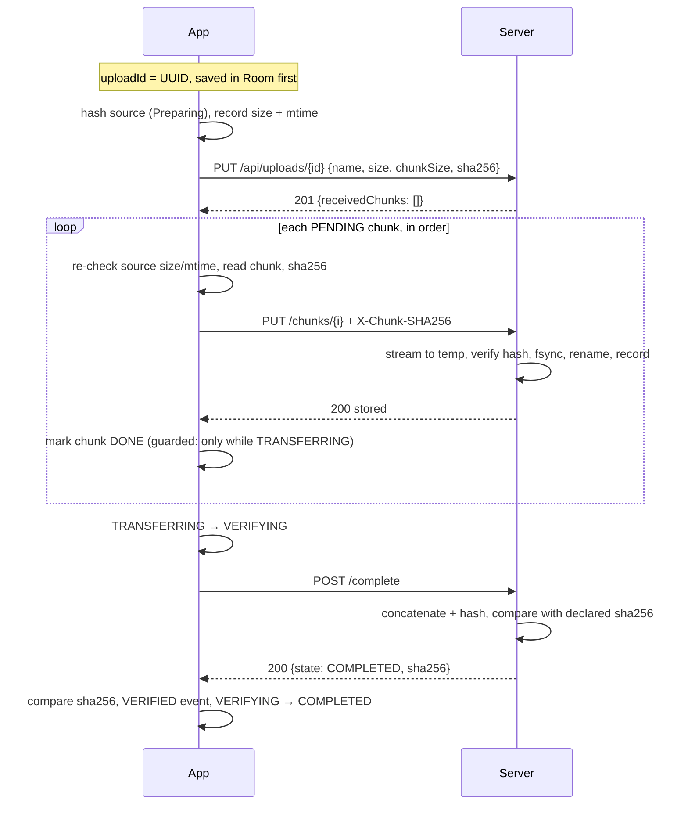
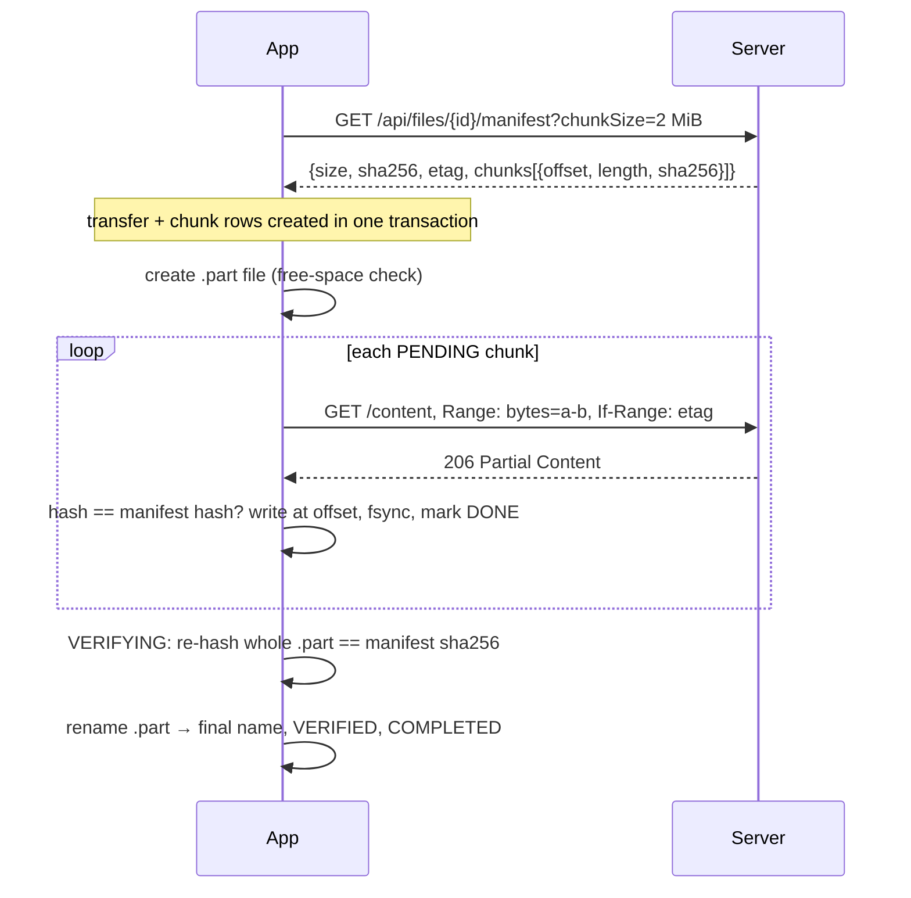
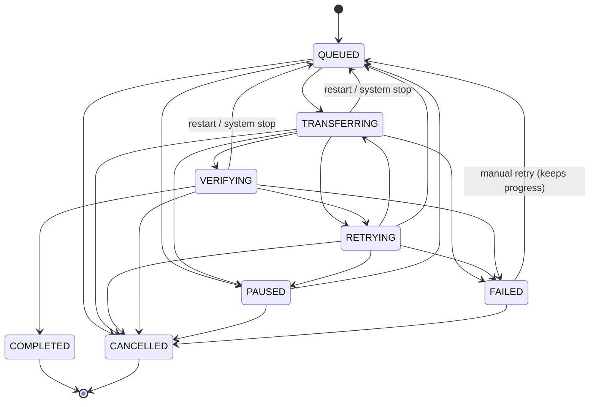

# StableShare

StableShare is an Android app (Kotlin, Jetpack Compose) that uploads and downloads files of up to 1 GB to a local Node.js mock server, and keeps going through everything a phone throws at it: pause and resume, lost or flapping networks, timeouts, lost responses, server errors, app kills and restarts. Files move in SHA-256-checked pieces, every state change is a validated compare-and-set in Room, retries are bounded and deliberate, and a transfer only shows **Completed** after the whole file has been verified end to end. The mock server injects faults on demand (from the app's own network simulator), so all of this can be watched happening.

| | | | | | |
|---|---|---|---|---|---|
|  |  |  |  |  |  |

All screenshots are in [docs/screenshots](docs/screenshots). The design is in [docs/DESIGN.md](docs/DESIGN.md) (engine) and [docs/UI-SPEC.md](docs/UI-SPEC.md) (UI).

---

## Contents
1. [Features](#1-features)
2. [Quick start](#2-quick-start)
3. [Architecture](#3-architecture)
4. [Transfer protocol](#4-transfer-protocol)
5. [Persistence](#5-persistence)
6. [State machine](#6-state-machine)
7. [Concurrency](#7-concurrency)
8. [Retry and recovery](#8-retry-and-recovery)
9. [Data integrity](#9-data-integrity)
10. [Lifecycle](#10-lifecycle)
11. [UI and design](#11-ui-and-design)
12. [Edge cases](#12-edge-cases)
13. [Testing](#13-testing)
14. [Limitations and future work](#14-limitations-and-future-work)
15. [Project structure](#15-project-structure)

---

## 1. Features

### The 12 requirements

| # | Requirement | How StableShare meets it | Code |
|---|---|---|---|
| 1 | Upload large files (up to 1 GB) in chunks | Client-generated upload id, idempotent session create, 1/2/5 MB pieces each sent with `X-Chunk-SHA256`, sequential per transfer. Files come from the system picker (SAF, persisted read grant) or are generated test files. | [UploadPipeline](android/app/src/main/java/com/maanit/stableshare/engine/UploadPipeline.kt), [FileStore](android/app/src/main/java/com/maanit/stableshare/data/files/FileStore.kt), [server uploads](server/src/routes/uploads.js) |
| 2 | Download large files with ranged requests | Manifest with per-chunk hashes, `Range` + `If-Range` per chunk, written into a per-transfer `.part` file at its offset. | [DownloadPipeline](android/app/src/main/java/com/maanit/stableshare/engine/DownloadPipeline.kt), [server files](server/src/routes/files.js) |
| 3 | Pause and resume | Pause is a CAS to PAUSED; the coordinator cancels the job (and its OkHttp call). Resume continues after the last DONE chunk; uploads re-sync from the server's list. | [TransferController](android/app/src/main/java/com/maanit/stableshare/engine/TransferController.kt), [TransferEngine](android/app/src/main/java/com/maanit/stableshare/engine/TransferEngine.kt) |
| 4 | Survive network loss and resume automatically | No network = RETRYING `NETWORK_UNAVAILABLE`, no attempt consumed, slot released; a usable-network edge (NetworkCallback) or a CONNECTED WorkManager wake-up resumes it; with Wi-Fi only on, a metered network counts as unusable (METERED_NETWORK). | [ConnectivityMonitor](android/app/src/main/java/com/maanit/stableshare/engine/ConnectivityMonitor.kt), [ErrorClassifier](android/app/src/main/java/com/maanit/stableshare/data/net/ErrorClassifier.kt) |
| 5 | Timeouts and server errors with bounded retries | Classified RETRYABLE / WAITING / FATAL; full-jitter exponential backoff (1 s base, ×2, 30 s cap), 5 attempts per chunk, persisted; then FAILED `RETRIES_EXHAUSTED` with progress kept. | [RetryRunner](android/app/src/main/java/com/maanit/stableshare/engine/RetryRunner.kt), [RetryPolicy](android/app/src/main/java/com/maanit/stableshare/domain/RetryPolicy.kt) |
| 6 | Lost responses | A timed-out chunk PUT or `complete` is followed by `GET status` before any resend; the server dedupes identical chunks (`already_received`) and `complete` is idempotent. | [UploadPipeline](android/app/src/main/java/com/maanit/stableshare/engine/UploadPipeline.kt) (`confirmedViaStatus`) |
| 7 | App kill, process death, restart, reboot | Room is the source of truth; WorkManager re-runs the unique coordinator; restart reconciliation moves TRANSFERRING/VERIFYING back to QUEUED; the UI marks them "Restored after restart". | [TransferRepository](android/app/src/main/java/com/maanit/stableshare/data/repo/TransferRepository.kt) (`reconcileAfterProcessStart`), [RestoredTransfers](android/app/src/main/java/com/maanit/stableshare/engine/RestoredTransfers.kt) |
| 8 | Only COMPLETED after the whole file is verified | Uploads: the server re-hashes the assembled file and the client compares its hash. Downloads: the client re-hashes the whole `.part` file. COMPLETED is reachable only from VERIFYING. | [StateMachine](android/app/src/main/java/com/maanit/stableshare/domain/StateMachine.kt), both pipelines |
| 9 | Cancel with cleanup | CANCELLED wins the CAS first (terminal, never revived), then the job is stopped and the server session or local file is deleted in `NonCancellable`. | [TransferController](android/app/src/main/java/com/maanit/stableshare/engine/TransferController.kt) |
| 10 | Several transfers at once, with a limit | One coordinator runs at most N (1–4, default 2) pipelines; the limit applies immediately from Settings. | [TransferEngine](android/app/src/main/java/com/maanit/stableshare/engine/TransferEngine.kt), [WorkManagerScheduler](android/app/src/main/java/com/maanit/stableshare/worker/WorkManagerScheduler.kt) |
| 11 | Progress, speed and ETA | In-memory tracker (committed bytes + bytes in flight, EMA speed, ETA) drives rows, the detail ring, the chunk map and the ongoing notification. | [TransferProgressTracker](android/app/src/main/java/com/maanit/stableshare/engine/TransferProgressTracker.kt), [TransferRow](android/app/src/main/java/com/maanit/stableshare/ui/components/TransferRow.kt) |
| 12 | Deliverables: source, README, signed APK | This repository, this README, [docs/DESIGN.md](docs/DESIGN.md), and `release/StableShare-1.0.0.apk`. | [release/](release) |

### Beyond the requirements
- **Wi-Fi only** (Settings → Transfers): when on, no transfer request goes over a metered network. Running transfers stop within 1.5 s of losing Wi-Fi (brief roaming blips are ignored) without using a retry attempt, show "Waiting for Wi-Fi", and resume by themselves on Wi-Fi; a banner on Transfers explains why. See §8 and [DESIGN.md §7](docs/DESIGN.md#7-retry-and-error-classification).
- **Network simulator in the app** (Settings): presets (Slow network, Flaky Wi-Fi, Lost responses, Corruption, Chaos), per-fault sliders and live injected-fault counters from `/admin/stats`.
- **Per-transfer activity log** (every state change, piece run, retry, lost-response confirmation) and a live **chunk map** on the detail screen.
- **Mascot-led UI** with two deliberate visual styles, full reduced-motion support and accessibility semantics (§11).
- **Notifications**: an ongoing one while transfers run, and completion and failure notifications that open the transfer.
- **Reproducible chaos**: the server's faults come from a seeded PRNG; `server/scripts/chaos-test.sh` kills and resumes a CLI client mid-transfer.
- **Open and Share** completed downloads (FileProvider), History with filters.

---

## 2. Quick start

### Prerequisites
- Node.js 20 or newer.
- An Android 8.0+ device or emulator (minSdk 26; tested on an API 37 emulator).
- To build from source: Android Studio (bundled JBR) with SDK 37.

### Server
```sh
cd server
npm install
npm run seed     # deterministic sample files: 0 B, 3 MB + 123 B, 50 MB, 200 MB, 500 MB, 1 GB
npm run dev      # http://0.0.0.0:8080, restarts on change (npm start without watching)
npm test         # 32 protocol, range, restart and fault tests
```

### App
- **Install the APK:** `adb install -r release/StableShare-1.0.0.apk`
- **Or build it:** from `android/`, `./gradlew assembleDebug` (debug) or `./gradlew assembleRelease` (needs `android/keystore.properties` with `storeFile`, `storePassword`, `keyAlias`, `keyPassword`; without it the release APK is unsigned).

### Server address
- **Emulator:** the default `http://10.0.2.2:8080` reaches the host machine.
- **Phone:** in Settings → Server address, enter your computer's LAN address (for example `http://192.168.1.20:8080`); both must be on the same Wi-Fi. "Test connection" checks it.
- **Android 17+** asks for the nearby-devices (local network) permission during onboarding; without it, traffic to private addresses silently times out.

### Using the network simulator
Settings → Network simulator: pick a preset (or open Advanced and set each fault), tap **Apply**. The live counters show what the server injected. **Reset** turns everything off and zeroes the counters. Faults apply to every client of that server.

---

## 3. Architecture



**Layers** (package `com.maanit.stableshare`):
- `domain`: pure rules: the [StateMachine](android/app/src/main/java/com/maanit/stableshare/domain/StateMachine.kt) table and allowed actions, [RetryPolicy](android/app/src/main/java/com/maanit/stableshare/domain/RetryPolicy.kt), [ChunkPlanner](android/app/src/main/java/com/maanit/stableshare/domain/ChunkPlanner.kt). No I/O, no clocks.
- `data`: Room ([Entities](android/app/src/main/java/com/maanit/stableshare/data/db/Entities.kt), [Daos](android/app/src/main/java/com/maanit/stableshare/data/db/Daos.kt)), the [TransferRepository](android/app/src/main/java/com/maanit/stableshare/data/repo/TransferRepository.kt) (the only writer of state), [ProtocolClient](android/app/src/main/java/com/maanit/stableshare/data/net/ProtocolClient.kt) + [ErrorClassifier](android/app/src/main/java/com/maanit/stableshare/data/net/ErrorClassifier.kt), [FileStore](android/app/src/main/java/com/maanit/stableshare/data/files/FileStore.kt), [SettingsRepository](android/app/src/main/java/com/maanit/stableshare/data/settings/SettingsRepository.kt).
- `engine`: the coordinator loop ([TransferEngine](android/app/src/main/java/com/maanit/stableshare/engine/TransferEngine.kt)), the two pipelines, [RetryRunner](android/app/src/main/java/com/maanit/stableshare/engine/RetryRunner.kt), [TransferController](android/app/src/main/java/com/maanit/stableshare/engine/TransferController.kt), progress, connectivity, bootstrap.
- `worker`: thin WorkManager wrappers, notifications.
- `ui`: Compose screens and ViewModels; a pure presentation model in [`ui/model`](android/app/src/main/java/com/maanit/stableshare/ui/model) (state → words, colours, moods) that is unit-tested on its own.
- `di`: [AppContainer](android/app/src/main/java/com/maanit/stableshare/di/AppContainer.kt), manual dependency injection.

**Why each technology:**
- **Jetpack Compose + Material 3**: the UI is mostly custom drawing (ring, plane, chunk map, hoop) and state-driven animation; Compose makes both declarative and testable.
- **Room**: transactional SQLite with observable queries. The state CAS (`UPDATE … WHERE state = :expected`) and the guarded chunk writes are plain SQL, and multi-row changes are atomic.
- **WorkManager**: survives process death and reboot, supports expedited foreground work with a `dataSync` type, constraints (network) and unique work, so there is exactly one coordinator.
- **OkHttp, no Retrofit**: streaming request bodies with progress, cancellable calls, and full control: `retryOnConnectionFailure(false)` so every retry is our decision.
- **Coroutines + Flow**: structured cancellation reaches the socket on pause/cancel; Room, DataStore and the tracker all expose Flows.
- **kotlinx-serialization, DataStore**: small, reflection-free JSON; typed preferences.
- **Manual DI** (no Hilt): a single container is enough and keeps tests explicit.
- **Express 5 server**: async handlers, one dependency; storage is plain files written atomically.

---

## 4. Transfer protocol

Full specification with error codes: [DESIGN.md §3](docs/DESIGN.md#3-transfer-protocol).

| Method | Path | Purpose |
|---|---|---|
| `PUT` | `/api/uploads/:id` | Create the session (client UUID); idempotent: `201` new, `200` identical |
| `PUT` | `/api/uploads/:id/chunks/:index` | One chunk, `X-Chunk-SHA256`; `200 stored` or `200 already_received`; `422` on a hash mismatch |
| `GET` | `/api/uploads/:id` | Received chunk list (resume, and after any ambiguous failure); `sha256` once COMPLETED |
| `POST` | `/api/uploads/:id/complete` | Assemble, verify the full SHA-256, `COMPLETED`; idempotent; `409 MISSING_CHUNKS` lists gaps |
| `DELETE` | `/api/uploads/:id` | Cancel cleanup; idempotent |
| `GET` | `/api/files` | Downloadable files |
| `GET` | `/api/files/:id/manifest?chunkSize=` | Size, SHA-256, ETag, per-chunk offsets and hashes |
| `GET` | `/api/files/:id/content` | `Range` + `If-Range`; `206`, or `200` if the file changed, `416` if unsatisfiable |
| `GET` | `/health` | `{"ok":true}` |
| `GET`/`PUT` | `/admin/faults` | Fault configuration (never faulted itself) |
| `POST` | `/admin/faults/reset` | Defaults, zeroed stats |
| `GET` | `/admin/stats` | Requests and injected-fault counters |

### Upload


### Download


### Lost response
```mermaid
sequenceDiagram
  participant A as App
  participant S as Server
  A->>S: PUT /chunks/7 (whole body written)
  S->>S: chunk stored and fsynced
  S--xA: connection dropped before the 200
  Note over A: timeout / reset = ambiguous: do not resend yet
  A->>S: GET /api/uploads/{id}
  S-->>A: receivedChunks [.., 7]
  A->>A: chunk 7 DONE, CHUNK_CONFIRMED_AFTER_LOST_RESPONSE, no attempt used
  Note over A,S: had 7 been missing, the client resends; a racing duplicate gets 200 already_received
```
The same check protects `complete`: after an ambiguous failure the client asks for status, and a COMPLETED session (with a matching `sha256`) completes the transfer; otherwise `complete` is called again, which is safe because it is idempotent.

---

## 5. Persistence

- **Room (`stableshare.db`)** holds three tables ([schema](android/app/schemas)):
  - `transfers`: one row per transfer: type, file name and size, local URI, remote id, chunk size and count, expected SHA-256, ETag, `state`, `bytesDone`, error code and message, attempts, `nextRetryAt`, timestamps.
  - `chunks`: one row per piece: offset, length, hash, `PENDING/DONE/FAILED`, attempts.
  - `transfer_events`: an append-only log (state changes, pieces, retries, lost-response confirmations, verification), shown as the detail screen's Activity.
- **Only `TransferRepository.transition()` writes `state`**, as a compare-and-set validated by the StateMachine, logged in the same transaction. Chunk progress is written only while the transfer is TRANSFERRING, enforced in the SQL itself:
  ```sql
  UPDATE chunks SET status = 'DONE' … WHERE transferId = :id AND `index` = :i
    AND (SELECT state FROM transfers WHERE id = :id) = 'TRANSFERRING'
  ```
  so a paused, cancelled or stale job writes nothing.
- **Write ordering:** bytes first, then fsync, then the database, never the reverse. Downloads `fsync` the `.part` file before marking a chunk DONE; uploads mark DONE only after the server's 2xx (the server fsyncs before replying). The database never claims bytes that do not exist.
- **Settings** (server URL, concurrency, piece size, auto-retry, onboarding flag) live in DataStore.
- **Server:** every metadata file is written temp → fsync → rename → fsync directory; chunk files are renamed only after their hash checks out. Sessions survive server restarts; idle sessions expire after 24 h.
- **Not persisted on purpose:** live speed/ETA and the in-flight chunk (in memory, rebuilt from the database), and backups (`allowBackup=false`: a restored database without its part files would be inconsistent).

---

## 6. State machine



| State | Meaning | User actions (`StateMachine.allowedActions`) |
|---|---|---|
| QUEUED | Waiting for a slot (shows its place in line) | Pause, Cancel |
| TRANSFERRING | A pipeline is moving pieces (or hashing the source, "Preparing") | Pause, Cancel |
| RETRYING | Backing off after a retryable error, or waiting for the network | Pause, Cancel |
| VERIFYING | Whole-file check (server `complete` or local re-hash) | Cancel |
| PAUSED | Stopped by the user, progress kept | Resume, Cancel |
| FAILED | Fatal error or retries exhausted, progress kept | Retry, Cancel |
| COMPLETED | Verified | (Remove from history) |
| CANCELLED | Stopped and cleaned up | (Remove from history) |

Every button in the UI comes from `allowedActions(state)`, and every action is a repository transition, so the UI cannot produce an illegal state. Transitions are compare-and-set: a pipeline that loses the race (the user paused or cancelled meanwhile) updates zero rows and exits.

**Why CANCELLED is terminal.** Cancelling deletes the server session or the local partial file. A transition out of CANCELLED would resurrect a transfer whose data no longer exists, so nothing leaves it: not reconciliation, not a late pipeline, not a pending retry. The CAS to CANCELLED happens *before* cleanup, so even a retry timer that fires during cleanup finds the row CANCELLED and stops. COMPLETED is terminal for the matching reason: its bytes are verified, and nothing may change them.

---

## 7. Concurrency

- **One coordinator.** [TransferCoordinatorWorker](android/app/src/main/java/com/maanit/stableshare/worker/TransferCoordinatorWorker.kt) is unique WorkManager work wrapping `TransferEngine.run()`, guarded by a mutex. It runs at most `maxConcurrent` (1–4) pipelines, each in a `SupervisorJob` scope; pieces within one transfer are sequential (bounded memory, simple write ordering).
- **Event-driven, no polling.** The loop wakes on Room changes, the concurrency setting, connectivity edges, job completions, and the earliest `nextRetryAt` of a backoff it does not own. Claiming is one transaction (`claimNextQueued`), oldest first, skipping transfers whose pipeline is still alive in this process (a pipeline backing off keeps its slot).
- **Raising the limit** fills new slots at once; **lowering** it lets running transfers finish.
- **The APPEND_OR_REPLACE race.** The coordinator exits when nothing is runnable, but WorkManager still reports the work as RUNNING for a moment. With `KEEP`, a new transfer created in that window would be dropped and stranded. With `APPEND_OR_REPLACE`, the request is chained after the exiting run (or replaces a failed chain). To avoid needless chained runs, `ensureRunning()` skips enqueueing while `TransferEngine.isAcceptingWork()` is true, and the exit path clears that flag *before* its final database check, so any row written before a caller saw the flag is caught by that check.
- **Exit and wake-up.** When only backoffs or network waits remain, the coordinator exits and schedules a wake-up worker (earliest `nextRetryAt`, `CONNECTED` constraint, 5 s floor for network waits).
- **Foreground and notification.** The coordinator runs as a `dataSync` foreground service with an ongoing notification. If Android refuses the foreground start (a run that began in the background), the work continues and the promotion is retried every 10 s, which succeeds once the app is in the foreground ([ForegroundPromoter](android/app/src/main/java/com/maanit/stableshare/worker/ForegroundPromoter.kt)).

---

## 8. Retry and recovery

### Classification
| Class | Examples | What happens |
|---|---|---|
| **RETRYABLE** | timeout, connection reset or dropped body, HTTP 5xx (not 507), 429, a piece corrupted in transit (hash mismatch) | RETRYING, backoff, retry the same step; uses one of the piece's 5 attempts |
| **WAITING** | no network, or a metered one while Wi-Fi only is on | RETRYING `NETWORK_UNAVAILABLE` / `METERED_NETWORK`, **no attempt used**, job ends and frees its slot; resumes when the network is usable again |
| **FATAL** | session or file gone (404), conflict (409), 413, 416, remote file changed (200 instead of 206), source changed or missing, whole-file hash mismatch, disk full | FAILED with a code and message; manual Retry keeps finished pieces |

Mapping table: [DESIGN.md §7](docs/DESIGN.md#7-retry-and-error-classification); code: [ErrorClassifier](android/app/src/main/java/com/maanit/stableshare/data/net/ErrorClassifier.kt).

### Wi-Fi only
A request on mobile data succeeds, so error handling alone cannot keep data off it. `ConnectivityMonitor` reports `NetworkState` (Offline, Metered, Unmetered) and `usableNetwork` (Metered counts only while Wi-Fi only is off), and:
- **The coordinator claims nothing** while the network is unusable; it exits with a WorkManager wake-up constrained to `UNMETERED` (Wi-Fi only) or `CONNECTED`.
- **`NetworkGuard`** wraps every request the engine makes: a request waits up to 1.5 s for a usable network before it starts, and is cancelled (with its OkHttp call) once the network has been unusable for 1.5 s. That stops a transfer as `RETRYING METERED_NETWORK` with no attempt used; finished pieces stay finished. Turning the switch on over mobile data does the same. A backoff in progress is cut short too.
- **Resuming:** when the network becomes usable, waiting rows go back to QUEUED and the coordinator restarts. Rows that are PAUSED or CANCELLED are never touched. While waiting, a row's code follows the network (METERED_NETWORK on mobile data, NETWORK_UNAVAILABLE offline).
- Only transfer traffic is gated; things you start yourself (Test connection, the server file list, the simulator) still go out.

### Backoff
```
delay(attempt) = uniform(0, min(30 s, 1 s × 2^(attempt − 1)))     attempt = 1, 2, … 5
```
Full jitter avoids synchronized retries. A server `Retry-After` is honoured as a lower bound (still capped at 30 s). Attempts are persisted per chunk (`chunks.attempts`), so a restart does not refill the budget; non-chunk steps (create session, status, complete, local hash) have an in-memory budget of 5 per run. A lost response confirmed by status consumes nothing. With "Retry automatically" off, the first retryable error fails the transfer.

### No infinite loops
Every loop is bounded:
- **Pieces:** each retry consumes a persisted attempt, at most 5, then FAILED `RETRIES_EXHAUSTED`.
- **Non-chunk steps:** at most 5 per pipeline run.
- **Restarts inside a pipeline:** at most 2 `MISSING_CHUNKS` re-syncs, at most 1 session recreation, at most 1 whole-file mismatch repair.
- **Network waits:** these end the job; only an external usable-network edge or a CONNECTED/UNMETERED wake-up (5 s floor) restarts it. The guard's wait before a request is at most 1.5 s.
- **The coordinator:** blocks on events or a deadline, and exits when nothing is runnable.

So every failure ends in success, a consumed attempt, an external signal, or FAILED.

### OkHttp and connections
`retryOnConnectionFailure(false)` means OkHttp never retries silently. Idle connections are evicted after 4 s, before the server's 5 s keep-alive closes them; otherwise a GET after an idle period (a Range request after a backoff, a health check) could reuse a dead socket and fail once.

### Restart reconciliation
On every coordinator start (once per process in practice) `reconcileAfterProcessStart()` moves TRANSFERRING and VERIFYING rows, which were in flight when the process died, back to QUEUED, logs "Reconciled after process start", and records their ids in an in-memory set so the UI can show **Restored after restart**. RETRYING rows keep their persisted backoff. QUEUED, PAUSED, FAILED, COMPLETED and CANCELLED are never touched. Uploads then re-sync from the server's received list (the server is the source of truth); downloads re-hash their newest DONE pieces on disk.

### Corrupted-partial recovery (downloads)
1. **Tail check on resume:** the last 2 DONE pieces are re-hashed from the `.part` file; a mismatch goes back to PENDING.
2. **Whole-file check:** any older damage fails the full SHA-256 in VERIFYING; every piece is then re-hashed on disk and only the bad ones are fetched again (one repair per run; a second mismatch is FAILED `FILE_HASH_MISMATCH`).
3. **Missing or resized `.part` file:** all pieces reset and the file is recreated after a free-space check.

---

## 9. Data integrity

- **Per piece:** uploads send `X-Chunk-SHA256` and the server rejects a mismatch (`422`) before storing anything; downloads hash each Range body and compare it with the manifest *before* writing it.
- **Whole file:** uploads: the server hashes while assembling and compares with the hash declared at create, then the client compares the returned hash with its own. Downloads: the client re-hashes the finished `.part` file. COMPLETED is only reachable from VERIFYING after that check (rule 3).
- **Source integrity:** the upload source is hashed before the session exists; its size and modification time are re-checked before every piece (`SOURCE_CHANGED`, `SOURCE_MISSING`).
- **Remote integrity:** every Range request carries `If-Range: <etag>`; a changed file answers `200` instead of `206`, which is `REMOTE_FILE_CHANGED` (the body is not consumed).
- **Atomic finalisation:** the `.part` file is renamed to its final name only after verification, never overwriting an existing file ("name (1).ext").

---

## 10. Lifecycle

| Situation | Behaviour |
|---|---|
| App in background | Transfers run in the foreground service, not the Activity; the UI only observes Room. |
| Swipe away / process death / crash | WorkManager re-runs the coordinator; reconciliation requeues in-flight rows; transfers resume from the last fsynced piece and show "Restored after restart". Verified on the emulator with `kill -9`. |
| Reboot | WorkManager re-enqueues its persisted work after boot. |
| System stop (quota, the 6-hour `dataSync` limit, constraints, WorkManager reschedule) | An interruption, not a failure: running rows go back to QUEUED with an INFO event ("Interrupted by a system stop (reason)"), no error code, no attempt used; rows the user paused meanwhile are untouched; a 15 s backstop wake-up is scheduled. The stop reason is logged. |
| Network lost / restored | §8: wait without using attempts, resume on the edge. |
| Wi-Fi ↔ mobile data (Wi-Fi only on) | Running transfers stop within 1.5 s and wait as "Waiting for Wi-Fi"; queued ones are not started; they resume by themselves on Wi-Fi. Verified on the API 37 emulator with `adb shell svc wifi disable/enable` during a 200 MB upload: `/admin/stats` `apiRequests` stayed flat for 25–70 s on mobile data in each of three cycles, and the upload finished verified. |
| **Force stop** | **Platform limitation:** Android cancels every job and alarm of a force-stopped app and forbids restarting it until the user opens it again. Transfers stay in their persisted state. On the next launch the app reads the exit reason (`REASON_USER_REQUESTED`, API 30+) and pauses interrupted transfers instead of resuming them; the user resumes them. This is documented, not worked around. |
| Notification permission denied | Transfers run normally; notifications are simply not shown. |
| Local network permission denied (Android 17+) | Transport errors to the private-range server become FAILED "Local network permission denied" instead of burning retries; Retry works once granted. |

---

## 11. UI and design

The UI follows [docs/UI-SPEC.md](docs/UI-SPEC.md) exactly. It has two deliberately different styles that share one mascot:

| Style | Look | Screens |
|---|---|---|
| **Mint** | mint background, rounded Comfortaa type, line-art mascot, centred layout | Splash, Onboarding, Transfer detail |
| **Neutral** | light grey page, white cards, Inter type, orange accent | Transfers, Upload (hoop), Download sheet, History, Settings, all dialogs and sheets |

Both are locked token sets (`MintTokens`, `NeutralTokens`) provided as CompositionLocals by [StableShareTheme](android/app/src/main/java/com/maanit/stableshare/ui/theme/Theme.kt): light theme only, no dynamic colour, bundled fonts (OFL licences in the app).

**The mascot.** Nimbus the cloud and Dart the paper plane tell you a transfer's state at a glance. On the detail screen the plane flies on the progress ring.


| State | Mood | Plane |
|---|---|---|
| QUEUED | focused, breathing | perched on the cloud |
| TRANSFERRING (Preparing) | focused | hovering above the cloud |
| TRANSFERRING | focused, data drops pulsing | on the ring at the progress angle, bobbing |
| VERIFYING | focused | lapping the ring |
| RETRYING | worried | on the ring, wobbling |
| Waiting for network | searching (face scans side to side) | perched |
| PAUSED | sleepy | parked on the ring |
| FAILED | sad, rain falling | bottom of the ring, nose down |
| COMPLETED | happy, waves | one fast lap, then 12 o'clock; the ring closes into a solid line |
| CANCELLED | calm | fades away |

**The hoop.** Uploading is a throw: the file chip arcs into a basketball hoop, drops through the net, a "+1" pops and the queue counter ticks up. The transfer is created *before* the animation plays, so the celebration never lies.

**Accessibility and reduced motion.**
- Every interactive element has a content description and a 48 dp touch target; the mascot is one accessibility node ("StableShare cloud, smiling, transfer complete").
- Progress bars and the ring expose range info and a state description ("Uploading, 42 percent"); the chunk map is one node described by its summary.
- Colour is never the only signal: every state has a text label. Text meets WCAG AA contrast (the spec darkens a few source colours for this).
- With **Remove animations** on (animator duration scale 0), the splash is static for 600 ms, the mascot stops breathing/bobbing/waving, the ring stops rotating, the throw becomes a fade, and nothing slides. Layouts scroll so they stay usable at 200% font scale.

---

## 12. Edge cases

From [DESIGN.md §11](docs/DESIGN.md#11-edge-case-catalogue), where each one names its tests.

| # | Scenario | Behaviour |
|---|---|---|
| 1 | Zero-byte file | Upload: 0 chunks, `complete` straight away. Download: empty manifest, verified empty file. |
| 2 | Size not divisible by the piece size | Last piece is shorter; server and manifest agree on its length. |
| 3 | Duplicate chunk | `200 already_received`, not rewritten, counted in stats. |
| 4 | Wrong-hash chunk | `422`, nothing stored, client retries (one attempt). |
| 5 | Wrong-length chunk | `400`/`413`, fatal (a client bug). |
| 6 | Lost response after a chunk was stored | Status shows it: no resend, no attempt used. |
| 7 | `complete` response lost | Status says COMPLETED with the hash: verified and completed. |
| 8 | Server restart mid-transfer | All metadata on disk; client waits/retries, then resumes from status. |
| 9 | Session expired or lost | Recreated once with the same id; a second loss is FAILED `SESSION_NOT_FOUND`. |
| 10 | Remote file changed mid-download | `If-Range` gives 200: FAILED `REMOTE_FILE_CHANGED`, `.part` kept until cancelled. |
| 11 | Source edited or deleted mid-upload | FAILED `SOURCE_CHANGED` / `SOURCE_MISSING`. |
| 12 | Disk full | Server: 507. Client: free-space check, ENOSPC is FAILED `DISK_FULL`. |
| 13 | Pause during a chunk write | Call cancelled; the partial piece is never marked DONE (guarded write). |
| 14 | Cancel during a chunk write | CAS to CANCELLED wins; later writes match 0 rows; session / `.part` deleted. |
| 15 | Cancel while backing off | The cancel wins the CAS; the retry's `RETRYING → TRANSFERRING` fails and the job exits. |
| 16 | App killed during VERIFYING | Requeued; `complete` (idempotent) or the local re-hash runs again. |
| 17 | Network flapping | Each loss waits without attempts; each return resumes. |
| 18 | Same file twice | Separate upload ids / distinct download names, no shared partial files. |
| 19 | Download body corrupted in transit | Piece hash fails: refetched (one attempt); 5 failures: `RETRIES_EXHAUSTED`. |
| 20 | Request hangs forever | Read timeout: retryable and ambiguous, status checked before resending. |
| 21 | Client killed mid-transfer | Resumes from Room after verification of what was written. |
| 22 | Crash between a write and the DB update | The piece stays PENDING (download) or status reports it (upload). |
| 23 | Same upload id, different parameters | `409 SESSION_CONFLICT`, fatal. |
| 24 | Partial download damaged on disk while the app was down | Tail re-hash, then whole-file check repairs only bad pieces. |
| 25 | Too many transfers | At most `maxConcurrent`; changes apply immediately. |
| 26 | System stop | Requeued without error or attempt; paused rows untouched. |
| 27 | Backoff across coordinator exits | Wake-up at the earliest `nextRetryAt`. |
| 28 | Server keeps failing a piece | 5 attempts, then FAILED with finished pieces kept; Retry sends only the rest. |
| 29 | Idle keep-alive closed by the server | Pool evicts idle sockets first (4 s < 5 s), no wasted attempt. |
| 30 | Coordinator started in the background | Foreground promotion retried until allowed, so the notification appears. |
| 31 | Wi-Fi lost with Wi-Fi only on | Requests stopped within 1.5 s, RETRYING `METERED_NETWORK` without using attempts, nothing claimed on mobile data; resumes on Wi-Fi. |

---

## 13. Testing

| Suite | Command | Count | What it covers |
|---|---|---|---|
| Server | `cd server && npm test` | 32 | Protocol, idempotency, ranges and `If-Range`, restart durability, session expiry, every fault type |
| Chaos (CLI client) | `cd server && npm run chaos` | 1 scenario | 200 MB up and down under errors, drops, lost responses and corruption, each run `kill -9`'d mid-transfer and resumed; asserts the hashes and that faults fired |
| Android JVM | `cd android && ./gradlew testDebugUnitTest` | 282 | Wi-Fi only (network guard and 1.5 s debounce, gate, re-coding, resume; virtual time), state machine, repository CAS and guards (in-memory Room), protocol client (MockWebServer), classifier, retry policy, the real engine against an in-memory server with virtual time (pause, cancel, system stop, process death, lost responses, corruption, network loss), notifications, and Compose UI tests under Robolectric |
| Android instrumented | `cd android && ./gradlew connectedDebugAndroidTest` | 2 | App launch; a file picked through the real system picker (SAF) uploads to the running mock server with a persisted read grant and a server-verified hash |

The Compose UI tests check:
- every state's label and allowed buttons (COMPLETED and CANCELLED rows have no Pause or Resume)
- cancel asks for confirmation
- Skip and Get started set the onboarding flag and land on Transfers
- Upload stays disabled until a file is ready
- the chunk-map summary text
- the concurrency setting persists
- reduced motion skips the splash animation

The presentation model is tested separately: the 99 % cap, formatting, activity messages generated by the real engine, and the state table.

### Manual demo script (about 10 minutes)
1. `cd server && npm run seed && npm run dev`; install the APK; open it, read the intro, **Get started**, allow both permissions.
2. **Download:** + → Download from server → `sample-200MB.bin`. Open it: the plane rides the ring, the chunk map fills.
3. **Upload:** + → Upload a file → **200 MB** test chip → **Upload**. Watch the throw; the row appears below.
4. **Pause / resume** the download from its row; the detail screen turns sleepy and the plane parks.
5. **Chaos:** Settings → Network simulator → **Flaky Wi-Fi** → Apply. Watch rows flip to "Retrying in 3 s" and back; the detail Activity logs each failed piece and retry; the stats counters rise.
6. **Kill the process mid-transfer:** `adb root`, then `adb shell kill -9 $(adb shell pidof com.maanit.stableshare)` (needs an emulator image without Google Play, which allows root). Reopen the app: the transfers show **Restored after restart** and continue from the last verified piece.
7. **Airplane mode** on, then off: rows show "Waiting for network", then resume by themselves without using attempts.
8. When both finish: solid ring, happy cloud, a completion notification, and **Verified** with the hash in History. Open the downloaded file from its overflow menu.
9. Settings → Reset the simulator.

---

## 14. Limitations and future work

- **Force-stop** cannot be survived (platform rule); transfers resume on the next launch.
- **Cleartext HTTP** to the local mock server only (network security config); a real deployment needs TLS and authentication.
- **One piece at a time per transfer.** Parallel pieces within a transfer would be faster on high-latency links; the write-ordering and progress model would need per-piece state.
- **`REMOTE_FILE_CHANGED` retry** reuses the stored ETag and fails again; the user must cancel and download again. A "Download again" action that fetches a fresh manifest would be nicer.
- **Generated test files are never deleted** after their upload.
- **Rare crash windows:** a crash between the final rename and recording the new path re-downloads the file (the verified copy is left orphaned); a cancel whose cleanup is cut short by process death leaves a server session (expires in 24 h) or a local file.
- **Server disk-full (507)** has no automated test (it needs a size-limited filesystem).
- **Durations** in History and Details are measured from when the transfer was added, so they include time spent waiting in line.
- **R8** optimises library code only (that is what shrinks the release APK from 22 MB to under 4 MB); app classes are kept as compiled, which avoids keep rules for Room, kotlinx-serialization and WorkManager.
- The screenshots were taken with the debug build, which is visually identical to the release build.

---

## 15. Project structure

```
StableShare/
├── README.md                 this document
├── CLAUDE.md                 working rules, decisions log, open issues
├── docs/
│   ├── DESIGN.md             engine design: protocol, state machine, persistence, recovery
│   ├── UI-SPEC.md            UI source of truth: tokens, screens, copy, motion
│   ├── design/mascot/        mascot vector drawables, SVG sources, preview renders
│   └── screenshots/
├── release/                  StableShare-1.0.0.apk
├── server/
│   ├── src/                  app.js, server.js, routes/ (uploads, files, admin), faults.js, storage.js, locks.js
│   ├── scripts/              seed.js, cli-client.js (reference client), chaos-test.sh
│   └── test/                 uploads, files, faults
└── android/app/src/
    ├── main/java/com/maanit/stableshare/
    │   ├── domain/           StateMachine, RetryPolicy, ChunkPlanner, enums
    │   ├── data/             db/ (Room), repo/ (TransferRepository), net/ (ProtocolClient, ErrorClassifier),
    │   │                     files/ (FileStore), settings/ (DataStore)
    │   ├── engine/           TransferEngine, Upload/DownloadPipeline, RetryRunner, TransferController,
    │   │                     TransferProgressTracker, ConnectivityMonitor, RestoredTransfers, EngineBootstrap
    │   ├── worker/           coordinator and wake-up workers, scheduler, notifications, ForegroundPromoter
    │   ├── di/               AppContainer
    │   └── ui/               theme/, mascot/, components/, model/ (pure presentation),
    │                         splash/, onboarding/, transfers/, upload/, detail/, history/, settings/, licences/
    ├── main/res/             mascot drawables, fonts, strings (all copy), themes
    ├── debug/                mascot gallery activity (debug builds only)
    ├── test/                 JVM + Robolectric tests
    └── androidTest/          instrumented tests (launch, SAF picker upload)
```
