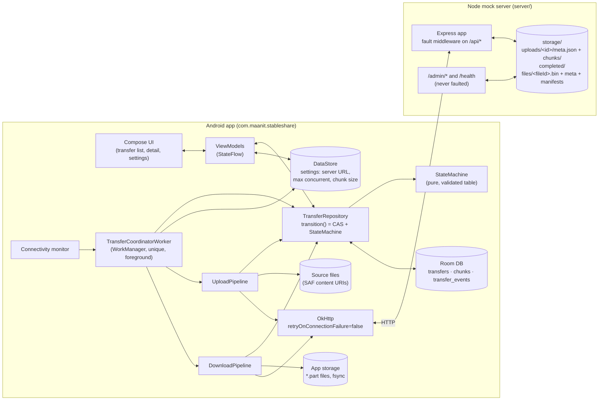
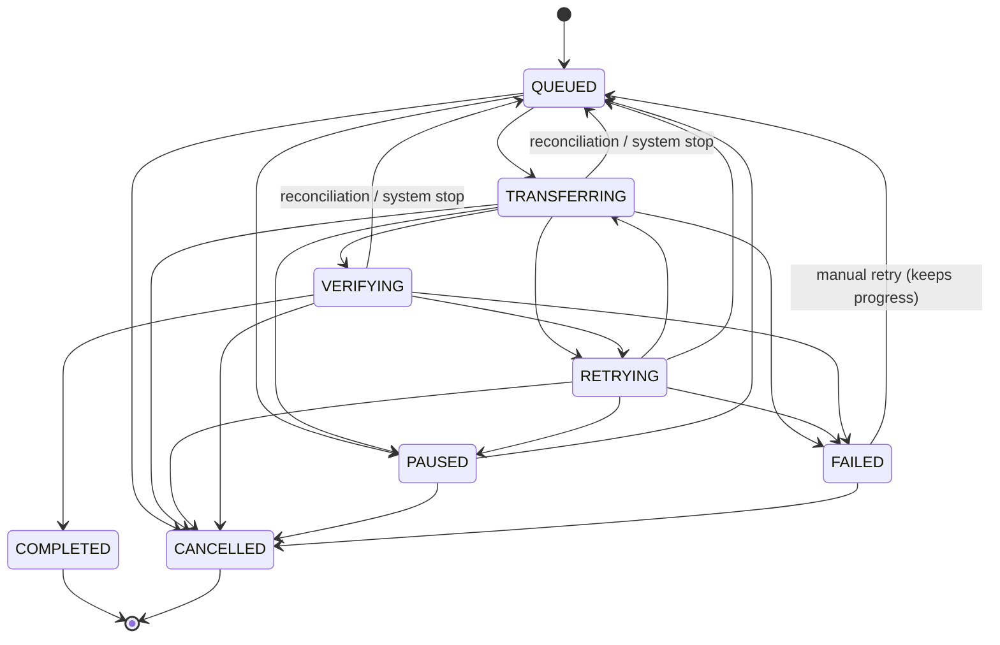

# StableShare — Design

This is the source of truth for StableShare's design. The root `CLAUDE.md` holds the short rules, and this document expands on them without contradicting them. If an implementation has to deviate, this file is updated in the same commit and the change is logged under *Decisions* in `CLAUDE.md`.

Contents
1. [Goals and non-goals](#1-goals-and-non-goals)
2. [Architecture](#2-architecture)
3. [Transfer protocol](#3-transfer-protocol)
4. [State machine](#4-state-machine)
5. [Persistence](#5-persistence)
6. [Concurrency model](#6-concurrency-model)
7. [Retry and error classification](#7-retry-and-error-classification)
8. [Lost-response handling](#8-lost-response-handling)
9. [Lifecycle](#9-lifecycle)
10. [Data integrity](#10-data-integrity)
11. [Edge-case catalogue](#11-edge-case-catalogue)

---

## 1. Goals and non-goals

### Goals
- Upload and download files of up to 1 GiB (1 073 741 824 bytes) between an Android device (minSdk 26) and a local Node.js server.
- A transfer resumes from where it stopped after:
  - a user pause
  - loss or flapping of the network
  - timeouts
  - lost responses
  - server 5xx errors and server restarts
  - the app being swiped away, killed by the system or restarted
  - a device reboot
- A transfer is marked COMPLETED only once the whole file has been verified by SHA-256: the server confirms it for uploads, and the client re-hashes it for downloads.
- Every failure is bounded. A transfer always succeeds, waits on a named external signal, or ends FAILED with a code and a human-readable message. Nothing loops forever.
- Behaviour is observable: each transfer has an event log (`transfer_events`), the server logs every request, and `/admin/stats` counts injected faults.
- Faults are reproducible. The mock server injects latency, bandwidth limits, errors, hangs, dropped connections, lost responses and corrupted bytes from a seeded PRNG.

### Non-goals
- Authentication, authorisation, TLS, multi-user accounts. The server is a local mock.
- Parallel chunks *within* one transfer. Chunks are sequential, and concurrency happens across transfers (§6).
- Delta sync, deduplication across files, compression, encryption at rest.
- Files larger than 1 GiB, and multi-range downloads.
- Surviving an Android *force-stop*. The platform forbids it (see §9). The app recovers on the next launch.
- A production-grade server. The server is deliberately simple: everything is stored on its local disk and it runs as one process.

---

## 2. Architecture



Responsibilities:
- **Compose UI and ViewModels** never write to the database directly. User intents (start, pause, resume, cancel, retry) become `TransferRepository` calls.
- **TransferRepository** is the only writer of `transfers.state`. Its `transition(id, to, errorCode?, errorMessage?, nextRetryAt?, expectedFrom?)` reads the current state inside a transaction and runs a compare-and-set:

  ```sql
  UPDATE transfers SET state = :next … WHERE id = :id AND state = :expected
  ```

  The update only runs after `StateMachine.canTransition(current, next)` (and, when the caller passes `expectedFrom`, only if the current state equals it). The same transaction also appends a `transfer_events` row. It returns `false` if the transition is illegal or 0 rows were updated; the caller lost the race and must re-read.
- **TransferCoordinatorWorker** is a single unique WorkManager worker that runs as a foreground service. It picks up QUEUED transfers and runs at most *N* pipelines at once.
- **Pipelines** carry out the protocol in §3. They own retries (§7) and write progress only while their transfer is TRANSFERRING (rule 5).
- **Server.** Every piece of metadata lives on disk and is written atomically (temp file → fsync → rename), so a restart loses nothing. The fault middleware sits only on `/api/*`.

---

## 3. Transfer protocol

General conventions:
- Base URL: `http://<host>:8080`. The emulator reaches the server at `http://10.0.2.2:8080`.
- **Android client network setup.** Cleartext HTTP is allowed through `res/xml/network_security_config.xml` (`base-config cleartextTrafficPermitted="true"`). This is acceptable only because the server is a local mock; the URL is user-configurable (LAN IPs), so a domain allow-list would not work. On Android 17 (API 37) and later, traffic to private-range hosts such as 10.0.2.2 or a LAN server also needs the runtime `ACCESS_LOCAL_NETWORK` permission (NEARBY_DEVICES group). Without it, connects silently time out. The app requests it at launch.
- JSON errors always have the shape `{"error": "CODE", "message": "human text", ...extra}`.
- Hashes are lowercase hex SHA-256.
- Each chunk of a file has a fixed `chunkSize`, except the last one, which may be shorter. The number of chunks is `totalChunks = ceil(fileSize / chunkSize)`, so a zero-byte file has 0 chunks. Chunk `i` covers `[i·chunkSize, min(fileSize, (i+1)·chunkSize))`.
- Limits: `fileSize` ≤ 1 GiB, and `chunkSize` lies between 1 KiB and 64 MiB inclusive. The server default is 2 MiB (`DEFAULT_CHUNK_SIZE`).
- When the server rejects a request before reading its body, it adds `Connection: close`.
- An unknown route returns `404 {"error":"NOT_FOUND"}`. Malformed JSON returns `400 INVALID_REQUEST`. Any other unexpected failure returns `500 INTERNAL`, which the client classifies as retryable.

### 3.1 Uploads

The client generates the `uploadId` (a UUID, any version) and persists it **before** the first request. Because every write is idempotent, the client can repeat any request when it does not know whether the previous one took effect.

#### PUT /api/uploads/:uploadId — create session (idempotent)
Request:
```http
PUT /api/uploads/0f8fad5b-d9cb-469f-a165-70867728950e
Content-Type: application/json

{"fileName":"video.mp4","fileSize":5242880,"chunkSize":2097152,"sha256":"9f86d0…"}
```
Response `201 Created` (new session) or `200 OK` (same id, identical params, including a completed session):
```json
{"uploadId":"0f8fad5b-d9cb-469f-a165-70867728950e","totalChunks":3,"chunkSize":2097152,"receivedChunks":[],"state":"UPLOADING"}
```

| Status | error | When |
|---|---|---|
| 400 | `INVALID_UPLOAD_ID` | id is not a UUID |
| 400 | `INVALID_REQUEST` | missing or ill-typed field, bad sha256, chunkSize out of range |
| 413 | `FILE_TOO_LARGE` | fileSize > 1 GiB |
| 409 | `SESSION_CONFLICT` | id exists with different fileName/fileSize/chunkSize/sha256 |

A `fileSize` of 0 gives `totalChunks: 0`. Such a session can be completed straight away.

#### PUT /api/uploads/:uploadId/chunks/:index — upload one chunk
Request:
```http
PUT /api/uploads/0f8f…/chunks/2
Content-Type: application/octet-stream
Content-Length: 1048576
X-Chunk-SHA256: 3a7bd3…

<bytes>
```
The server checks the request, then streams the body to `chunks/<i>.<random>.tmp` while hashing it. If the hash matches, it fsyncs the file, renames it to `chunks/<i>.bin`, fsyncs the directory, and records the hash in `meta.json` (atomic write). Responses:

```json
200 {"uploadId":"0f8f…","index":2,"status":"stored","sha256":"3a7bd3…"}
200 {"uploadId":"0f8f…","index":2,"status":"already_received","sha256":"3a7bd3…"}
```
The second response comes back when the chunk is already stored with the same hash. The body is still read and hashed to check it, but the file is **not** rewritten.

| Status | error | When |
|---|---|---|
| 400 | `INVALID_UPLOAD_ID` | id is not a UUID |
| 400 | `INVALID_CHUNK_INDEX` | index not an integer in `[0, totalChunks)` |
| 400 | `INVALID_CHUNK_HASH` | `X-Chunk-SHA256` missing or malformed |
| 411 | `LENGTH_REQUIRED` | no `Content-Length` |
| 413 | `CHUNK_TOO_LARGE` | `Content-Length` > expected length of that index |
| 400 | `CHUNK_LENGTH_MISMATCH` | `Content-Length` < expected length of that index |
| 400 | `INCOMPLETE_BODY` | body ended before `Content-Length` bytes (normally the client is gone) |
| 404 | `SESSION_NOT_FOUND` | unknown, deleted or expired session |
| 409 | `SESSION_COMPLETED` | session already COMPLETED |
| 409 | `CHUNK_CONFLICT` | chunk already stored with a **different** hash |
| 422 | `CHUNK_HASH_MISMATCH` | body hash ≠ `X-Chunk-SHA256`; temp file deleted, nothing stored |
| 507 | `INSUFFICIENT_STORAGE` | server disk full (ENOSPC) |

#### GET /api/uploads/:uploadId — session status
```json
200 {"uploadId":"0f8f…","fileName":"video.mp4","fileSize":5242880,"chunkSize":2097152,
     "totalChunks":3,"receivedChunks":[0,2],"state":"UPLOADING"}
200 {"uploadId":"0f8f…", … ,"receivedChunks":[0,1,2],"state":"COMPLETED","sha256":"9f86d0…"}
```
`sha256` appears only once the session is COMPLETED, and it is the hash the server verified. Errors: 400 `INVALID_UPLOAD_ID`, 404 `SESSION_NOT_FOUND`. The client calls this endpoint when it resumes, and after any ambiguous failure (§8).

#### POST /api/uploads/:uploadId/complete — assemble and verify (idempotent)
Steps, under the session lock:
1. Check that every chunk is present.
2. Stream-concatenate the chunks into `completed/<id>.<random>.tmp` while hashing.
3. Compare the result with the declared `sha256`.
4. fsync the file and rename it to `completed/<uploadId>.bin`, then fsync the directory.
5. Atomically write `state: COMPLETED` to the session meta.
6. Delete the chunk files.

```json
200 {"uploadId":"0f8f…","state":"COMPLETED","sha256":"9f86d0…","size":5242880}
```
If the session is already COMPLETED, the response is the same `200` with the same body.

| Status | error | When |
|---|---|---|
| 404 | `SESSION_NOT_FOUND` | unknown session |
| 409 | `MISSING_CHUNKS` | `{"error":"MISSING_CHUNKS","message":"…","missing":[1]}` |
| 422 | `FILE_HASH_MISMATCH` | `{"error":"FILE_HASH_MISMATCH","expected":"…","actual":"…"}`; session stays UPLOADING, assembled temp deleted |
| 507 | `INSUFFICIENT_STORAGE` | disk full |

#### DELETE /api/uploads/:uploadId — cancel cleanup (idempotent)
Removes the session directory and any completed file. Returns `204` whether or not the session existed (400 for a non-UUID id).

#### Session expiry
Once an hour, a sweeper removes every non-COMPLETED session whose `updatedAt` (bumped on create and on each stored chunk) is more than 24 h old. It also removes stray `*.tmp` files older than 1 h. After that, the session's endpoints return `404 SESSION_NOT_FOUND`, which the client treats as fatal: `FAILED SESSION_NOT_FOUND`.

### 3.2 Downloads

#### GET /api/files
```json
200 [{"fileId":"sample-50MB","name":"sample-50MB.bin","size":52428800,"sha256":"…"}, …]
```

#### GET /api/files/:fileId/manifest?chunkSize=2097152
`chunkSize` is optional and defaults to `DEFAULT_CHUNK_SIZE`, within the same bounds as uploads. The manifest is computed in a single streaming pass and cached on disk as `files/<fileId>.manifest.<chunkSize>.json`. The cache is recomputed when the file's ETag changes.
```json
200 {"fileId":"sample-odd","name":"sample-odd.bin","size":3145851,"sha256":"…","etag":"\"…\"",
     "chunkSize":1048576,
     "chunks":[{"index":0,"offset":0,"length":1048576,"sha256":"…"},
               …,
               {"index":3,"offset":3145728,"length":123,"sha256":"…"}]}
```
Errors: 400 `INVALID_REQUEST` (bad chunkSize), 404 `FILE_NOT_FOUND`.

#### GET /api/files/:fileId/content
Every response carries `ETag` (strong, quoted), `Accept-Ranges: bytes` and `Content-Type: application/octet-stream`.

| Request | Response |
|---|---|
| no `Range` | `200`, full body |
| `Range: bytes=a-b` / `bytes=a-` / `bytes=-n` | `206`, `Content-Range: bytes a-b/size`; `b` clamped to `size-1` |
| `Range` + `If-Range: <current etag>` | `206` as above |
| `Range` + `If-Range: <other etag or a date>` | `200`, **full** body. For the client, this means the remote file changed. |
| start ≥ size, zero-byte file, malformed or multi-range | `416 RANGE_NOT_SATISFIABLE`, `Content-Range: bytes */size` |
| unknown file | `404 FILE_NOT_FOUND` |

`HEAD` returns the same status and headers with no body.

Example:
```http
GET /api/files/sample-200MB/content
Range: bytes=2097152-4194303
If-Range: "5e0c…"

HTTP/1.1 206 Partial Content
Content-Range: bytes 2097152-4194303/209715200
Content-Length: 2097152
ETag: "5e0c…"
```

#### Seeding
`npm run seed` creates deterministic files in `storage/files/`:

| fileId | size |
|---|---|
| sample-50MB | 50 MiB |
| sample-200MB | 200 MiB |
| sample-500MB | 500 MiB |
| sample-1GB | 1 GiB |
| sample-0B | 0 B |
| sample-odd | 3 MiB + 123 B |

The bytes are an AES-256-CTR keystream (a fast seeded PRNG) whose key is `sha256("stableshare-seed:<fileId>")`. Hashes are therefore identical on every machine. Files that already exist are skipped. A file's `etag` is its quoted sha256.

### 3.3 Admin (never faulted)

| Endpoint | Purpose |
|---|---|
| `GET /health` | `200 {"ok":true}` |
| `GET /admin/faults` | current fault config |
| `PUT /admin/faults` | merge a partial config. Rates are validated to [0,1] (`400 INVALID_REQUEST` otherwise). Setting `seed` re-seeds the PRNG. Returns the full config. |
| `POST /admin/faults/reset` | restore defaults (disabled, every rate 0, seed 1), re-seed and zero the stats; returns config |
| `GET /admin/stats` | `{"requests":N,"apiRequests":N,"faults":{"latency":…,"error":…,"timeout":…,"dropMidBody":…,"dropAfterProcess":…,"corrupt":…},"dedupedChunks":N}` |
| `POST /admin/files/:fileId/mutate` | rewrite 4 KiB in the middle of the file (or append 16 B to an empty file), recompute sha256 and ETag, drop cached manifests; returns the new file info |

Fault config:
```json
{"enabled":false,"seed":1,"latencyMs":0,"latencyJitterMs":0,"bandwidthKbps":0,
 "errorRate":0,"timeoutRate":0,"dropMidBodyRate":0,"dropAfterProcessRate":0,"corruptRate":0}
```
When faults are enabled, each `/api/*` request draws from one seeded PRNG in a fixed order: jitter, error, timeout, dropMidBody, dropAfterProcess, corrupt, then the drop and corrupt position. The same seed with the same sequence of requests therefore gives the same faults. The faults take precedence in this order: error > timeout > dropMidBody > dropAfterProcess. Corruption is independent of the others.

| Fault | Effect |
|---|---|
| `latencyMs` ± `latencyJitterMs` | delay before handling |
| `bandwidthKbps` | throttles chunk request bodies and download bodies (kilobits/s; 0 = unlimited) |
| `errorRate` | `503 INJECTED_FAULT` before any processing |
| `timeoutRate` | request accepted, never answered |
| `dropMidBodyRate` | socket destroyed partway through the request body (chunk PUT) or the response body (downloads and JSON) |
| `dropAfterProcessRate` | chunk PUT or complete fully processed and persisted, then the socket is destroyed instead of sending the 2xx (the lost-response case) |
| `corruptRate` | one byte flipped in a download body |

### 3.4 Reference client (`server/scripts/cli-client.js`)
The CLI implements the client half of this protocol: the same algorithm as the Android pipelines, with a JSON sidecar playing the role of Room.

- **Upload sidecar** `<path>.stableshare-upload.json`: `{uploadId, path, size, mtimeMs, sha256, chunkSize, createdAt}`. It is written atomically *before* the first request. On restart, if size, mtime or sha256 differ, the CLI fails with `SOURCE_CHANGED`.
- **Download sidecar** `<out>.stableshare-download.json`: `{fileId, etag, size, sha256, chunkSize, doneChunks}`, next to `<out>.part`. On restart:
  - an etag change gives `REMOTE_CHANGED`
  - every chunk in `doneChunks` is re-hashed from the `.part` file, and mismatches are re-downloaded
- **Retries** follow §7 and §8. A chunk PUT or `complete` that failed ambiguously is followed by GET status before any resend. `ECONNREFUSED` and similar are WAITING, bounded by `--max-wait-ms`.
- **Output.** stdout carries `resume: …`, `progress i/N …` and `RESULT {json}`. The chaos script greps these lines.
- **Exit codes**: 0 means verified success, 1 means `FAILED <CODE>: message`, 2 means usage error.

`server/scripts/chaos-test.sh` exercises the client under faults:
- It seeds, then starts the server on `CHAOS_PORT` (default 18080).
- It enables latency 20 ± 20 ms, 10 % errors, 5 % dropAfterProcess, 5 % dropMidBody and 2 % corrupt with a fixed seed.
- It uploads and then downloads `sample-200MB`. Each CLI run is killed with `kill -9` after 30 chunks and rerun. The script asserts that the second run resumed rather than starting from 0.
- It asserts that both SHA-256 values equal the seeded hash, and that error, dropMidBody and dropAfterProcess faults actually fired.

---

## 4. State machine



| From | To | Rationale |
|---|---|---|
| QUEUED | TRANSFERRING | The coordinator has a free slot and starts the pipeline. |
| QUEUED | PAUSED | The user pauses before the transfer starts. |
| QUEUED | CANCELLED | The user cancels before the transfer starts. |
| TRANSFERRING | VERIFYING | Every chunk is confirmed, so full-file verification starts: `complete` for uploads, a local re-hash for downloads. |
| TRANSFERRING | RETRYING | A retryable error occurred and the pipeline is backing off, or the network is gone (`NETWORK_UNAVAILABLE`, which consumes no attempt). |
| TRANSFERRING | PAUSED | The user pauses. The in-flight call is cancelled, and progress already written is kept. |
| TRANSFERRING | FAILED | A fatal error occurred, or retries ran out. |
| TRANSFERRING | CANCELLED | The user cancels. The pipeline stops, deletes the server session or `.part` file, and writes nothing more. |
| TRANSFERRING | QUEUED* | Only through restart reconciliation, because the process died while the transfer was in flight, or through a system stop (WorkManager stop reason). The transfer simply runs again. |
| RETRYING | TRANSFERRING | The backoff has elapsed, or connectivity is back. |
| RETRYING | QUEUED | The worker was stopped during the backoff, or reconciliation found the row RETRYING. The slot is given back. |
| RETRYING | PAUSED | The user pauses during the backoff. |
| RETRYING | FAILED | Bounded waiting has ended, for example the attempt budget is gone after a failure seen in RETRYING. |
| RETRYING | CANCELLED | The user cancels during the backoff. The cancel must win over the pending retry (CAS). |
| VERIFYING | COMPLETED | The full-file SHA-256 matched: the server confirmed it for uploads, and the local re-hash matched for downloads. |
| VERIFYING | RETRYING | A retryable error hit `complete`, for example a 5xx or a lost response. The next step is GET status, then `complete` again. |
| VERIFYING | FAILED | `FILE_HASH_MISMATCH`, repeated local mismatches, or a fatal error. |
| VERIFYING | CANCELLED | The user cancels. |
| VERIFYING | QUEUED* | Through reconciliation or a system stop. Verification is idempotent, so it simply runs again. |
| PAUSED | QUEUED | The user resumes. The transfer waits for a slot. |
| PAUSED | CANCELLED | The user cancels. |
| FAILED | QUEUED | The user retries manually. Attempt counters are reset, and DONE chunks are kept. |
| FAILED | CANCELLED | The user discards the transfer. |
| COMPLETED, CANCELLED | — | Terminal. Nothing revives these states, including reconciliation. |

Every transition is a CAS (§2). A late pipeline therefore cannot overwrite a user's PAUSED or CANCELLED: its `transition(TRANSFERRING → …)` updates 0 rows, and the pipeline exits.

---

## 5. Persistence

### 5.1 Server
```
storage/
  uploads/<uploadId>/meta.json        {uploadId,fileName,fileSize,chunkSize,totalChunks,sha256,state,
                                        chunks:{"<i>":"<sha256>"},createdAt,updatedAt,completedAt?,result?}
  uploads/<uploadId>/chunks/<i>.bin   verified chunk bytes
  completed/<uploadId>.bin            assembled, verified file
  files/<fileId>.bin                  downloadable file
  files/<fileId>.meta.json            {fileId,name,size,sha256,etag}
  files/<fileId>.manifest.<chunkSize>.json
```
Every metadata write follows the same sequence: write `*.tmp`, fsync the file, `rename()` it, then fsync the directory. Bytes are always made durable before the metadata that refers to them.

### 5.2 Android (Room), final schema (database version 1)
`AppDatabase` (`stableshare.db`), schema exported to `android/app/schemas/…/1.json`. Enums are stored as their names (Room's built-in mapping). Every write goes through `TransferRepository`; DAO write methods are `internal`.

**transfers** (indices: `state`, `createdAt`)

| column | type | notes |
|---|---|---|
| id | TEXT PK | UUID. For uploads it is also the server `uploadId`, generated and persisted before the first request |
| type | TEXT | UPLOAD / DOWNLOAD |
| fileName, fileSize, mimeType? | TEXT, INTEGER, TEXT | |
| localUri | TEXT | upload: source URI (`content://` with a persisted read grant, or `file://` for generated files). Download: the per-transfer `.part` file, replaced by the final file URI after finalize |
| remoteId? | TEXT | upload: the uploadId; download: the server `fileId` |
| chunkSize, totalChunks | INTEGER | fixed at creation (settings changes affect new transfers only) |
| sha256? | TEXT | expected full-file hash: computed from the source (upload), from the manifest (download) |
| sourceLastModified? | INTEGER | upload: mtime when recorded; re-checked with the size before every chunk |
| etag? | TEXT | download: manifest ETag, sent as `If-Range` |
| state | TEXT | written **only** by `transition()` / `claimNextQueued()` / `reconcileAfterProcessStart()` |
| bytesDone | INTEGER | `SUM(length)` of DONE chunks, recomputed in the same transaction as every chunk write |
| errorCode?, errorMessage? | TEXT | set on RETRYING/FAILED; cleared on TRANSFERRING, COMPLETED and manual retry |
| attemptCount | INTEGER | failures counted while active; reset by manual retry (FAILED → QUEUED) |
| nextRetryAt? | INTEGER | RETRYING only. `null` while RETRYING means "waiting for network" |
| sessionCreated | INTEGER (bool) | upload: create-session acknowledged |
| createdAt, updatedAt, completedAt? | INTEGER | epoch ms |

**chunks** (PK `(transferId, index)`; FK `transferId → transfers.id ON DELETE CASCADE`)

| column | type | notes |
|---|---|---|
| transferId, index | TEXT, INTEGER | `index` is quoted in SQL |
| offset, length | INTEGER | from `ChunkPlanner`; download rows must match the manifest exactly |
| sha256? | TEXT | download: manifest hash; upload: hash of the bytes sent, set when DONE |
| status | TEXT | PENDING / DONE / FAILED |
| attempts | INTEGER | failed attempts of this chunk (max 5, §7) |
| lastError? | TEXT | |

**transfer_events** (index `transferId`; FK cascade)

| column | type | notes |
|---|---|---|
| id | INTEGER PK autoincrement | |
| transferId, timestamp | TEXT, INTEGER | |
| type | TEXT | STATE_CHANGE, CHUNK_DONE, CHUNK_FAILED, CHUNK_CONFIRMED_AFTER_LOST_RESPONSE, RETRY_SCHEDULED, VERIFIED, ERROR, INFO |
| fromState?, toState?, chunkIndex? | | |
| message | TEXT | append-only audit log for the detail screen and tests |

**Repository operations.**
- `createUpload` / `createDownload(manifest)`: the transfer row, all chunk rows (PENDING) and a STATE_CHANGE event in one transaction.
- `claimNextQueued(limit)`: in one transaction, takes the oldest (`createdAt`, then `id`) rows that are QUEUED, or RETRYING with `nextRetryAt ≤ now`, and CASes each to TRANSFERRING. Room serialises write transactions, so concurrent claims never overlap.
- `applyServerReceivedChunks(id, indices)` (listed → DONE, all others → PENDING) and `resetChunks` are allowed while TRANSFERRING or VERIFYING (the `MISSING_CHUNKS` re-sync happens in VERIFYING). Index lists are batched at 500 to stay under SQLite's 999-variable limit.
- `deleteTransfer` succeeds only for COMPLETED/CANCELLED; chunks and events cascade.

### 5.3 Write ordering
1. **Write the bytes, fsync, then update the DB. Never the reverse.**
   - *Downloads*: write the chunk into `<target>.part` at its offset, call `FileDescriptor.sync()`, then mark the chunk DONE.
   - *Uploads*: the server's 2xx is the durability point, because the server fsyncs before responding. Only then does the client mark the chunk DONE.

   If the app crashes in between, the worst case is a chunk that is done but not recorded as done. That chunk is either re-verified (download) or reported by GET status (upload). The DB never claims bytes that do not exist.
2. **Progress is guarded.** Chunk progress is written in one transaction with a guard:

   ```sql
   UPDATE chunks … WHERE transferId = :id
     AND (SELECT state FROM transfers WHERE id = :id) = 'TRANSFERRING'
   ```

   A stale or cancelled job therefore writes nothing (rule 5). `markChunkDone` / `markChunkFailed` return `false` when the guard matched 0 rows, and log nothing.

---

## 6. Concurrency model
- **TransferCoordinatorWorker** is enqueued as unique work (`ExistingWorkPolicy.KEEP`) and promotes itself to a foreground service (`dataSync` type) with an ongoing notification. Only one coordinator can therefore exist.
- The coordinator keeps a semaphore of *N* permits. *N* is `maxConcurrent` in DataStore, range 1–4, default 2. It loops through these steps:
  1. Reconcile (§9).
  2. Take QUEUED transfers in `createdAt` order while permits are free.
  3. `transition(QUEUED → TRANSFERRING)`. A CAS failure means the transfer was paused or cancelled in the meantime, so it is skipped.
  4. Launch the pipeline coroutine.

  It stops when nothing is QUEUED, TRANSFERRING, RETRYING or VERIFYING.
- A RETRYING row whose `nextRetryAt` has passed is also claimable (`claimNextQueued`), so a backoff persisted before a restart is honoured. If a pipeline is still waiting out that backoff in-process, both it and the coordinator try `RETRYING → TRANSFERRING`; the CAS lets exactly one win, and the loser exits without writing.
- Changing *N* in Settings applies at the next slot acquisition. Running transfers are never pre-empted.
- Inside one transfer, chunks are **sequential**. This keeps the write-ordering argument simple and bounds memory to one chunk buffer per transfer.
- **Pause and cancel** are state transitions made from the UI thread through the repository. Each pipeline observes its row's state with a Flow:
  - It checks the state between chunks.
  - On PAUSED or CANCELLED it cancels the in-flight OkHttp `Call`.
  - A cancel also triggers cleanup: server `DELETE` for uploads, deleting the `.part` file for downloads.
- On the server, a per-upload async mutex serialises `meta.json` updates and `complete`. Chunk bodies stream into unique temp files *outside* the lock, so concurrent PUTs of different chunks do not block each other.

---

## 7. Retry and error classification
OkHttp has `retryOnConnectionFailure = false`, so every retry is a deliberate decision of the pipeline.

| Class | Triggers | Action |
|---|---|---|
| **RETRYABLE** | socket/read/connect timeout, connection reset or EOF mid-body, HTTP 5xx (except 507), 429, chunk-hash mismatch on a download (data corrupted in transit), 422 `CHUNK_HASH_MISMATCH` on upload (body corrupted in transit) | `TRANSFERRING → RETRYING`, backoff, retry. Consumes one attempt for that chunk. |
| **WAITING** | no validated network (ConnectivityManager reports none, or `UnknownHostException`/`ConnectException` while offline) | `→ RETRYING` with code `NETWORK_UNAVAILABLE`. **No attempt consumed.** Resumes on the connectivity callback (or the WorkManager `CONNECTED` constraint). |
| **FATAL** | 404 `SESSION_NOT_FOUND`/`FILE_NOT_FOUND`; 409 `SESSION_CONFLICT`/`CHUNK_CONFLICT`/`SESSION_COMPLETED`; 413; 416; 200 instead of 206 (remote changed); source size/mtime/hash changed or source missing; the same chunk failing its hash 5 times; `FILE_HASH_MISMATCH`; local disk full (`ENOSPC`) or 507 | `→ FAILED` with `errorCode` and `errorMessage`. Manual retry is possible (keeps progress). |

Special cases:
- **409 `MISSING_CHUNKS`** on `complete` re-syncs from GET status and re-uploads the missing chunks. This is allowed at most twice, and after that it is FATAL.

**Android mapping** (`ErrorClassifier.classify(Throwable) → Outcome`, codes from `ErrorCode`):

| Input | Outcome |
|---|---|
| `CancellationException` | rethrown, never classified (pause/cancel) |
| `DiskFullException` or any IOException carrying ENOSPC | Fatal `DISK_FULL` |
| `SourceChangedException` / `SourceMissingException` | Fatal `SOURCE_CHANGED` / `SOURCE_MISSING` |
| `RemoteFileChangedException` (200 instead of 206) | Fatal `REMOTE_FILE_CHANGED` |
| `ProtocolViolationException` (bad Content-Range, undecodable body), `PartFileMissingException` | Fatal `UNKNOWN` |
| `ChunkHashMismatchException` (download corrupted in transit) | Retryable `CHUNK_HASH_MISMATCH` |
| HTTP 507 | Fatal `DISK_FULL` |
| HTTP 5xx | Retryable `SERVER_ERROR` (+ `Retry-After`) |
| HTTP 429 | Retryable `RATE_LIMITED` (+ `Retry-After`) |
| HTTP 404 `SESSION_NOT_FOUND` / `FILE_NOT_FOUND` / other | Fatal `SESSION_NOT_FOUND` / `REMOTE_FILE_CHANGED` / `UNKNOWN` |
| HTTP 409 (any code; `MISSING_CHUNKS` is intercepted by the pipeline first) | Fatal `SESSION_CONFLICT` |
| HTTP 422 `CHUNK_HASH_MISMATCH` / `FILE_HASH_MISMATCH` | Retryable `CHUNK_HASH_MISMATCH` / Fatal `FILE_HASH_MISMATCH` |
| HTTP 416 | Fatal `REMOTE_FILE_CHANGED` (the file shrank) |
| HTTP 400 `INCOMPLETE_BODY` | treated as a transport drop (next row) |
| HTTP 413, other 4xx | Fatal `UNKNOWN` (a client bug; retrying cannot help) |
| any other IOException, **no network** (`ConnectivityChecker`) | WaitForNetwork (`NETWORK_UNAVAILABLE`, no attempt consumed) |
| `SocketTimeoutException` / `InterruptedIOException`, online | Retryable `TIMEOUT` |
| any other IOException, online | Retryable `CONNECTION_LOST` |
| anything else | Fatal `UNKNOWN` |

Connectivity is checked for timeouts too, so an offline timeout waits instead of burning attempts. `TIMEOUT` and `CONNECTION_LOST` are *ambiguous* (`Outcome.isAmbiguous`): before resending a chunk PUT or `complete`, the pipeline calls GET status (§8). When the 5 attempts of a chunk are used up, the transfer fails with `RETRIES_EXHAUSTED`. `ConnectivityChecker` requires an active network with the INTERNET capability but not VALIDATED, because a LAN-only network hosting the mock server never passes Android's internet validation.

**Backoff**, full jitter, where `attempt` counts the failures of this chunk so far (1, 2, …):
```
delay(attempt) = random_uniform(0, min(30 s, 1 s × 2^(attempt−1)))
```
- The cap is 30 s.
- A chunk gets at most 5 attempts. When the 5th attempt fails, the transfer goes to `FAILED RETRIES_EXHAUSTED`.
- A successful chunk resets the counter for the next chunk.
- The Android pipeline honours a `Retry-After` header on 429/503 as a lower bound, capped at 30 s. The mock server never sends one, so the CLI ignores it.

**Bounded by construction.** Every loop ends in one of four ways: success, a consumed attempt (at most 5), waiting on a connectivity signal (an external event), or FAILED.

---

## 8. Lost-response handling
"Lost response" means that the server processed and persisted the request, but the client saw a timeout or reset instead of the 2xx. The server's `dropAfterProcessRate` fault reproduces exactly this case.

**Chunk PUT.**
1. When a chunk PUT fails ambiguously (timeout, reset, EOF), the client does **not** blindly resend. It first calls `GET /api/uploads/:id`.
2. If the index is in `receivedChunks`, the chunk is done and no attempt is consumed beyond the one that failed.
3. Otherwise the client resends.
4. A resend of a chunk that did land anyway (a race) is harmless. The server answers `200 already_received` without rewriting, after checking that the hash is the same.

**Complete.**
1. When the `complete` call fails ambiguously, the client calls GET status. If the session is `COMPLETED`, the client compares `sha256` with its own hash and goes `VERIFYING → COMPLETED`.
2. Otherwise it calls `complete` again. This is safe because `complete` is idempotent: a COMPLETED session returns the same 200 body.

**Downloads.** A GET has no server-side effect, so a lost response is just a retry of the same Range request.

**Create session.** The `uploadId` is persisted before the first PUT, and create is idempotent (identical parameters return 200), so resending after a lost response is always safe.

---

## 9. Lifecycle

| Situation | Behaviour |
|---|---|
| **Foreground / background** | Work runs in the coordinator's foreground service, not in the Activity, so leaving the app does not stop transfers. The UI only observes Room Flows. |
| **Swipe-away from recents** | The process may be killed. The foreground service usually survives, and if it does not, WorkManager reschedules the unique work. On restart, reconciliation sets TRANSFERRING/VERIFYING → QUEUED and the transfer resumes from DONE chunks. RETRYING rows keep their persisted backoff (§6). |
| **Process death (OOM, crash)** | Same as swipe-away. Chunk progress was written only after fsync (§5.3), so resuming is exact. |
| **Reboot** | WorkManager persists its jobs and re-enqueues them after boot through its own `RECEIVE_BOOT_COMPLETED` receiver. The coordinator starts, reconciles and resumes. |
| **System stop** | WorkManager stops the worker: constraints unmet, quota, or a foreground-service timeout on Android 15 `dataSync`. `getStopReason()` is available on API 31+. In `onStopped`, every running pipeline is cancelled and its transfer goes `TRANSFERRING/VERIFYING/RETRYING → QUEUED` with an INFO event "system stop" (no error code, no attempt consumed). WorkManager re-runs the worker later. |
| **Force-stop (Settings → Force stop, or `adb shell am force-stop`)** | **Platform limitation.** Android cancels all jobs and alarms of a force-stopped app, and nothing may restart it until the user launches it again. Transfers simply stay in their persisted state. On the next launch, `Application.onCreate` enqueues the coordinator, and reconciliation resumes everything. This is documented and not worked around. |
| **Restart reconciliation** | `reconcileAfterProcessStart()` runs once per process, before the coordinator claims work, in one transaction. Rows in TRANSFERRING or VERIFYING go to QUEUED with a STATE_CHANGE and an INFO "Reconciled after process start" event. RETRYING rows are left as they are: one with `nextRetryAt` is claimed once that time passes, and one waiting for network (`nextRetryAt = null`) is moved RETRYING → QUEUED by the connectivity monitor (Phase 3). QUEUED, PAUSED, FAILED, COMPLETED and CANCELLED are left untouched, so a **cancelled transfer is never revived** (rule 4). For downloads, DONE chunks are re-verified against their manifest hashes on disk before resuming (§10). For uploads, GET status overrides the local chunk table, because the server is the source of truth (rule 7). |

---

## 10. Data integrity
- **Per-chunk SHA-256.**
  - *Uploads*: the client sends `X-Chunk-SHA256`, and the server hashes while streaming and rejects a mismatch with 422 before anything is stored.
  - *Downloads*: the client hashes each Range body and compares it with the manifest's chunk hash before writing to the `.part` file.
- **Full-file SHA-256.**
  - *Uploads*: the server hashes while assembling and compares with the hash declared at create. Then the client compares the server's returned `sha256` with its own.
  - *Downloads*: the client re-hashes the whole `.part` file and compares it with the manifest `sha256`.

  COMPLETED is only reachable from VERIFYING after one of these checks passes (rule 3).
- **Atomic renames.** On the server, chunk files, assembled files and every JSON metadata file follow temp → fsync → rename → fsync dir. On the client, `<target>.part` is renamed to `<target>` only after full verification.
- **ETag and If-Range.**
  - The manifest carries `etag`, which the client stores, and every Range request sends `If-Range: <etag>`.
  - If the remote file changed, the server returns `200` with the full body instead of `206`. The client treats that as `FAILED REMOTE_FILE_CHANGED` and does not consume the body.
  - A manifest re-fetched on resume with a different etag is also `REMOTE_FILE_CHANGED`.
- **Corrupted-partial recovery.** On resume, every DONE chunk of a download is re-hashed from the `.part` file. Any chunk that does not match goes back to PENDING and is downloaded again. This covers torn writes, external tampering and a lost fsync. A `.part` file that is missing or the wrong size resets all chunks.
- **Source integrity (uploads).**
  - Before the session is created, the source is hashed, and `sourceSize` and `sourceLastModified` are recorded.
  - Before each chunk, size and mtime are re-checked. The chunk hash is computed from the bytes actually sent.
  - If the source changed or disappeared, the transfer fails with `FAILED SOURCE_CHANGED` / `SOURCE_MISSING`.

---

## 11. Edge-case catalogue
Where it is "Tested" by:
- `server/test/*` is `npm test`.
- `chaos` is `server/scripts/chaos-test.sh` running the CLI client, which implements the same client algorithm as the app.
- Android: JVM unit tests under `android/app/src/test` (`./gradlew testDebugUnitTest`); pipeline-level tests arrive in Phase 3.

| # | Scenario | Expected behaviour | Where handled | How tested |
|---|---|---|---|---|
| 1 | Zero-byte file | Upload: `totalChunks 0`; `complete` succeeds right away with the empty-string hash. Download: manifest `chunks: []`; Range → 416, so the client skips the transfer and verifies the empty file. | `routes/uploads.js`, `routes/files.js`; pipelines | `uploads.test.js` "zero-byte upload"; `files.test.js` "416 for unsatisfiable, multi-range, zero-byte"; Phase 3 unit test |
| 2 | Size not divisible by chunk size | Last chunk is shorter. The server expects exactly that length, and the manifest's last entry has the remainder. | `expectedChunkLength()` | `uploads.test.js` "odd-size last chunk"; `files.test.js` "manifest chunk hashes recompute correctly"; seed `sample-odd`; `ChunkPlannerTest` |
| 3 | Duplicate chunk | `200 already_received`, file not rewritten (mtime unchanged), `dedupedChunks++` | chunk PUT | `uploads.test.js` "duplicate chunk" |
| 4 | Wrong-hash chunk | `422 CHUNK_HASH_MISMATCH`, temp deleted, nothing recorded; the client retries (a consumed attempt) | chunk PUT | `uploads.test.js` "wrong hash rejected and not stored" |
| 5 | Wrong-length chunk | `400 CHUNK_LENGTH_MISMATCH` (short) / `413 CHUNK_TOO_LARGE` (long); fatal for the client (bug) | chunk PUT | `uploads.test.js` "wrong length" |
| 6 | Lost response after a chunk was processed | Client: GET status shows the chunk, so no resend; any resend gets `already_received` | §8; CLI `sendChunk` | `faults.test.js` "dropAfterProcess: socket destroyed, yet status lists the chunk…"; chaos (5 % dropAfterProcess) |
| 7 | `complete` response lost | Client: GET status says COMPLETED with sha256, so the client verifies and completes. Calling `complete` again returns the same 200. | §8; `complete` idempotent | `uploads.test.js` "finalize idempotent"; `faults.test.js` "dropAfterProcess on complete"; chaos |
| 8 | Server restart mid-transfer | All metadata is on disk. The client sees connection refused (WAITING), then GET status and resumes. | `storage.js` atomic writes | `uploads.test.js` "server restart keeps sessions and chunks" |
| 9 | Session expired (24 h) | 404 `SESSION_NOT_FOUND` leads to `FAILED SESSION_NOT_FOUND`. Manual retry creates a new session id. | sweeper; client classification | `uploads.test.js` "sweeper expires idle sessions" |
| 10 | Remote file changed mid-download | If-Range mismatch returns 200 instead of 206, giving `FAILED REMOTE_FILE_CHANGED` (the CLI prints `REMOTE_CHANGED`). A changed manifest etag on resume is the same failure. | content route; download pipeline | `files.test.js` "If-Range after the remote file changed"; CLI resume after `mutate` → `REMOTE_CHANGED` |
| 11 | Source modified or deleted mid-upload | Size, mtime or hash check fails, giving `FAILED SOURCE_CHANGED` / `SOURCE_MISSING`. | upload pipeline / CLI resume check | CLI: upload killed, source edited, rerun → `FAILED SOURCE_CHANGED` (verified manually in Phase 1); Phase 3 instrumented test |
| 12 | Disk full | Server: ENOSPC gives 507 `INSUFFICIENT_STORAGE`, which is fatal. Client: free space is checked before a download starts, and an ENOSPC during a write is `FAILED DISK_FULL`. | error handler; download pipeline | Phase 3 unit test with a fake file system |
| 13 | Pause during chunk write | The in-flight call is cancelled. The partial chunk is never marked DONE, because the guarded write requires TRANSFERRING. Resume re-sends or re-downloads that chunk. | pipeline + guarded `UPDATE` | `TransferRepositoryTest` "markChunkDoneIgnoredUnlessTransferring"; Phase 3 pipeline test |
| 14 | Cancel during chunk write | CAS → CANCELLED. The pipeline's later writes match 0 rows. Server `DELETE` / `.part` deleted. | repository + pipeline | `TransferRepositoryTest` "cancelledNeverMovesToPausedOrQueued"; `ProtocolClientTest` "coroutineCancellationCancelsTheCall"; `DELETE` idempotent in `uploads.test.js`; Phase 3 pipeline test |
| 15 | Cancel while RETRYING | `RETRYING → CANCELLED` wins the CAS. When the backoff wakes, its `RETRYING → TRANSFERRING` fails, so the pipeline exits. | StateMachine + CAS | `StateMachineTest`; `TransferRepositoryTest` "expectedFromActsAsCompareAndSet" |
| 16 | App killed during VERIFYING | Reconciliation sets `VERIFYING → QUEUED`. The re-run calls `complete` (idempotent) or re-hashes the `.part` file. | reconciliation; idempotent complete | `uploads.test.js` "finalize idempotent"; Phase 3 test |
| 17 | Network flapping | Each loss is WAITING (no attempt consumed). Each return resumes from GET status / DONE chunks. Mid-body drops are RETRYABLE. | connectivity monitor; classification | chaos (dropMidBody, errors); Phase 3 test |
| 18 | Same file transferred twice | Each transfer has its own uploadId and its own session, so two copies are stored. Downloads to the same target get distinct names (`name (1).bin`), so there are no shared `.part` files. | client id generation; target naming | `uploads.test.js` uses separate ids; `FileStoreTest` "finalizeRenamesWithCollisionSuffixes", "twoTransfersOfTheSameFileGetDistinctPartFiles" |
| 19 | Download body corrupted in transit | The chunk hash does not match the manifest, so the chunk is retried (consumed attempt). After 5 failures: `FAILED RETRIES_EXHAUSTED`. | download pipeline / CLI | `faults.test.js` "corrupt: exactly one byte flipped"; chaos (2 % corrupt) |
| 20 | Request hangs forever | The client's read timeout fires, which is RETRYABLE and ambiguous. GET status follows before the resend. | OkHttp timeouts / CLI timeout | `faults.test.js` "timeout: request never answered and nothing persisted" |
| 21 | Client killed mid-transfer and restarted | Resumes from the sidecar (CLI) or Room (app). Already-sent or already-written chunks are skipped after verification. | CLI sidecar; reconciliation | chaos (kill -9 and rerun for both directions) |
| 22 | Crash between the chunk write and the DB update | Download: the chunk stays PENDING and is re-downloaded. Upload: GET status reports it. | write ordering §5.3 | chaos kill -9 |
| 23 | Create session with the same id but different params | `409 SESSION_CONFLICT` (fatal) | create route | `uploads.test.js` "idempotent create" |
| 24 | Partial download corrupted on disk while the client was down | On-disk re-hash of DONE chunks finds the mismatch, so that chunk alone is re-downloaded. | CLI/pipeline resume verification | CLI: `.part` bytes overwritten between runs → "chunk 0 failed on-disk verification", then a verified RESULT (manual, Phase 1) |
