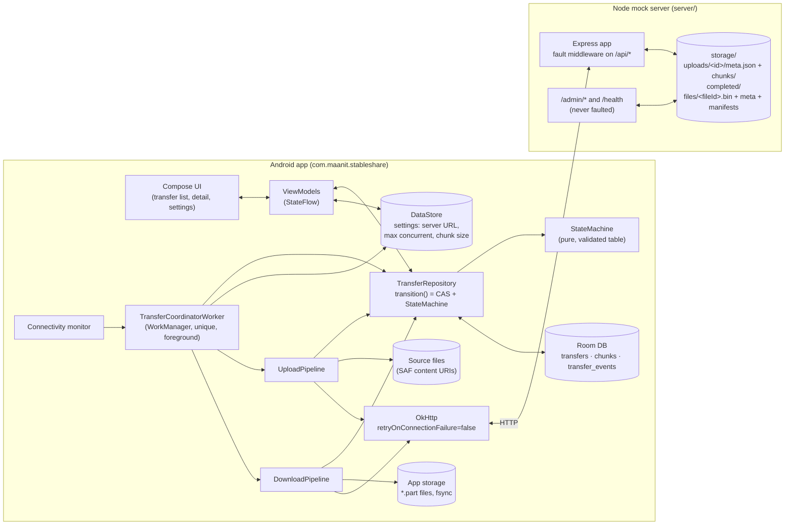
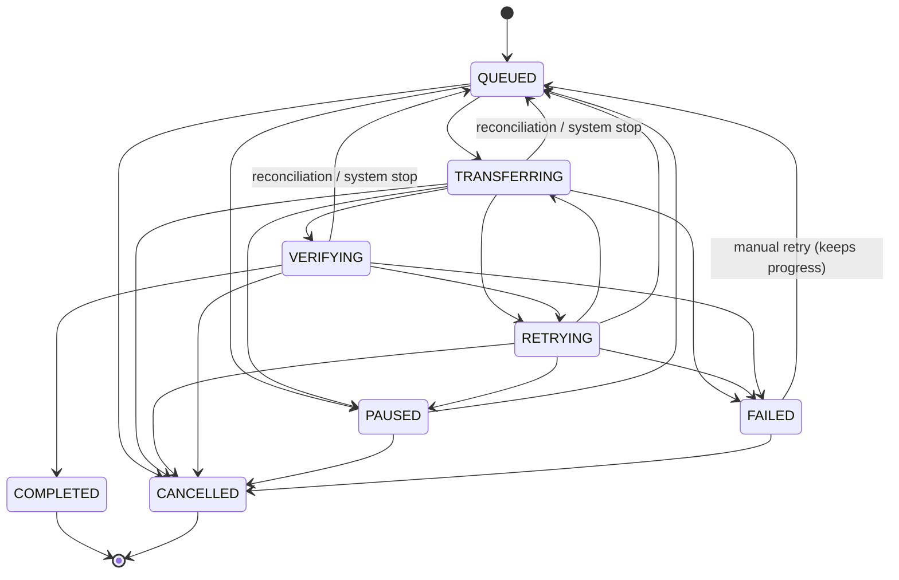

# StableShare — Design

This is the source of truth for StableShare's design. The root `CLAUDE.md` holds the short rules, and this document expands on them without contradicting them. If an implementation has to deviate, this file is updated in the same commit and the change is logged under *Decisions* in `CLAUDE.md`.

Contents
1. [Goals and non-goals](#1-goals-and-non-goals)
2. [Architecture](#2-architecture)
3. [Transfer protocol](#3-transfer-protocol)
4. [State machine](#4-state-machine)
5. [Persistence](#5-persistence)
6. [Concurrency model](#6-concurrency-model)
7. [Retry and error classification](#7-retry-and-error-classification)
8. [Lost-response handling](#8-lost-response-handling)
9. [Lifecycle](#9-lifecycle)
10. [Data integrity](#10-data-integrity)
11. [Edge-case catalogue](#11-edge-case-catalogue)

---

## 1. Goals and non-goals

### Goals
- Upload and download files of up to 1 GiB (1 073 741 824 bytes) between an Android device (minSdk 26) and a local Node.js server.
- A transfer resumes from where it stopped after:
  - a user pause
  - loss or flapping of the network
  - timeouts
  - lost responses
  - server 5xx errors and server restarts
  - the app being swiped away, killed by the system or restarted
  - a device reboot
- A transfer is marked COMPLETED only once the whole file has been verified by SHA-256: the server confirms it for uploads, and the client re-hashes it for downloads.
- Every failure is bounded. A transfer always succeeds, waits on a named external signal, or ends FAILED with a code and a human-readable message. Nothing loops forever.
- Behaviour is observable: each transfer has an event log (`transfer_events`), the server logs every request, and `/admin/stats` counts injected faults.
- Faults are reproducible. The mock server injects latency, bandwidth limits, errors, hangs, dropped connections, lost responses and corrupted bytes from a seeded PRNG.

### Non-goals
- Authentication, authorisation, TLS, multi-user accounts. The server is a local mock.
- Parallel chunks *within* one transfer. Chunks are sequential, and concurrency happens across transfers (§6).
- Delta sync, deduplication across files, compression, encryption at rest.
- Files larger than 1 GiB, and multi-range downloads.
- Surviving an Android *force-stop*. The platform forbids it (see §9). The app recovers on the next launch.
- A production-grade server. The server is deliberately simple: everything is stored on its local disk and it runs as one process.

---

## 2. Architecture



Responsibilities:
- **Compose UI and ViewModels** never write to the database directly. User intents (start, pause, resume, cancel, retry) become `TransferRepository` calls.
- **TransferRepository** is the only writer of `transfers.state`. Its `transition(id, to, errorCode?, errorMessage?, nextRetryAt?, expectedFrom?)` reads the current state inside a transaction and runs a compare-and-set:

  ```sql
  UPDATE transfers SET state = :next … WHERE id = :id AND state = :expected
  ```

  The update only runs after `StateMachine.canTransition(current, next)` (and, when the caller passes `expectedFrom`, only if the current state equals it). The same transaction also appends a `transfer_events` row. It returns `false` if the transition is illegal or 0 rows were updated; the caller lost the race and must re-read.
- **TransferCoordinatorWorker** is a single unique WorkManager worker that runs as a foreground service. It picks up QUEUED transfers and runs at most *N* pipelines at once.
- **Pipelines** carry out the protocol in §3. They own retries (§7) and write progress only while their transfer is TRANSFERRING (rule 5).
- **Server.** Every piece of metadata lives on disk and is written atomically (temp file → fsync → rename), so a restart loses nothing. The fault middleware sits only on `/api/*`.

---

## 3. Transfer protocol

General conventions:
- Base URL: `http://<host>:8080`. The emulator reaches the server at `http://10.0.2.2:8080`.
- **Android client network setup.** Cleartext HTTP is allowed through `res/xml/network_security_config.xml` (`base-config cleartextTrafficPermitted="true"`). This is acceptable only because the server is a local mock; the URL is user-configurable (LAN IPs), so a domain allow-list would not work. On Android 17 (API 37) and later, traffic to private-range hosts such as 10.0.2.2 or a LAN server also needs the runtime `ACCESS_LOCAL_NETWORK` permission (NEARBY_DEVICES group). Without it, connects silently time out. The app requests it together with POST_NOTIFICATIONS when the user finishes or skips onboarding, and again once per process when the Transfers screen opens if it is still missing. On a grant, the coordinator is nudged with `ensureRunning()`.
- **Connection reuse.** OkHttp's pool evicts idle connections after 4 s, below Node's 5 s keep-alive timeout. Otherwise a GET after an idle period could reuse a socket the server had already closed and, with retries off, fail once with "unexpected end of stream" (a wasted backoff and attempt). Regression test: `ProtocolClientTest.idleConnectionsAreEvictedBeforeTheServerClosesThem`.
- JSON errors always have the shape `{"error": "CODE", "message": "human text", ...extra}`.
- Hashes are lowercase hex SHA-256.
- Each chunk of a file has a fixed `chunkSize`, except the last one, which may be shorter. The number of chunks is `totalChunks = ceil(fileSize / chunkSize)`, so a zero-byte file has 0 chunks. Chunk `i` covers `[i·chunkSize, min(fileSize, (i+1)·chunkSize))`.
- Limits: `fileSize` ≤ 1 GiB, and `chunkSize` lies between 1 KiB and 64 MiB inclusive. The server default is 2 MiB (`DEFAULT_CHUNK_SIZE`).
- When the server rejects a request before reading its body, it adds `Connection: close`.
- An unknown route returns `404 {"error":"NOT_FOUND"}`. Malformed JSON returns `400 INVALID_REQUEST`. Any other unexpected failure returns `500 INTERNAL`, which the client classifies as retryable.

### 3.1 Uploads

The client generates the `uploadId` (a UUID, any version) and persists it **before** the first request. Because every write is idempotent, the client can repeat any request when it does not know whether the previous one took effect.

#### PUT /api/uploads/:uploadId — create session (idempotent)
Request:
```http
PUT /api/uploads/0f8fad5b-d9cb-469f-a165-70867728950e
Content-Type: application/json

{"fileName":"video.mp4","fileSize":5242880,"chunkSize":2097152,"sha256":"9f86d0…"}
```
Response `201 Created` (new session) or `200 OK` (same id, identical params, including a completed session):
```json
{"uploadId":"0f8fad5b-d9cb-469f-a165-70867728950e","totalChunks":3,"chunkSize":2097152,"receivedChunks":[],"state":"UPLOADING"}
```

| Status | error | When |
|---|---|---|
| 400 | `INVALID_UPLOAD_ID` | id is not a UUID |
| 400 | `INVALID_REQUEST` | missing or ill-typed field, bad sha256, chunkSize out of range |
| 413 | `FILE_TOO_LARGE` | fileSize > 1 GiB |
| 409 | `SESSION_CONFLICT` | id exists with different fileName/fileSize/chunkSize/sha256 |

A `fileSize` of 0 gives `totalChunks: 0`. Such a session can be completed straight away.

#### PUT /api/uploads/:uploadId/chunks/:index — upload one chunk
Request:
```http
PUT /api/uploads/0f8f…/chunks/2
Content-Type: application/octet-stream
Content-Length: 1048576
X-Chunk-SHA256: 3a7bd3…

<bytes>
```
The server checks the request, then streams the body to `chunks/<i>.<random>.tmp` while hashing it. If the hash matches, it fsyncs the file, renames it to `chunks/<i>.bin`, fsyncs the directory, and records the hash in `meta.json` (atomic write). Responses:

```json
200 {"uploadId":"0f8f…","index":2,"status":"stored","sha256":"3a7bd3…"}
200 {"uploadId":"0f8f…","index":2,"status":"already_received","sha256":"3a7bd3…"}
```
The second response comes back when the chunk is already stored with the same hash. The body is still read and hashed to check it, but the file is **not** rewritten.

| Status | error | When |
|---|---|---|
| 400 | `INVALID_UPLOAD_ID` | id is not a UUID |
| 400 | `INVALID_CHUNK_INDEX` | index not an integer in `[0, totalChunks)` |
| 400 | `INVALID_CHUNK_HASH` | `X-Chunk-SHA256` missing or malformed |
| 411 | `LENGTH_REQUIRED` | no `Content-Length` |
| 413 | `CHUNK_TOO_LARGE` | `Content-Length` > expected length of that index |
| 400 | `CHUNK_LENGTH_MISMATCH` | `Content-Length` < expected length of that index |
| 400 | `INCOMPLETE_BODY` | body ended before `Content-Length` bytes (normally the client is gone) |
| 404 | `SESSION_NOT_FOUND` | unknown, deleted or expired session |
| 409 | `SESSION_COMPLETED` | session already COMPLETED |
| 409 | `CHUNK_CONFLICT` | chunk already stored with a **different** hash |
| 422 | `CHUNK_HASH_MISMATCH` | body hash ≠ `X-Chunk-SHA256`; temp file deleted, nothing stored |
| 507 | `INSUFFICIENT_STORAGE` | server disk full (ENOSPC) |

#### GET /api/uploads/:uploadId — session status
```json
200 {"uploadId":"0f8f…","fileName":"video.mp4","fileSize":5242880,"chunkSize":2097152,
     "totalChunks":3,"receivedChunks":[0,2],"state":"UPLOADING"}
200 {"uploadId":"0f8f…", … ,"receivedChunks":[0,1,2],"state":"COMPLETED","sha256":"9f86d0…"}
```
`sha256` appears only once the session is COMPLETED, and it is the hash the server verified. Errors: 400 `INVALID_UPLOAD_ID`, 404 `SESSION_NOT_FOUND`. The client calls this endpoint when it resumes, and after any ambiguous failure (§8).

#### POST /api/uploads/:uploadId/complete — assemble and verify (idempotent)
Steps, under the session lock:
1. Check that every chunk is present.
2. Stream-concatenate the chunks into `completed/<id>.<random>.tmp` while hashing.
3. Compare the result with the declared `sha256`.
4. fsync the file and rename it to `completed/<uploadId>.bin`, then fsync the directory.
5. Atomically write `state: COMPLETED` to the session meta.
6. Delete the chunk files.

```json
200 {"uploadId":"0f8f…","state":"COMPLETED","sha256":"9f86d0…","size":5242880}
```
If the session is already COMPLETED, the response is the same `200` with the same body.

| Status | error | When |
|---|---|---|
| 404 | `SESSION_NOT_FOUND` | unknown session |
| 409 | `MISSING_CHUNKS` | `{"error":"MISSING_CHUNKS","message":"…","missing":[1]}` |
| 422 | `FILE_HASH_MISMATCH` | `{"error":"FILE_HASH_MISMATCH","expected":"…","actual":"…"}`; session stays UPLOADING, assembled temp deleted |
| 507 | `INSUFFICIENT_STORAGE` | disk full |

#### DELETE /api/uploads/:uploadId — cancel cleanup (idempotent)
Removes the session directory and any completed file. Returns `204` whether or not the session existed (400 for a non-UUID id).

#### Session expiry
Once an hour, a sweeper removes every non-COMPLETED session whose `updatedAt` (bumped on create and on each stored chunk) is more than 24 h old. It also removes stray `*.tmp` files older than 1 h. After that, the session's endpoints return `404 SESSION_NOT_FOUND`, which the client treats as fatal: `FAILED SESSION_NOT_FOUND`.

### 3.2 Downloads

#### GET /api/files
```json
200 [{"fileId":"sample-50MB","name":"sample-50MB.bin","size":52428800,"sha256":"…"}, …]
```

#### GET /api/files/:fileId/manifest?chunkSize=2097152
`chunkSize` is optional and defaults to `DEFAULT_CHUNK_SIZE`, within the same bounds as uploads. The manifest is computed in a single streaming pass and cached on disk as `files/<fileId>.manifest.<chunkSize>.json`. The cache is recomputed when the file's ETag changes.
```json
200 {"fileId":"sample-odd","name":"sample-odd.bin","size":3145851,"sha256":"…","etag":"\"…\"",
     "chunkSize":1048576,
     "chunks":[{"index":0,"offset":0,"length":1048576,"sha256":"…"},
               …,
               {"index":3,"offset":3145728,"length":123,"sha256":"…"}]}
```
Errors: 400 `INVALID_REQUEST` (bad chunkSize), 404 `FILE_NOT_FOUND`.

#### GET /api/files/:fileId/content
Every response carries `ETag` (strong, quoted), `Accept-Ranges: bytes` and `Content-Type: application/octet-stream`.

| Request | Response |
|---|---|
| no `Range` | `200`, full body |
| `Range: bytes=a-b` / `bytes=a-` / `bytes=-n` | `206`, `Content-Range: bytes a-b/size`; `b` clamped to `size-1` |
| `Range` + `If-Range: <current etag>` | `206` as above |
| `Range` + `If-Range: <other etag or a date>` | `200`, **full** body. For the client, this means the remote file changed. |
| start ≥ size, zero-byte file, malformed or multi-range | `416 RANGE_NOT_SATISFIABLE`, `Content-Range: bytes */size` |
| unknown file | `404 FILE_NOT_FOUND` |

`HEAD` returns the same status and headers with no body.

Example:
```http
GET /api/files/sample-200MB/content
Range: bytes=2097152-4194303
If-Range: "5e0c…"

HTTP/1.1 206 Partial Content
Content-Range: bytes 2097152-4194303/209715200
Content-Length: 2097152
ETag: "5e0c…"
```

#### Seeding
`npm run seed` creates deterministic files in `storage/files/`:

| fileId | size |
|---|---|
| sample-50MB | 50 MiB |
| sample-200MB | 200 MiB |
| sample-500MB | 500 MiB |
| sample-1GB | 1 GiB |
| sample-0B | 0 B |
| sample-odd | 3 MiB + 123 B |

The bytes are an AES-256-CTR keystream (a fast seeded PRNG) whose key is `sha256("stableshare-seed:<fileId>")`. Hashes are therefore identical on every machine. Files that already exist are skipped. A file's `etag` is its quoted sha256.

### 3.3 Admin (never faulted)

| Endpoint | Purpose |
|---|---|
| `GET /health` | `200 {"ok":true}` |
| `GET /admin/faults` | current fault config |
| `PUT /admin/faults` | merge a partial config. Rates are validated to [0,1] (`400 INVALID_REQUEST` otherwise). Setting `seed` re-seeds the PRNG. Returns the full config. |
| `POST /admin/faults/reset` | restore defaults (disabled, every rate 0, seed 1), re-seed and zero the stats; returns config |
| `GET /admin/stats` | `{"requests":N,"apiRequests":N,"faults":{"latency":…,"error":…,"timeout":…,"dropMidBody":…,"dropAfterProcess":…,"corrupt":…},"dedupedChunks":N}` |
| `POST /admin/files/:fileId/mutate` | rewrite 4 KiB in the middle of the file (or append 16 B to an empty file), recompute sha256 and ETag, drop cached manifests; returns the new file info |

Fault config:
```json
{"enabled":false,"seed":1,"latencyMs":0,"latencyJitterMs":0,"bandwidthKbps":0,
 "errorRate":0,"timeoutRate":0,"dropMidBodyRate":0,"dropAfterProcessRate":0,"corruptRate":0}
```
When faults are enabled, each `/api/*` request draws from one seeded PRNG in a fixed order: jitter, error, timeout, dropMidBody, dropAfterProcess, corrupt, then the drop and corrupt position. The same seed with the same sequence of requests therefore gives the same faults. The faults take precedence in this order: error > timeout > dropMidBody > dropAfterProcess. Corruption is independent of the others.

| Fault | Effect |
|---|---|
| `latencyMs` ± `latencyJitterMs` | delay before handling |
| `bandwidthKbps` | throttles chunk request bodies and download bodies (kilobits/s; 0 = unlimited) |
| `errorRate` | `503 INJECTED_FAULT` before any processing |
| `timeoutRate` | request accepted, never answered |
| `dropMidBodyRate` | socket destroyed partway through the request body (chunk PUT) or the response body (downloads and JSON) |
| `dropAfterProcessRate` | chunk PUT or complete fully processed and persisted, then the socket is destroyed instead of sending the 2xx (the lost-response case) |
| `corruptRate` | one byte flipped in a download body |

### 3.4 Reference client (`server/scripts/cli-client.js`)
The CLI implements the client half of this protocol: the same algorithm as the Android pipelines, with a JSON sidecar playing the role of Room.

- **Upload sidecar** `<path>.stableshare-upload.json`: `{uploadId, path, size, mtimeMs, sha256, chunkSize, createdAt}`. It is written atomically *before* the first request. On restart, if size, mtime or sha256 differ, the CLI fails with `SOURCE_CHANGED`.
- **Download sidecar** `<out>.stableshare-download.json`: `{fileId, etag, size, sha256, chunkSize, doneChunks}`, next to `<out>.part`. On restart:
  - an etag change gives `REMOTE_CHANGED`
  - every chunk in `doneChunks` is re-hashed from the `.part` file, and mismatches are re-downloaded
- **Retries** follow §7 and §8. A chunk PUT or `complete` that failed ambiguously is followed by GET status before any resend. `ECONNREFUSED` and similar are WAITING, bounded by `--max-wait-ms`.
- **Output.** stdout carries `resume: …`, `progress i/N …` and `RESULT {json}`. The chaos script greps these lines.
- **Exit codes**: 0 means verified success, 1 means `FAILED <CODE>: message`, 2 means usage error.

`server/scripts/chaos-test.sh` exercises the client under faults:
- It seeds, then starts the server on `CHAOS_PORT` (default 18080).
- It enables latency 20 ± 20 ms, 10 % errors, 5 % dropAfterProcess, 5 % dropMidBody and 2 % corrupt with a fixed seed.
- It uploads and then downloads `sample-200MB`. Each CLI run is killed with `kill -9` after 30 chunks and rerun. The script asserts that the second run resumed rather than starting from 0.
- It asserts that both SHA-256 values equal the seeded hash, and that error, dropMidBody and dropAfterProcess faults actually fired.

---

## 4. State machine



| From | To | Rationale |
|---|---|---|
| QUEUED | TRANSFERRING | The coordinator has a free slot and starts the pipeline. |
| QUEUED | PAUSED | The user pauses before the transfer starts. |
| QUEUED | CANCELLED | The user cancels before the transfer starts. |
| TRANSFERRING | VERIFYING | Every chunk is confirmed, so full-file verification starts: `complete` for uploads, a local re-hash for downloads. |
| TRANSFERRING | RETRYING | A retryable error occurred and the pipeline is backing off, or the network may not be used: gone (`NETWORK_UNAVAILABLE`) or metered while Wi-Fi only is on (`METERED_NETWORK`). Neither consumes an attempt. |
| TRANSFERRING | PAUSED | The user pauses. The in-flight call is cancelled, and progress already written is kept. |
| TRANSFERRING | FAILED | A fatal error occurred, or retries ran out. |
| TRANSFERRING | CANCELLED | The user cancels. The pipeline stops, deletes the server session or `.part` file, and writes nothing more. |
| TRANSFERRING | QUEUED* | Only through restart reconciliation, because the process died while the transfer was in flight, or through a system stop (WorkManager stop reason). The transfer simply runs again. |
| RETRYING | TRANSFERRING | The backoff has elapsed, or connectivity is back. |
| RETRYING | QUEUED | The worker was stopped during the backoff, or reconciliation found the row RETRYING. The slot is given back. |
| RETRYING | PAUSED | The user pauses during the backoff. |
| RETRYING | FAILED | Bounded waiting has ended, for example the attempt budget is gone after a failure seen in RETRYING. |
| RETRYING | CANCELLED | The user cancels during the backoff. The cancel must win over the pending retry (CAS). |
| VERIFYING | COMPLETED | The full-file SHA-256 matched: the server confirmed it for uploads, and the local re-hash matched for downloads. |
| VERIFYING | RETRYING | A retryable error hit `complete`, for example a 5xx or a lost response. The next step is GET status, then `complete` again. This is also the only way back to TRANSFERRING when verification finds specific chunks to send again: upload `MISSING_CHUNKS`, or a local full-file mismatch. The row goes RETRYING with `nextRetryAt = now`, then straight to TRANSFERRING. |
| VERIFYING | FAILED | `FILE_HASH_MISMATCH`, repeated local mismatches, or a fatal error. |
| VERIFYING | CANCELLED | The user cancels. |
| VERIFYING | QUEUED* | Through reconciliation or a system stop. Verification is idempotent, so it simply runs again. |
| PAUSED | QUEUED | The user resumes. The transfer waits for a slot. |
| PAUSED | CANCELLED | The user cancels. |
| FAILED | QUEUED | The user retries manually. Attempt counters are reset, and DONE chunks are kept. |
| FAILED | CANCELLED | The user discards the transfer. |
| COMPLETED, CANCELLED | — | Terminal. Nothing revives these states, including reconciliation. |

Every transition is a CAS (§2). A late pipeline therefore cannot overwrite a user's PAUSED or CANCELLED: its `transition(TRANSFERRING → …)` updates 0 rows, and the pipeline exits.

---

## 5. Persistence

### 5.1 Server
```
storage/
  uploads/<uploadId>/meta.json        {uploadId,fileName,fileSize,chunkSize,totalChunks,sha256,state,
                                        chunks:{"<i>":"<sha256>"},createdAt,updatedAt,completedAt?,result?}
  uploads/<uploadId>/chunks/<i>.bin   verified chunk bytes
  completed/<uploadId>.bin            assembled, verified file
  files/<fileId>.bin                  downloadable file
  files/<fileId>.meta.json            {fileId,name,size,sha256,etag}
  files/<fileId>.manifest.<chunkSize>.json
```
Every metadata write follows the same sequence: write `*.tmp`, fsync the file, `rename()` it, then fsync the directory. Bytes are always made durable before the metadata that refers to them.

### 5.2 Android (Room), final schema (database version 1)
`AppDatabase` (`stableshare.db`), schema exported to `android/app/schemas/…/1.json`. Enums are stored as their names (Room's built-in mapping). Every write goes through `TransferRepository`; DAO write methods are `internal`.

**transfers** (indices: `state`, `createdAt`)

| column | type | notes |
|---|---|---|
| id | TEXT PK | UUID. For uploads it is also the server `uploadId`, generated and persisted before the first request |
| type | TEXT | UPLOAD / DOWNLOAD |
| fileName, fileSize, mimeType? | TEXT, INTEGER, TEXT | |
| localUri | TEXT | upload: source URI (`content://` with a persisted read grant, or `file://` for generated files). Download: the per-transfer `.part` file, replaced by the final file URI after finalize |
| remoteId? | TEXT | upload: the uploadId; download: the server `fileId` |
| chunkSize, totalChunks | INTEGER | fixed at creation (settings changes affect new transfers only) |
| sha256? | TEXT | expected full-file hash: computed from the source (upload), from the manifest (download) |
| sourceLastModified? | INTEGER | upload: mtime when recorded; re-checked with the size before every chunk |
| etag? | TEXT | download: manifest ETag, sent as `If-Range` |
| state | TEXT | written **only** through `transition()`'s CAS (`transitionLocked`), also used by `claimNextQueued()`, `reconcileAfterProcessStart()`, `promoteDueRetries()` and `promoteWaitingForNetwork()` |
| bytesDone | INTEGER | `SUM(length)` of DONE chunks, recomputed in the same transaction as every chunk write |
| errorCode?, errorMessage? | TEXT | set on RETRYING/FAILED; cleared on TRANSFERRING, COMPLETED and manual retry |
| attemptCount | INTEGER | failures counted while active; reset by manual retry (FAILED → QUEUED) |
| nextRetryAt? | INTEGER | RETRYING only. `null` while RETRYING means "waiting for network" |
| sessionCreated | INTEGER (bool) | upload: create-session acknowledged |
| createdAt, updatedAt, completedAt? | INTEGER | epoch ms |

**chunks** (PK `(transferId, index)`; FK `transferId → transfers.id ON DELETE CASCADE`)

| column | type | notes |
|---|---|---|
| transferId, index | TEXT, INTEGER | `index` is quoted in SQL |
| offset, length | INTEGER | from `ChunkPlanner`; download rows must match the manifest exactly |
| sha256? | TEXT | download: manifest hash; upload: hash of the bytes sent, set when DONE |
| status | TEXT | PENDING / DONE / FAILED |
| attempts | INTEGER | failed attempts of this chunk (max 5, §7) |
| lastError? | TEXT | |

**transfer_events** (index `transferId`; FK cascade)

| column | type | notes |
|---|---|---|
| id | INTEGER PK autoincrement | |
| transferId, timestamp | TEXT, INTEGER | |
| type | TEXT | STATE_CHANGE, CHUNK_DONE, CHUNK_FAILED, CHUNK_CONFIRMED_AFTER_LOST_RESPONSE, RETRY_SCHEDULED, VERIFIED, ERROR, INFO |
| fromState?, toState?, chunkIndex? | | |
| message | TEXT | append-only audit log for the detail screen and tests |

**Repository operations.**
- `createUpload` / `createDownload(manifest)`: the transfer row, all chunk rows (PENDING) and a STATE_CHANGE event in one transaction.
- `claimNextQueued(limit, exclude)`: in one transaction, takes the oldest (`createdAt`, then `id`) rows that are QUEUED, or RETRYING with `nextRetryAt ≤ now`, skipping ids in `exclude` (transfers whose pipeline still runs in this process), and CASes each to TRANSFERRING. Room serialises write transactions, so concurrent claims never overlap.
- `promoteDueRetries()` / `promoteWaitingForNetwork()`: RETRYING → QUEUED for rows whose backoff has elapsed, or that wait for the network (`nextRetryAt = null`), with a STATE_CHANGE giving the reason.
- `setSourceInfo(id, sha256, lastModified)`: the upload hash and mtime, recorded once before the session is created.
- `applyServerReceivedChunks(id, indices)` (listed → DONE, all others → PENDING) and `resetChunks` are allowed while TRANSFERRING or VERIFYING (the `MISSING_CHUNKS` re-sync happens in VERIFYING). Index lists are batched at 500 to stay under SQLite's 999-variable limit.
- `deleteTransfer` succeeds only for COMPLETED/CANCELLED; chunks and events cascade.

### 5.3 Write ordering
1. **Write the bytes, fsync, then update the DB. Never the reverse.**
   - *Downloads*: write the chunk into `<target>.part` at its offset, call `FileDescriptor.sync()`, then mark the chunk DONE.
   - *Uploads*: the server's 2xx is the durability point, because the server fsyncs before responding. Only then does the client mark the chunk DONE.

   If the app crashes in between, the worst case is a chunk that is done but not recorded as done. That chunk is either re-verified (download) or reported by GET status (upload). The DB never claims bytes that do not exist.
2. **Progress is guarded.** Chunk progress is written in one transaction with a guard:

   ```sql
   UPDATE chunks … WHERE transferId = :id
     AND (SELECT state FROM transfers WHERE id = :id) = 'TRANSFERRING'
   ```

   A stale or cancelled job therefore writes nothing (rule 5). `markChunkDone` / `markChunkFailed` return `false` when the guard matched 0 rows, and log nothing.

---

## 6. Concurrency model

### 6.1 Coordinator
- **One coordinator per process.** `TransferCoordinatorWorker` is a thin `CoroutineWorker` around `TransferEngine.run()`, which holds a mutex so two runs never overlap. It is started only through `TransferScheduler.ensureRunning()`. That call enqueues unique work `"transfer-coordinator"` with `ExistingWorkPolicy.APPEND_OR_REPLACE`, as an expedited request (`RUN_AS_NON_EXPEDITED_WORK_REQUEST` when out of quota).
- **Why APPEND_OR_REPLACE, not KEEP.** The coordinator exits when it finds nothing to do. Between that decision and WorkManager marking the work SUCCEEDED, the work is still RUNNING. With KEEP, an `ensureRunning()` landing in that window (say a new transfer is created) would be dropped, and the new QUEUED row would be stranded until some later trigger. APPEND chains a fresh run after the current one. REPLACE takes over if the previous chain FAILED or was CANCELLED, so a dead chain never blocks new work.
- **No needless runs.** `TransferEngine.isAcceptingWork()` is true while a run is going and has not started exiting. In that case `ensureRunning()` enqueues nothing, because the running coordinator sees the DB change itself. The exit path is *flag, then check*: it clears the flag first, then does a fresh DB query for QUEUED or due rows. A caller that wrote a row and then saw the flag set is therefore covered by that query. A caller that saw it cleared enqueues an appended run, which at worst finds nothing and exits.
- **Callers of `ensureRunning()`:**
  - app start, when QUEUED/TRANSFERRING/RETRYING/VERIFYING rows exist (`EngineBootstrap`)
  - a new transfer, resume, manual retry (`TransferController`)
  - a false → true edge of `usableNetwork` (always, so QUEUED rows held back by the gate start too)
  - a `maxConcurrent` or `wifiOnly` change
  - the wake-up worker

### 6.2 Run loop
1. `reconcileAfterProcessStart()` (§9), then `promoteDueRetries()` (RETRYING with a past `nextRetryAt` → QUEUED), then `promoteWaitingForNetwork()` if the network is usable.
2. Event loop on a conflated wake channel. It is fed by `observeTransfers()`, `maxConcurrent` changes, `usableNetwork` changes (a false → true edge promotes network waiters), job completions, and a timer for the earliest future `nextRetryAt` of a RETRYING row this run does not own. Nothing polls.
3. Each pass:
   - Cancel the Job of any transfer whose row has left {TRANSFERRING, RETRYING, VERIFYING} (paused, cancelled, failed, completed, deleted).
   - Read `maxConcurrent` fresh and fill `maxConcurrent − running` slots with `claimNextQueued(free, exclude = running ids)`. **Nothing is claimed while `usableNetwork` is false** (offline, or metered with Wi-Fi only on), and a run with nothing claimable then exits instead of spinning.
   - Each claimed row gets a pipeline Job in a `SupervisorJob` scope, so one crash does not kill the others.
   - Lowering the limit pre-empts nothing; running jobs finish, and no new job starts until the count is below the new limit.
4. **Exclusion.** A pipeline that backs off in-process keeps its slot, and its row is RETRYING with a `nextRetryAt`. Without `exclude`, the coordinator could claim that row a second time once the backoff falls due.
5. **Exit** when no job runs and nothing is runnable (QUEUED or due, with a usable network). Before exiting, `WakeupPlan.compute` schedules unique work `"transfer-coordinator-wakeup"` (REPLACE) for what is left: `initialDelay` = time to the earliest `nextRetryAt`, with `NetworkType.CONNECTED`, or `NetworkType.UNMETERED` while Wi-Fi only is on. While the network is unusable, QUEUED rows and due retries count as network waiters. Network-only waiters use a 5 s floor, so a disagreement between the monitor and a failing request cannot spin faster than that. If nothing waits, any wake-up is cancelled. The wake-up worker only calls `ensureRunning()`.
6. The coordinator never writes COMPLETED; only a pipeline's verification step does (rule 3).

### 6.3 Foreground service and notification
`doWork()` calls `setForeground` with an ongoing, silent, low-importance notification on channel `"transfers"` (UI-SPEC §5.12): "Moving {n} file(s)" where n is the larger of the running pipelines and the queued-plus-active rows, "{percent}% overall, {speed}" and a determinate bar of the aggregate progress (DB `bytesDone` plus in-flight bytes). It is refreshed at most once a second, and tapping it opens Transfers. Completion and failure notifications go to a second channel, `"results"`, posted by `TransferResultNotifier` when this process sees a row move into COMPLETED or FAILED (the first emission after process start is only a baseline); tapping one opens that transfer's detail screen. The type is `FOREGROUND_SERVICE_TYPE_DATA_SYNC`, with the manifest declaring FOREGROUND_SERVICE, FOREGROUND_SERVICE_DATA_SYNC and POST_NOTIFICATIONS, plus WorkManager's `SystemForegroundService` with `foregroundServiceType="dataSync"` (`tools:node="merge"`). If the platform refuses the foreground start (background-start restrictions on Android 12+, for example when WorkManager re-runs the coordinator after a restart), the refusal is logged and the work runs anyway; `ForegroundPromoter` retries the promotion at most every 10 s, which succeeds as soon as the app is in the foreground (Phase 4 fix: previously the run stayed without a notification). Without the notification permission the notification is simply not shown.

### 6.4 Inside a transfer
- Chunks are **sequential**. This keeps the write-ordering argument simple and bounds memory to one chunk buffer per transfer.
- **Live progress** lives only in memory, in `TransferProgressTracker`. It holds:
  - the phase: Preparing, Transferring, Verifying, Waiting for network, or Retrying at *t*
  - in-flight bytes from OkHttp's body progress, and the index of the chunk currently moving (cleared on commit and whenever the phase leaves Transferring; the detail screen's chunk map highlights it)
  - speed, as an EMA with a time constant of ≈ 3 s
  - the ETA

  The UI shows `bytesDone + inFlight`. A job's entry is cleared when the job ends.
- On the server, a per-upload async mutex serialises `meta.json` updates and `complete`. Chunk bodies stream into unique temp files *outside* the lock, so concurrent PUTs of different chunks do not block each other.

### 6.5 Pause, resume, cancel
User intents go through `TransferController`; the UI never writes state.
- **Pause:**
  1. `transition(→ PAUSED)`.
  2. The coordinator sees the row leave the active set and cancels the Job. That cancels the in-flight OkHttp `Call`.
  3. Nothing is cleaned up and nothing more is written. A partially sent or written chunk is never marked DONE, because the guarded write requires TRANSFERRING.
- **Resume:** `PAUSED → QUEUED`, then `ensureRunning()`.
- **Manual retry:** `FAILED → QUEUED`, which resets the attempt counters and keeps DONE chunks, then `ensureRunning()`.
- **Cancel:**
  1. `transition(→ CANCELLED)` wins the CAS first, so nothing can revive the row.
  2. In `withContext(NonCancellable)`: `engine.stopJob(id)` (cancel and join, if this process runs the transfer), then best-effort cleanup. Uploads: `DELETE /api/uploads/:id`, ignoring 404 and network errors (the session would expire in 24 h anyway), and release the persisted URI grant. Downloads: delete the `.part` file, or a file already renamed but never marked COMPLETED.
  3. The result is logged as an INFO event. Cleanup never writes state or progress.

  Because cleanup lives in the controller and not in the coordinator, cancelling a PAUSED, FAILED or QUEUED transfer cleans up even when no coordinator is running.

---

## 7. Retry and error classification
OkHttp has `retryOnConnectionFailure = false`, so every retry is a deliberate decision of the pipeline.

| Class | Triggers | Action |
|---|---|---|
| **RETRYABLE** | socket/read/connect timeout, connection reset or EOF mid-body, HTTP 5xx (except 507), 429, chunk-hash mismatch on a download (data corrupted in transit), 422 `CHUNK_HASH_MISMATCH` on upload (body corrupted in transit) | `TRANSFERRING → RETRYING`, backoff, retry. Consumes one attempt for that chunk. |
| **WAITING** | the network may not be used: none with INTERNET (`NETWORK_UNAVAILABLE`), or metered while Wi-Fi only is on (`METERED_NETWORK`); detected after a transport failure, or by the network guard below | `→ RETRYING` with that code and no `nextRetryAt`. **No attempt consumed.** Resumes when `usableNetwork` turns true (or the WorkManager `CONNECTED` / `UNMETERED` constraint). |
| **FATAL** | 404 `SESSION_NOT_FOUND`/`FILE_NOT_FOUND`; 409 `SESSION_CONFLICT`/`CHUNK_CONFLICT`/`SESSION_COMPLETED`; 413; 416; 200 instead of 206 (remote changed); source size/mtime/hash changed or source missing; the same chunk failing its hash 5 times; `FILE_HASH_MISMATCH`; local disk full (`ENOSPC`) or 507 | `→ FAILED` with `errorCode` and `errorMessage`. Manual retry is possible (keeps progress). |

Special cases:
- **409 `MISSING_CHUNKS`** on `complete` re-syncs from GET status and re-uploads the missing chunks. This is allowed at most twice, and after that it is FATAL.

**Android mapping** (`ErrorClassifier.classify(Throwable) → Outcome`, codes from `ErrorCode`):

| Input | Outcome |
|---|---|
| `CancellationException` | rethrown, never classified (pause/cancel) |
| `DiskFullException` or any IOException carrying ENOSPC | Fatal `DISK_FULL` |
| `SourceChangedException` / `SourceMissingException` | Fatal `SOURCE_CHANGED` / `SOURCE_MISSING` |
| `RemoteFileChangedException` (200 instead of 206) | Fatal `REMOTE_FILE_CHANGED` |
| `ProtocolViolationException` (bad Content-Range, undecodable body), `PartFileMissingException` | Fatal `UNKNOWN` |
| `ChunkHashMismatchException` (download corrupted in transit) | Retryable `CHUNK_HASH_MISMATCH` |
| HTTP 507 | Fatal `DISK_FULL` |
| HTTP 5xx | Retryable `SERVER_ERROR` (+ `Retry-After`) |
| HTTP 429 | Retryable `RATE_LIMITED` (+ `Retry-After`) |
| HTTP 404 `SESSION_NOT_FOUND` / `FILE_NOT_FOUND` / other | Fatal `SESSION_NOT_FOUND` / `REMOTE_FILE_CHANGED` / `UNKNOWN` |
| HTTP 409 (any code; `MISSING_CHUNKS` is intercepted by the pipeline first) | Fatal `SESSION_CONFLICT` |
| HTTP 422 `CHUNK_HASH_MISMATCH` / `FILE_HASH_MISMATCH` | Retryable `CHUNK_HASH_MISMATCH` / Fatal `FILE_HASH_MISMATCH` |
| HTTP 416 | Fatal `REMOTE_FILE_CHANGED` (the file shrank) |
| HTTP 400 `INCOMPLETE_BODY` | treated as a transport drop (next row) |
| HTTP 413, other 4xx | Fatal `UNKNOWN` (a client bug; retrying cannot help) |
| `NetworkUnusableException(code)` (the network guard stopped the request) | WaitForNetwork(code) |
| any other IOException while the network is **unusable** (`NetworkBlocker.blockReason()`) | WaitForNetwork(`NETWORK_UNAVAILABLE` if offline, `METERED_NETWORK` if metered with Wi-Fi only on; no attempt consumed) |
| `SocketTimeoutException` / `InterruptedIOException`, online | Retryable `TIMEOUT` |
| any other IOException, online | Retryable `CONNECTION_LOST` |
| anything else | Fatal `UNKNOWN` |

Connectivity is checked for timeouts too, so an offline timeout waits instead of burning attempts. `TIMEOUT` and `CONNECTION_LOST` are *ambiguous* (`Outcome.isAmbiguous`): before resending a chunk PUT or `complete`, the pipeline calls GET status (§8). When the 5 attempts of a chunk are used up, the transfer fails with `RETRIES_EXHAUSTED`. `NetworkState` is Offline without an active network with the INTERNET capability (VALIDATED is not required, because a LAN-only network hosting the mock server never passes Android's internet validation), Unmetered with NOT_METERED, and Metered otherwise.

**Wi-Fi only.** `Settings.wifiOnly` (DataStore `wifi_only`, default off). `ConnectivityMonitor` exposes `networkState` and `usableNetwork` (Offline → false, Metered → !wifiOnly, Unmetered → true; until DataStore answers, Wi-Fi only counts as on). A request on a metered network succeeds, so classifying failures cannot keep data off mobile networks. Every pipeline request therefore goes through `NetworkGuard` (`GuardedTransferApi`):
1. If the network is unusable, the request waits up to **1500 ms** for it to become usable, and otherwise never starts.
2. While it runs, a watcher cancels it (and its OkHttp Call) once `usableNetwork` has been false for 1500 ms in one stretch, so a Wi-Fi roaming blip interrupts nothing. Switching Wi-Fi only on over mobile data takes the same path.
3. Both throw `NetworkUnusableException(code)` → RETRYING with the code, no attempt consumed, the chunk is not marked FAILED, and the job ends to free its slot. DONE chunks stay DONE; on resume the upload re-syncs from GET status (rule 7).
4. A job sleeping in a backoff wakes early when the network has been unusable for 1500 ms. RETRYING → RETRYING is not a transition, so it goes RETRYING → TRANSFERRING → RETRYING(code) (the same path as a backoff that ends with no network).
5. Local-only work (hashing an upload's source, a download's full-file check and finalise) uses no data and runs on until the job's next request.

Only the engine's traffic is gated. Requests the user starts (Test connection, the file list and manifest when adding a download, the simulator, the health banner check, cancel cleanup) go out regardless. While rows wait, `EngineBootstrap` keeps their code in step with the network: METERED_NETWORK on mobile data, NETWORK_UNAVAILABLE when offline (`recodeNetworkWaiters`, which changes only `errorCode`/`errorMessage` and logs an INFO event, never the state).

**Backoff**, full jitter, where `attempt` counts the failures of this chunk so far (1, 2, …):
```
delay(attempt) = random_uniform(0, min(30 s, 1 s × 2^(attempt−1)))
```
- The cap is 30 s.
- A chunk gets at most 5 attempts. When the 5th attempt fails, the transfer goes to `FAILED RETRIES_EXHAUSTED`.
- A successful chunk resets the counter for the next chunk.
- The Android pipeline honours a `Retry-After` header on 429/503 as a lower bound, capped at 30 s. The mock server never sends one, so the CLI ignores it.

**Attempt budgets (Android).** Chunk failures count against the persisted `chunks.attempts`, so the budget survives restarts. Non-chunk steps keep an in-memory counter per pipeline run with the same limit of 5: create session, GET status, `complete`, creating the part file, and the local full-file hash. A lost response confirmed by GET status consumes no extra attempt. With `autoRetryEnabled = false`, a retryable error goes straight to FAILED with its own code. When `ACCESS_LOCAL_NETWORK` is denied (Android 17+), an ambiguous transport error becomes `FAILED UNKNOWN` "Local network permission denied" instead of burning 5 timeouts. It is retryable by hand once the permission is granted.

**Retry mechanics.**
1. A retryable failure increments the attempt count, then `TRANSFERRING/VERIFYING → RETRYING` with `nextRetryAt` and a RETRY_SCHEDULED event.
2. The pipeline waits *inside its job*, so the slot stays occupied.
3. It CASes `RETRYING → TRANSFERRING` and retries the same step. A lost CAS (paused or cancelled meanwhile) ends the job silently.
4. VERIFYING steps (`complete`, local hash) restart the pipeline from the top after the backoff instead (GET status, then `complete` again).

WaitForNetwork moves the row to `RETRYING NETWORK_UNAVAILABLE` or `RETRYING METERED_NETWORK` with `nextRetryAt = null` and **ends the job**, which frees the slot. On a false → true edge of `usableNetwork` (a NetworkCallback combined with the Wi-Fi only setting), the coordinator and a process-level collector promote such rows to QUEUED (only RETRYING rows move, so PAUSED and CANCELLED never do), and the collector calls `ensureRunning()`.

**No infinite loops.** Every loop in the engine is bounded:
- *Chunk retry loop:* each turn consumes one persisted attempt, up to 5, or ends the job (WaitForNetwork, FAILED, lost CAS).
- *Non-chunk step retries:* at most 5 per pipeline run.
- *Pipeline restarts:*
  - Upload `MISSING_CHUNKS`: at most 2 re-syncs, then `FAILED SESSION_CONFLICT`.
  - Upload session loss: one recreation, then `FAILED SESSION_NOT_FOUND`.
  - Download full-file mismatch: one recovery, and the second consecutive mismatch is `FAILED FILE_HASH_MISMATCH`.
  - Part file vanished before verification: rebuilding the file costs at least one chunk fetch, which is itself bounded.
- *Waiting for the network:* the job ends. The transfer runs again only after an external usable edge, or a wake-up with a CONNECTED (UNMETERED under Wi-Fi only) constraint and a 5 s floor. The guard's wait before a request is bounded by 1500 ms.
- *Coordinator loop:* it blocks on events or a deadline, and it exits when nothing is runnable.
- *Wake-up → coordinator → exit cycles:* each needs a due backoff (which itself consumes an attempt) or a connectivity signal.
- *Restarts after process death or a system stop:* these are external events, not loops.

Every failure therefore ends in success, a consumed attempt, an external signal, or FAILED.

---

## 8. Lost-response handling
"Lost response" means that the server processed and persisted the request, but the client saw a timeout or reset instead of the 2xx. The server's `dropAfterProcessRate` fault reproduces exactly this case.

**Chunk PUT.**
1. When a chunk PUT fails ambiguously (timeout, reset, EOF) **after the whole body was written**, the client does **not** blindly resend. It first calls `GET /api/uploads/:id`. If the body was not fully written, the server cannot have stored the chunk, so this check is skipped.
2. If the index is in `receivedChunks`, the chunk is marked DONE and a `CHUNK_CONFIRMED_AFTER_LOST_RESPONSE` event is logged. No attempt is consumed. If the status call itself fails, the original error is handled normally.
3. Otherwise the client resends.
4. A resend of a chunk that did land anyway (a race) is harmless. The server answers `200 already_received` without rewriting, after checking that the hash is the same.

**Complete.**
1. When the `complete` call fails ambiguously, the client calls GET status. If the session is `COMPLETED`, the client compares `sha256` with its own hash and goes `VERIFYING → COMPLETED`.
2. Otherwise it calls `complete` again. This is safe because `complete` is idempotent: a COMPLETED session returns the same 200 body.

**Downloads.** A GET has no server-side effect, so a lost response is just a retry of the same Range request.

**Create session.** The `uploadId` is persisted before the first PUT, and create is idempotent (identical parameters return 200), so resending after a lost response is always safe.

---

## 9. Lifecycle

| Situation | Behaviour |
|---|---|
| **Foreground / background** | Work runs in the coordinator's foreground service, not in the Activity, so leaving the app does not stop transfers. The UI only observes Room Flows. |
| **Swipe-away from recents** | The process may be killed. The foreground service usually survives, and if it does not, WorkManager reschedules the unique work. On restart, reconciliation sets TRANSFERRING/VERIFYING → QUEUED and the transfer resumes from DONE chunks. RETRYING rows keep their persisted backoff (§6). |
| **Process death (OOM, crash)** | Same as swipe-away. Chunk progress was written only after fsync (§5.3), so resuming is exact. Observed on the API 37 emulator after `kill -9`: the system restarted the process within a second for WorkManager's job. WorkManager stopped its stale run (stop path above), and the next coordinator run reconciled and resumed both transfers about 18 s after the kill. |
| **Reboot** | WorkManager persists its jobs and re-enqueues them after boot through its own `RECEIVE_BOOT_COMPLETED` receiver. The coordinator starts, reconciles and resumes. |
| **System stop** | WorkManager stops the worker: quota, constraints, the Android 15 6-hour `dataSync` foreground-service limit (`STOP_REASON_FOREGROUND_SERVICE_TIMEOUT`), or its own reschedule after a process restart. `getStopReason()` is logged. A stop is an **interruption, not a failure**: `doWork()` is cancelled, `TransferEngine.run` cancels and joins every pipeline, then in `NonCancellable` moves each interrupted row from its active state to QUEUED (CAS with `expectedFrom`, so a row the user paused meanwhile is untouched). It logs an INFO event "Interrupted by a system stop (reason); requeued", with no error code and no attempt consumed. WorkManager re-runs stopped work, and a backstop wake-up is scheduled 15 s later with a CONNECTED constraint. Jobs that had already ended on their own (FAILED, waiting for network) are not requeued. |
| **Force-stop (Settings → Force stop, or `adb shell am force-stop`)** | **Platform limitation.** Android cancels all jobs and alarms of a force-stopped app, and nothing may restart it until the user launches it again. Transfers simply stay in their persisted state. On the next launch, `Application.onCreate` enqueues the coordinator, and reconciliation resumes everything. This is documented and not worked around. |
| **Wi-Fi ↔ mobile data** | With Wi-Fi only off, nothing changes: a metered network is as good as Wi-Fi. With it on, losing Wi-Fi to mobile data stops every running request within 1500 ms (or the request fails first because the old socket died) → `RETRYING METERED_NETWORK`, no attempt consumed, slots freed, and the coordinator exits with an UNMETERED wake-up. QUEUED rows stay QUEUED (the gate) and show "Waiting for Wi-Fi". Going fully offline re-codes waiting rows to NETWORK_UNAVAILABLE and back. When Wi-Fi returns, waiting rows are promoted and the coordinator restarts by itself. Observed on the API 37 emulator (`svc wifi disable/enable` during a 200 MB upload with Flaky Wi-Fi): `apiRequests` stayed flat for 25–70 s on mobile data in each of three cycles, and the upload resumed by itself and was verified. |
| **Restart reconciliation** | `reconcileAfterProcessStart()` runs once per process, before the coordinator claims work, in one transaction. Rows in TRANSFERRING or VERIFYING go to QUEUED with a STATE_CHANGE and an INFO "Reconciled after process start" event. It returns the ids it moved; the engine adds them to an in-memory `RestoredTransfers` set (pruned by `EngineBootstrap` once a row is terminal or deleted) so the UI can mark them "Restored after restart" (UI-SPEC §5.4.2). RETRYING rows are left as they are. One with `nextRetryAt` is promoted or claimed once that time passes. One waiting for the network (`nextRetryAt = null`) is moved RETRYING → QUEUED when the coordinator starts with a usable network, or on a usable edge seen by `ConnectivityMonitor`. Every coordinator run reconciles before it claims anything. This is safe because runs never overlap, and a run does not return until all its pipelines have ended. QUEUED, PAUSED, FAILED, COMPLETED and CANCELLED are left untouched, so a **cancelled transfer is never revived** (rule 4). For downloads, the newest DONE chunks are re-verified against their manifest hashes on disk before resuming (§10). For uploads, GET status overrides the local chunk table, because the server is the source of truth (rule 7). |

---

## 10. Data integrity
- **Per-chunk SHA-256.**
  - *Uploads*: the client sends `X-Chunk-SHA256`, and the server hashes while streaming and rejects a mismatch with 422 before anything is stored.
  - *Downloads*: the client hashes each Range body and compares it with the manifest's chunk hash before writing to the `.part` file.
- **Full-file SHA-256.**
  - *Uploads*: the server hashes while assembling and compares with the hash declared at create. Then the client compares the server's returned `sha256` with its own.
  - *Downloads*: the client re-hashes the whole `.part` file and compares it with the manifest `sha256`.

  COMPLETED is only reachable from VERIFYING after one of these checks passes (rule 3).
- **Atomic renames.** On the server, chunk files, assembled files and every JSON metadata file follow temp → fsync → rename → fsync dir. On the client, `<target>.part` is renamed to `<target>` only after full verification.
- **ETag and If-Range.**
  - The manifest carries `etag`, which the client stores, and every Range request sends `If-Range: <etag>`.
  - If the remote file changed, the server returns `200` with the full body instead of `206`. The client treats that as `FAILED REMOTE_FILE_CHANGED` and does not consume the body.
  - A manifest re-fetched on resume with a different etag is also `REMOTE_FILE_CHANGED`.
- **Corrupted-partial recovery (downloads).** Recovery has three layers:
  1. **Tail check on resume.** The last 2 DONE chunks are re-hashed from the `.part` file, and a mismatch goes back to PENDING. These are the chunks a crash or a lost fsync could have torn. Re-hashing all of a 1 GiB file on every resume would cost too much.
  2. **Full-file check.** Anything older (external tampering, bit rot) is caught by the full-file hash in VERIFYING. On a mismatch, every chunk is re-hashed on disk and only the bad ones are reset. The row then goes `VERIFYING → RETRYING (FILE_HASH_MISMATCH, due now) → TRANSFERRING`, which keeps the state machine unchanged, and only those chunks are fetched again. A second consecutive mismatch, or a mismatch that no chunk explains, is `FAILED FILE_HASH_MISMATCH`.
  3. **Missing or resized part file.** A `.part` file that is missing or the wrong size resets all chunks and is recreated, after a free-space check (`FAILED DISK_FULL` if there is not enough room).
- **Download write order and finalisation.**
  1. The chunk hash is checked against the manifest **before** the write.
  2. `writeChunkAt` fsyncs, and only then is the chunk marked DONE.
  3. After the full-file hash matches, `finalizePart` renames the file without overwriting ("name (1).ext" on a collision).
  4. `localUri` is updated to the final file, a VERIFIED event is logged, and then `VERIFYING → COMPLETED`.

  A resumed transfer whose `localUri` already names the finalised file only re-verifies that file.
- **Remote change.** A 200 instead of 206 is `FAILED REMOTE_FILE_CHANGED`. The `.part` file is **kept** until the user cancels (which deletes it). Manual retry continues with the stored ETag, so it fails again until the user cancels and downloads the file again; a fresh manifest is needed.
- **Source integrity (uploads).**
  - Before the session is created, the source is hashed (phase "Preparing"), and `sourceSize` and `sourceLastModified` are recorded with `setSourceInfo`. If size or mtime change while it is being hashed, that is `SOURCE_CHANGED`.
  - Before each chunk, size and mtime are re-checked. The chunk hash is computed from the bytes actually sent.
  - If the source changed or disappeared, the transfer fails with `FAILED SOURCE_CHANGED` / `SOURCE_MISSING`.

---

## 11. Edge-case catalogue
Where it is "Tested" by:
- `server/test/*` is `npm test`.
- `chaos` is `server/scripts/chaos-test.sh` running the CLI client, which implements the same client algorithm as the app.
- Android: JVM unit tests under `android/app/src/test` (`./gradlew testDebugUnitTest`). The engine tests (`UploadPipelineTest`, `DownloadPipelineTest`, `TransferEngineTest`, `TransferCoordinatorWorkerTest`) drive the real `TransferEngine` against an in-memory `FakeTransferServer` with virtual time.
- `emulator chaos` is the Phase 3 live run: 200 MB up and down at once against the faulted server, with `kill -9` mid-transfer.

| # | Scenario | Expected behaviour | Where handled | How tested |
|---|---|---|---|---|
| 1 | Zero-byte file | Upload: `totalChunks 0`; `complete` succeeds right away with the empty-string hash. Download: manifest `chunks: []`; Range → 416, so the client skips the transfer and verifies the empty file. | `routes/uploads.js`, `routes/files.js`; pipelines | `uploads.test.js` "zero-byte upload"; `files.test.js` "416 for unsatisfiable, multi-range, zero-byte"; `UploadPipelineTest` "zeroByteUploadCompletesWithoutChunkRequests"; `DownloadPipelineTest` "zeroByteDownloadCompletesAfterVerification" |
| 2 | Size not divisible by chunk size | Last chunk is shorter. The server expects exactly that length, and the manifest's last entry has the remainder. | `expectedChunkLength()` | `uploads.test.js` "odd-size last chunk"; `files.test.js` "manifest chunk hashes recompute correctly"; seed `sample-odd`; `ChunkPlannerTest` |
| 3 | Duplicate chunk | `200 already_received`, file not rewritten (mtime unchanged), `dedupedChunks++` | chunk PUT | `uploads.test.js` "duplicate chunk" |
| 4 | Wrong-hash chunk | `422 CHUNK_HASH_MISMATCH`, temp deleted, nothing recorded; the client retries (a consumed attempt) | chunk PUT | `uploads.test.js` "wrong hash rejected and not stored" |
| 5 | Wrong-length chunk | `400 CHUNK_LENGTH_MISMATCH` (short) / `413 CHUNK_TOO_LARGE` (long); fatal for the client (bug) | chunk PUT | `uploads.test.js` "wrong length" |
| 6 | Lost response after a chunk was processed | Client: GET status shows the chunk, so no resend; any resend gets `already_received` | §8; CLI `sendChunk` | `faults.test.js` "dropAfterProcess: socket destroyed, yet status lists the chunk…"; chaos (5 % dropAfterProcess); `UploadPipelineTest` "lostChunkResponseIsConfirmedByStatusWithoutResending"; emulator chaos (2 confirmations logged) |
| 7 | `complete` response lost | Client: GET status says COMPLETED with sha256, so the client verifies and completes. Calling `complete` again returns the same 200. | §8; `complete` idempotent | `uploads.test.js` "finalize idempotent"; `faults.test.js` "dropAfterProcess on complete"; chaos; `UploadPipelineTest` "lostCompleteResponseIsConfirmedByStatus" |
| 8 | Server restart mid-transfer | All metadata is on disk. The client sees connection refused (WAITING), then GET status and resumes. | `storage.js` atomic writes | `uploads.test.js` "server restart keeps sessions and chunks" |
| 9 | Session expired (24 h) or lost | The app resets its chunks and recreates the session (same id) **once**, then re-sends everything. A second 404 `SESSION_NOT_FOUND` in the same run is `FAILED SESSION_NOT_FOUND`. | sweeper; upload pipeline | `uploads.test.js` "sweeper expires idle sessions"; `UploadPipelineTest` "sessionLostMidUploadIsRecreatedOnce", "sessionLostTwiceFails" |
| 10 | Remote file changed mid-download | If-Range mismatch returns 200 instead of 206, giving `FAILED REMOTE_FILE_CHANGED` (the CLI prints `REMOTE_CHANGED`). A changed manifest etag on resume is the same failure. | content route; download pipeline | `files.test.js` "If-Range after the remote file changed"; CLI resume after `mutate` → `REMOTE_CHANGED`; `DownloadPipelineTest` "remoteFileChangedFailsAndKeepsThePartFile" |
| 11 | Source modified or deleted mid-upload | Size, mtime or hash check fails, giving `FAILED SOURCE_CHANGED` / `SOURCE_MISSING`. | upload pipeline / CLI resume check | CLI: upload killed, source edited, rerun → `FAILED SOURCE_CHANGED` (verified manually in Phase 1); `UploadPipelineTest` "sourceChangedMidUploadFails", "sourceDeletedMidUploadFails" (file:// sources). content:// sources through the real system picker, with a persisted grant, are covered by the instrumented `PickedFileUploadTest` |
| 12 | Disk full | Server: ENOSPC gives 507 `INSUFFICIENT_STORAGE`, which is fatal. Client: free space is checked before a download starts, and an ENOSPC during a write is `FAILED DISK_FULL`. | error handler; download pipeline | `DownloadPipelineTest` "diskFullFails" (ENOSPC injected into `writeChunkAt`); server side untested (open issue) |
| 13 | Pause during chunk write | The in-flight call is cancelled. The partial chunk is never marked DONE, because the guarded write requires TRANSFERRING. Resume re-sends or re-downloads that chunk. | pipeline + guarded `UPDATE` | `TransferRepositoryTest` "markChunkDoneIgnoredUnlessTransferring"; `TransferEngineTest` "pauseAndResumeUploadNeverResendsEarlierChunks", "pauseAndResumeDownloadNeverRefetchesEarlierChunks" |
| 14 | Cancel during chunk write | CAS → CANCELLED. The pipeline's later writes match 0 rows. Server `DELETE` / `.part` deleted. | repository + pipeline | `TransferRepositoryTest` "cancelledNeverMovesToPausedOrQueued"; `ProtocolClientTest` "coroutineCancellationCancelsTheCall"; `DELETE` idempotent in `uploads.test.js`; `TransferEngineTest` "cancelWhileTransferringUploadDeletesSessionAndIsNeverRevived", "cancelWhileTransferringDownloadDeletesThePartFile", "cancelWhilePausedCleansUpWithoutACoordinator" |
| 15 | Cancel while RETRYING | `RETRYING → CANCELLED` wins the CAS. When the backoff wakes, its `RETRYING → TRANSFERRING` fails, so the pipeline exits. | StateMachine + CAS | `StateMachineTest`; `TransferRepositoryTest` "expectedFromActsAsCompareAndSet"; `TransferEngineTest` "cancelWhileRetryingWinsOverThePendingRetry" |
| 16 | App killed during VERIFYING | Reconciliation sets `VERIFYING → QUEUED`. The re-run calls `complete` (idempotent) or re-hashes the `.part` file. | reconciliation; idempotent complete | `uploads.test.js` "finalize idempotent"; `TransferRepositoryTest` "reconciliationRequeuesOnlyInFlightRows"; `TransferEngineTest` process-death tests (VERIFYING → COMPLETED only after VERIFIED) |
| 17 | Network flapping | Each loss is WAITING (no attempt consumed). Each return resumes from GET status / DONE chunks. Mid-body drops are RETRYABLE. | connectivity monitor; classification | chaos (dropMidBody, errors); `UploadPipelineTest` "networkLossWaitsWithoutConsumingAttemptsAndResumesWhenOnline"; emulator chaos (14 mid-body drops) |
| 18 | Same file transferred twice | Each transfer has its own uploadId and its own session, so two copies are stored. Downloads to the same target get distinct names (`name (1).bin`), so there are no shared `.part` files. | client id generation; target naming | `uploads.test.js` uses separate ids; `FileStoreTest` "finalizeRenamesWithCollisionSuffixes", "twoTransfersOfTheSameFileGetDistinctPartFiles" |
| 19 | Download body corrupted in transit | The chunk hash does not match the manifest, so the chunk is retried (consumed attempt). After 5 failures: `FAILED RETRIES_EXHAUSTED`. | download pipeline / CLI | `faults.test.js` "corrupt: exactly one byte flipped"; chaos (2 % corrupt); `DownloadPipelineTest` "chunkCorruptedInTransitIsRefetchedAlone"; emulator chaos (3 corruptions recovered) |
| 20 | Request hangs forever | The client's read timeout fires, which is RETRYABLE and ambiguous. GET status follows before the resend. | OkHttp timeouts / CLI timeout | `faults.test.js` "timeout: request never answered and nothing persisted" |
| 21 | Client killed mid-transfer and restarted | Resumes from the sidecar (CLI) or Room (app). Already-sent or already-written chunks are skipped after verification. | CLI sidecar; reconciliation | chaos (kill -9 and rerun for both directions); `TransferEngineTest` "processDeathMidChunkUploadResumesFromLastDoneChunk", "processDeathMidChunkDownloadResumesFromLastDoneChunk"; emulator chaos (`kill -9` at 68/100 and 26/100 chunks) |
| 22 | Crash between the chunk write and the DB update | Download: the chunk stays PENDING and is re-downloaded. Upload: GET status reports it. | write ordering §5.3 | chaos kill -9; `DownloadPipelineTest` "tornTailChunkIsRefetchedOnResume" |
| 23 | Create session with the same id but different params | `409 SESSION_CONFLICT` (fatal) | create route | `uploads.test.js` "idempotent create" |
| 24 | Partial download corrupted on disk while the client was down | On-disk re-hash of DONE chunks finds the mismatch, so that chunk alone is re-downloaded. | CLI/pipeline resume verification | CLI: `.part` bytes overwritten between runs → "chunk 0 failed on-disk verification", then a verified RESULT (manual, Phase 1); `DownloadPipelineTest` "tornTailChunkIsRefetchedOnResume" (tail), "fullFileMismatchRefetchesOnlyTheBadChunks" (older chunks), "partFileDeletedWhilePausedRestartsFromChunkZero" |
| 25 | Too many transfers at once | At most `maxConcurrent` (1–4) pipelines. Raising the limit fills new slots at once; lowering it lets running ones finish. | coordinator (§6) | `TransferEngineTest` "neverMoreThanMaxConcurrentAndRaisingTheLimitApplies", "loweringTheLimitLetsRunningTransfersFinish" |
| 26 | System stop (quota, 6 h dataSync limit) | Running rows → QUEUED with an INFO event, with no error and no attempt consumed. User-paused rows are untouched. Resumes on the next run. | coordinator (§9) | `TransferEngineTest` "systemStopRequeuesWithoutErrorOrAttemptAndResumes", "systemStopLeavesUserPausedRowsAlone" |
| 27 | Persisted backoff across exits | The coordinator exits and schedules a wake-up for the earliest `nextRetryAt`. While running, it claims another row's due backoff at its deadline. | `WakeupPlan`; coordinator timer | `WakeupPlanTest`; `TransferEngineTest` "persistedBackoffSchedulesAWakeupAndIsHonoured", "dueBackoffOfAnotherTransferIsPickedUpWhileRunning" |
| 28 | Server keeps failing a chunk | 5 attempts with full-jitter backoff, then `FAILED RETRIES_EXHAUSTED` with DONE chunks kept. Manual retry sends only the rest. | `RetryRunner` | `UploadPipelineTest` "twoServerErrorsThenSuccess", "serverErrorsForeverExhaustRetriesKeepingProgressAndManualRetrySendsOnlyTheRest", "autoRetryOffFailsOnTheFirstRetryableError" |
| 29 | Idle keep-alive connection closed by the server | The client's pool evicts idle sockets after 4 s, before the server's 5 s keep-alive closes them, so no request is sent on a dead socket. | `ProtocolClient.buildOkHttp` | `ProtocolClientTest` "idleConnectionsAreEvictedBeforeTheServerClosesThem" (a server that closes idle sockets like Node; fails with the old pool) |
| 30 | Coordinator started while the app is in the background | Android refuses the foreground start; the work continues and the promotion is retried every 10 s until it is allowed, so the ongoing notification appears once the app is foreground. | `ForegroundPromoter` | `ForegroundPromoterTest`; verified on the API 37 emulator after a reinstall-triggered restart |
| 31 | Wi-Fi only on, Wi-Fi lost to mobile data mid-chunk | The in-flight request is cancelled 1500 ms after `usableNetwork` turns false (or fails first because its socket died) → `RETRYING METERED_NETWORK`, no attempt consumed, DONE chunks kept; nothing is claimed or sent until an unmetered network returns, then the rows are promoted and resume (WifiOnlyTest). A blip shorter than 1500 ms interrupts nothing. |
| 32 | Wi-Fi only switched on while transferring over mobile data | Same path as #31 (`usableNetwork` turns false). Switching it off on mobile data makes the network usable: waiting rows resume. |

The UI that sits on this engine is specified in [UI-SPEC.md](UI-SPEC.md) and summarised in the [README](../README.md#11-ui-and-design).
